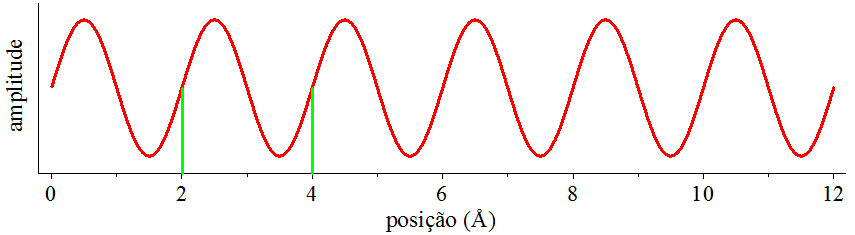
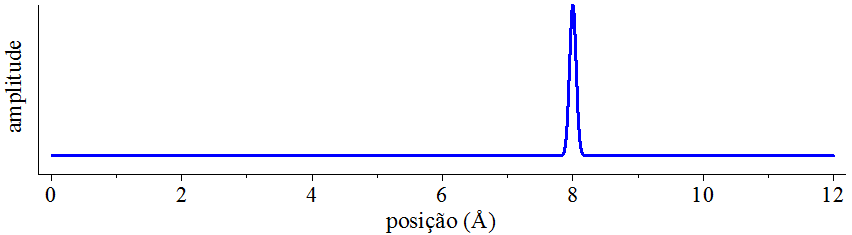
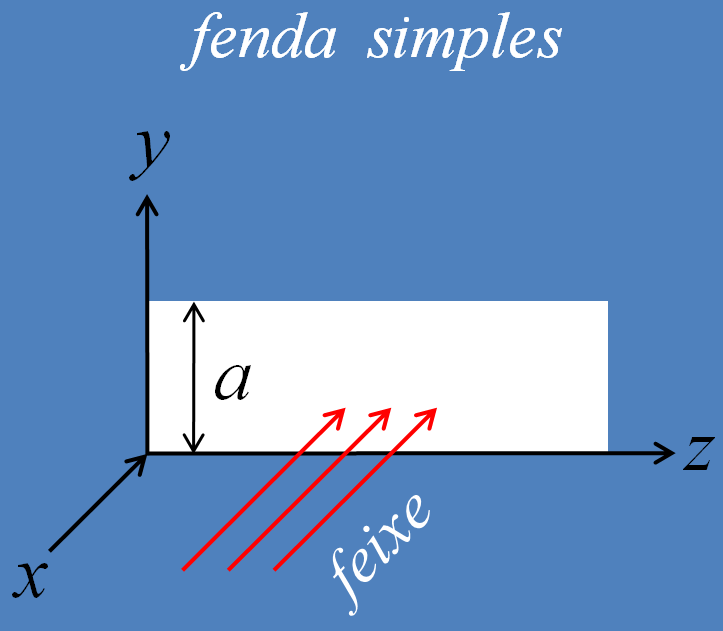
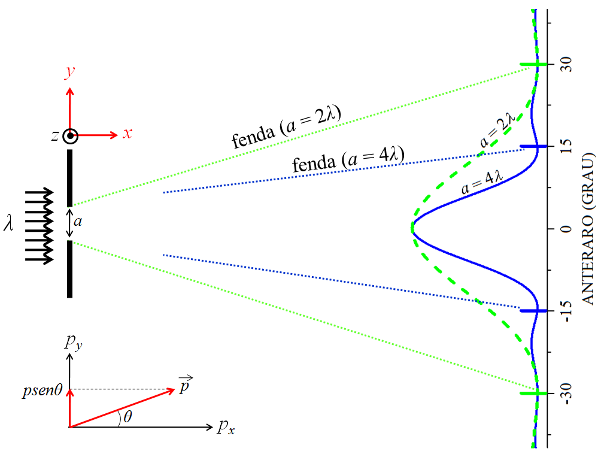
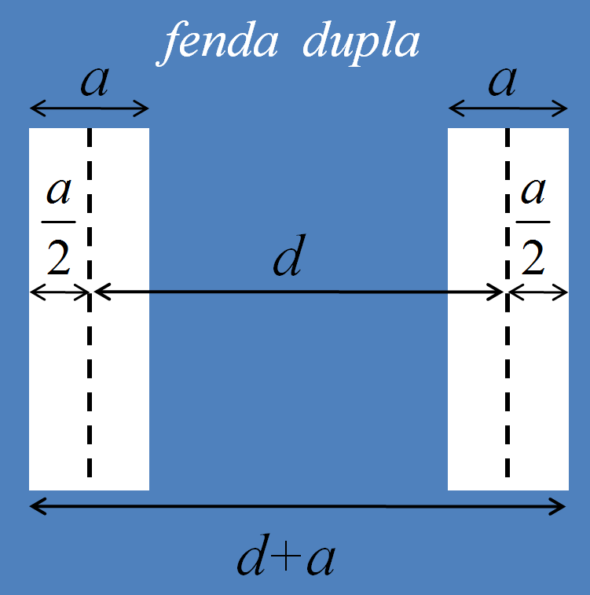
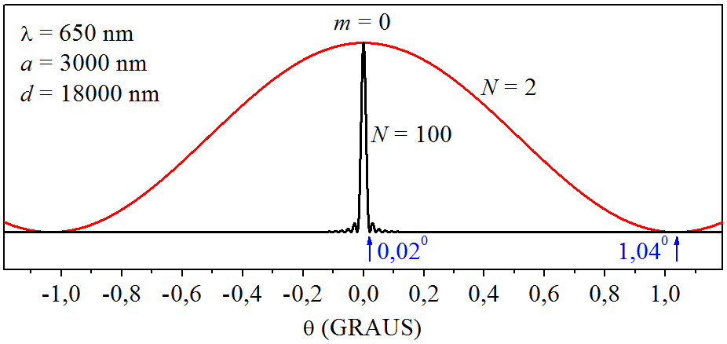

# A NATUREZA TRAZ EM SI A INCERTEZA {#Cap02}

## Introdução  {#Intro02}

Em uma experiência, estamos limitados pelos equipamentos de medição. Por exemplo, se medirmos o comprimento de
um objeto com uma régua milimétrica, os resultados terão a precisão da graduação da régua: milímetros. Mas se
utilizarmos um paquímetro micrométrico, os resultados passarão a ser mais precisos: agora na casa do
micrômetro. Nesse sentido, podemos dizer que a medição de uma grandeza física apresenta incertezas devido ao
_instrumental_. 

Werner Heisenberg, em 1927, enunciou um princípio o qual mostra que a natureza traz em si a _incerteza_, e essa
não está relacionada com o instrumental – são incertezas que estão, por essência, ligadas à própria natureza,
e não podem ser eliminadas por meio do aperfeiçoamento tecnológico dos equipamentos de medição.

O autor David J. Griffiths, em seu livro, _Introduction to Quantum Mechanics_, publicado em 1995 pela editora
Prentice Hall, Inc, ilustra o princípio da incerteza de Heisenberg analisando uma onda harmônica e um
pulso-delta de onda.

(\#fig:FIG7)Uma onda senoidal.

Aqui, tente responder as seguintes perguntas observando a onda senoidal que aparece na
Fig. \@ref(fig:FIG7).

Pergunta 1: __Qual é o valor da posição da onda senoidal?__

Pergunta 2: __Qual é o valor do comprimento de onda da onda senoidal?__

$\newcommand{\AA}{\unicode{xC5}}$
Sobre a pergunta 1, podemos dizer que a onda senoidal não está em uma posição específica e, sim,
se “esparrama” numa região do espaço – a pergunta 1 não faz sentido.
A resposta da pergunta 2 é clara: o comprimento de onda é igual a 2 $\AA$ – a pergunta 2 faz sentido.

Agora considere o pulso-delta de onda que aparece na
Fig. \@ref(fig:FIG8).

(\#fig:FIG8)Um pulso-delta.

A pergunta 1 agora faz sentido, pois podemos responder dizendo que o pulso de onda se
encontra na posição de coordenada 8 $\AA$. Já a pergunta 2 deixa de ter
sentido, pois não há sequer um comportamento periódico para se poder identificar um comprimento de onda.

A análise desses dois casos extremos de formas ondulatórias – a primeira, uma onda senoidal perfeita,
estendida por todo o espaço, e a segunda, um pulso de onda demarcado com exatidão no espaço –, nos leva à
conclusão de que: quanto mais podemos falar de posição, simultaneamente, menos podemos falar de comprimento de
onda; e inversamente: quanto menos podemos falar de posição, mais podemos falar de comprimento de onda – há
uma relação mútua entre as duas grandezas, posição e comprimento de onda estão relacionados entre si, são
grandezas correlacionadas. 

Se introduzirmos a relação de Broglie, de 1923, em nossas considerações, lembraremos que o comprimento de onda está
associado ao momento, $\lambda=h/p$, assim podemos reformular a argumentação anterior da seguinte maneira: _quanto mais
sabemos sobre a posição de uma partícula, simultaneamente, menos sabemos sobre seu momento; e inversamente:
quanto menos sabemos sobre a posição de uma partícula, simultaneamente, mais sabemos sobre seu momento_.

Como mencionamos, Heisenberg foi quem primeiro deduziu a relação de correlação entre as incertezas da posição
e momento, e estabeleceu o limite mínimo de correspondência: 

$$
{\rm (incerteza \,\, da \,\, posição)} \cdot {\rm (incerteza \,\, do \,\, momento)} \geqslant \frac{\hbar}{2}.
(\#eq:MAX41)
$$

Vamos simbolizar a incerteza da posição e do momento por $\Delta x$ e $\Delta p$, respectivamente.
Nessa notação, fica assim o princípio da incerteza de Heisenberg:

$$
\Delta x \Delta p \geqslant \frac{\hbar}{2}.
(\#eq:MAX42)
$$

O princípio garante que o valor mínimo para o resultado do produto $\Delta x \Delta p$ é $\hbar/2$.
Também pondera que são possíveis resultados maiores que $\hbar/2$, mas _nunca_ menores que $\hbar/2$.

Falamos que $\Delta x$ é a incerteza da posição de uma partícula quântica, mas como podemos entender isso de uma maneira
mais profunda?

Uma hipótese seria pensar que $\Delta x$ seria um intervalo específico do eixo $x$,
dentro do qual uma partícula quântica não seria encontrada e, assim, teria sua posição indeterminada?
Esqueça! $\Delta x$ _não_ deve ser interpretado dessa maneira!
A leitura da [ seção \@ref(InterProba) ] nos ajudou a entender
que uma partícula caracterizada por certa densidade de probabilidade pode ser
encontrada em todos os lugares em que sua densidade de probabilidade tem existência. Para essa partícula,
$\Delta x$ reflete a totalidade das prováveis posições e como estas se distribuem estatisticamente pelo espaço. Então,
$\Delta x$ não é um intervalo em que a partícula fica indeterminada no sentido de estar “invisível”, não é nada disso! 

A incerteza $\Delta x$ é um número, com unidade de comprimento, vinculado ao grau de dispersão das posições que uma
partícula pode manifestar. Se uma partícula pode ser encontrada em certa região do eixo $x$, de comprimento efetivo
$L$, então a posição de tal partícula é indeterminada, pois todas as posições dentro do segmento $L$ são possíveis de
medição. Vinculado ao valor de $L$, está o valor de $\Delta x$. Se $L$ é grande, $\Delta x$ é grande; e vice-versa.
Uma estimativa do valor de $\Delta x$ é fazer $\Delta x = L$, nesse caso, estamos dizendo que a incerteza da posição
é igual ao tamanho do intervalo efetivo de posições  que a partícula pode manifestar pelo eixo $x$. No futuro, seremos
capazes de determinar o valor de $\Delta x$ por meio de uma fórmula vinda da matemática estatística. Lá veremos que
$\Delta x < L$, mas, por hora, _vamos utilizar a estimativa_ $\Delta x = L$ _em exemplos didáticos_.

O grau de indeterminação da posição de uma partícula muda de partícula para partícula. Por exemplo, se certa
partícula 1 tem incerteza $\Delta x_1$, e se outra partícula 2 tem incerteza $\Delta x_2$, então, numa experiência
para fazer a medição da posição dessas partículas, se a posição da partícula 2 é mais indeterminada que a posição da
partícula 1, $\Delta x_2 > \Delta x_1$, isso significa que o centro de alta ocorrência da partícula 2 é mais largo
que o centro de alta ocorrência da partícula 1, em outras palavras, os resultados da medição da posição da partícula 2
estão mais dispersos que os resultados da medição da posição da partícula 1.

A incerteza $\Delta x$ é uma grandeza que caracteriza a maneira com que certa partícula quer aparecer ao observador
(equipamento de medição da posição). Se a partícula “quer ser espalhafatosa”, aparecer em muitos lugares,
então é porque ela é caracterizada por $\Delta x$ de grande porte, por outro lado, 
se ela _quer ser mais comedida_,
aparecer dentro de certos limites, então é porque ela manifesta $\Delta x$ de pequeno porte.

Isso não quer dizer que a partícula que manifesta  $\Delta x$ de pequeno porte seja “bacana em todos os sentidos”.
Heisenberg nos explicou que se melhorarmos o “temperamento” da posição, o momento se tornará “ranzinza”.
Ponderando sobre seu princípio, a diminuição da incerteza  $\Delta x$ resulta em aumento da incerteza $\Delta p$;
e vice-versa. Não podemos alterar uma incerteza sem alterar a outra. As incertezas têm relação mútua entre si.
Isso quer dizer que se a posição de uma partícula fosse determinada em $x=x_0$ com absoluta certeza, $\Delta x=0$,
o momento dessa partícula estaria absolutamente indeterminado, $\Delta p = \infty$,
podendo assumir com igual probabilidade qualquer valor entre $- \infty < p < \infty$.
No outro extremo, se o momento de uma partícula fosse determinado em $p=p_0$ com absoluta certeza, $\Delta p=0$,
a posição dessa partícula estaria absolutamente indeterminada, $\Delta x = \infty$, podendo assumir com igual
probabilidade qualquer valor entre $- \infty < x < \infty$.

No decorrer deste capítulo, entenderemos melhor a correspondência entre as incertezas $\Delta x$ e $\Delta p$
através da análise da interação do elétron com uma fenda única, fenda dupla, rede de difração.

Vale aqui salientar que a luz de comprimento de onda $\lambda_{l}$ carrega momento $p_{l}=h/\lambda_{l}$.
E o elétron de momento $p_{e}$ carrega comprimento de onda $\lambda_{e}=h/p_{e}$.
Por isso, luz e elétron são ondas, por possuírem comprimentos de onda, $\lambda_{l}$ e $\lambda_{e}$,
e luz e elétron são partículas, por também possuírem momentos, $p_{l}$ e $p_{e}$. Por causa dessa 
dualidade onda-partícula, os próximos exemplos se aplicam para o elétron e também para a luz, apesar deles
serem escritos dando ênfase ao elétron.

## Incertezas na experiência da fenda única  {#FenUnica}

Imagine uma fenda única, do tipo retangular, de largura $a$. Considere, também, um feixe de elétrons com
comprimento de onda $\lambda$, da mesma ordem de grandeza da largura dessa fenda. Ao fazer o feixe passar pela
abertura, aparecerá um padrão de difração em um anteparo: máximos e mínimos de intensidade, semelhante às
faixas em camisas listradas.

A ausência de elétrons no anteparo (mínimos) é decorrente da própria natureza ondulatória dos elétrons
difratados, os quais experimentam um fenômeno de interferência destrutiva; já os máximos decorrem da
interferência construtiva. 

A análise da diferença de caminho percorrido pelas ondas de matéria difratadas demonstra que os mínimos, na
figura de difração da experiência da fenda única, aparecem em ângulos $\theta$ determinados pela relação:

$$
a {\rm sen} \theta = m \lambda;\, \, \, m=1,2,3...
(\#eq:MAX43)
$$

Vê-se que o menor ângulo corresponde a $m=1$, ou seja, o primeiro mínimo de difração aparece em:

$$
{\rm sen} \theta = \frac{\lambda}{a}.
(\#eq:MAX44)
$$

Apesar de sabermos que os elétrons difratados sensibilizam – ou não – o anteparo, a análise da figura de
difração não informa o local exato da passagem desses elétrons por dentro da abertura $a$. Desse modo, há
incerteza na posição do elétron! Vamos definir a orientação da fenda e do feixe incidente conforme a 
Fig. \@ref(fig:FIG9).

(\#fig:FIG9)Uma fenda simples.

Como se vê na figura, o feixe incidente caminha pelo eixo $x$ e a largura da fenda se encontra no eixo $y$,
então, podemos _estimar_ a incerteza da posição em $y$, que representaremos por $\Delta y$,
da mesma ordem de grandeza da largura dessa fenda, quer dizer:

$$
\Delta y = a.
(\#eq:MAX45)
$$

Também no eixo $y$, o momento dos elétrons que passam pela fenda e atingem o anteparo, tem valores que vão desde
o momento dos elétrons que formam o máximo central, $p_y=0$, até o momento dos elétrons que formam o primeiro
mínimo, no lado direito, de valor $p_y=p{\rm sen} \theta$; e até o momento dos elétrons que formam o outro primeiro 
mínimo, no lado esquerdo, de valor $p_y=-p{\rm sen} \theta$. Desse modo, a incerteza do momento em $y$, 
que representaremos  por $\Delta p_y$, tem valor estimado:

$$
\Delta p_y = 2 p {\rm sen} \theta.
(\#eq:MAX46)
$$

Ao substituir a equação \@ref(eq:MAX44) e a relação de Broglie, $p=h/\lambda$, na equação \@ref(eq:MAX46),
podemos reescrever a incerteza do momento da seguinte maneira: 

$$
\Delta p_y=2 \frac{h}{\lambda}\frac{\lambda}{a} \,\, \Longrightarrow \,\, \Delta p_y=\frac{2h}{a}.
(\#eq:MAX47)
$$

O que aconteceria se desejássemos diminuir a incerteza $\Delta y$, com o objetivo de conhecer com maior precisão por
onde os elétrons atravessam a fenda? Poderíamos fazer isso diminuindo a largura da fenda, pois $\Delta y=a$, mas isso
acarretaria num aumento da incerteza do momento, pois o parâmetro $a$ também aparece no denominador de $\Delta p_y$. 

Vemos, então, que as incertezas \@ref(eq:MAX45) e \@ref(eq:MAX47), 
$\Delta y=a$ e $\Delta p_y=2h/a$, estão correlacionadas por meio do parâmetro $a$.
A diminuição de $a$ causa diminuição de $\Delta y$ e também aumento de $\Delta p_y$.
Por outro lado, o aumento de $a$ causa aumento de $\Delta y$ e diminuição de $\Delta p_y$.
Não podemos alterar uma incerteza sem alterar a outra.
Por fim, essa dependência resulta num produto de incertezas que não depende de $a$: 

$$
\Delta y \Delta p_y =2h.
(\#eq:MAX48)
$$

Numericamente, $2h = 13,\!25 \times 10^{-34} \, {\rm Js}$ e $\hbar/2 = 0,\!53 \times 10^{-34} \, {\rm Js}$,
então, percebe-se que a experiência da fenda única cumpre o princípio de Heisenberg,
discutido no início deste capítulo.

Agora vamos reforçar o assunto analisando a figura de difração de um feixe de elétrons que incide em uma fenda
simples, conforme simulamos na
Fig. \@ref(fig:FIG10).

(\#fig:FIG10)Um feixe de elétrons incidindo em uma fenda simples.

$\newcommand{\AA}{\unicode{xC5}}$
Os elétrons da Fig. \@ref(fig:FIG10) foram escolhidos para possuem o mesmo comprimento de onda dos
raios X gerados por átomos de cobre, $\lambda=1,\!5\ \AA$. A simulação foi montada com uma fenda de
largura $a=4\lambda=6\ \AA$. Depois o processo se repetiu com outra fenda de largura $a=2\lambda=3\ \AA$.
Observamos no anteparo as intensidades dos padrões de difração em função dos ângulos de difração (em graus).
A fenda mais estreita tem seu primeiro mínino de difração em $\theta=30^0$, enquanto que o primeiro mínino
da fenda mais larga aparece em $\theta=14,\!5^0$.

Segundo a equação \@ref(eq:MAX46), a fenda estreita produz o __dobro__ de incerteza de momento em relação à fenda larga:
$\Delta p_y=p$ (estreita) contra $\Delta p_y=0,\!5p$ (larga). 
Já a equação \@ref(eq:MAX45) deixa claro que a fenda estreita pruduz a __metade__ de incerteza de posição 
com respeito à fenda larga: $\Delta y=3\ \AA$ (estreita) contra $\Delta y=6\ \AA$ (larga).

As simulações apreentadas na Fig. \@ref(fig:FIG10) reforçam nosso entendimento de que
_quanto mais sabemos sobre a posição de uma partícula, simultaneamente, menos sabemos sobre seu momento_ 
(conforme se observou no caso da fenda estreita), e que
_quanto menos sabemos sobre a posição de uma partícula, simultaneamente, mais sabemos sobre seu momento_ 
(como se deu no caso da fenda larga).

## Incertezas na experiência da fenda dupla  {#FenDupla}

A experiência com a fenda dupla pode ser montada para investigar várias questões: Qual a influência, no
padrão de difração, do espaçamento entre as fendas? Qual a influência das próprias aberturas das fendas? O que
acontece, no padrão de difração, se uma das fendas for tampada? E se uma das fendas for monitorada? Antes de
examinarmos essas questões, precisamos caracterizar a fenda dupla. Cada fenda terá largura $a$; o espaço entre as
fendas será $d$, sendo contado a partir dos centros das aberturas. Desse modo, o tamanho total da fenda dupla
será $d+a$, conforme ilustrado na
Fig. \@ref(fig:FIG11).

(\#fig:FIG11)Uma fenda dupla.

### O caso ideal

Quando desprezamos a largura das fendas, $a=0$, e consideramos apenas a distância entre elas, estamos no que se
pode chamar de caso ideal.

A incerteza da posição reside no fato do elétron poder passar por qualquer uma das fendas, ou seja, em y,
temos uma incerteza igual ao próprio espaço entre as fendas:

$$
\Delta y = d.
(\#eq:MAX49)
$$

A análise da diferença de caminho percorrido pelas ondas de difratadas demonstra que os mínimos, na figura de
difração da experiência da fenda dupla, aparecem em ângulos $\theta$ que dependem do espaçamento $d$ e do comprimento de
onda $\lambda$ da onda que incide na fenda dupla: 

$$
d{\rm sen}\theta = \left( m+\frac{1}{2} \right) \lambda; \,\,\, m=0,1,2,3...
(\#eq:MAX50)
$$

Aqui, o primeiro mínimo de difração ocorre na ordem $m=0$, ou seja, em:

$$
{\rm sen}\theta = \frac{\lambda}{2d}.
(\#eq:MAX51)
$$

A incerteza do momento é estimada raciocinando da mesma maneira que fizemos na experiência da
fenda simples, [ seção \@ref(FenUnica) ], logo, para a ordem $m=0$, a fenda dupla gera:

$$
\Delta p_y=2p{\rm sen}\theta  \,\, \Longrightarrow \,\, \Delta p_y=2\frac{h}{\lambda}\frac{\lambda}{2d} \,\, \Longrightarrow \,\, \Delta p_y=\frac{h}{d}.
(\#eq:MAX52)
$$

Por fim, o produto das incertezas não depende do parâmetro $d$: 

$$
\Delta y\Delta p_y = h.
(\#eq:MAX53)
$$

Numericamente, $h = 6,\!626 \times 10^{-34} \, {\rm Js}$ e $\hbar/2 = 0,\!53 \times 10^{-34} \, {\rm Js}$,
então, percebe-se que a experiência da fenda dupla também cumpre o princípio da Heisenberg.

### O caso real

Vamos estudar o caso da fenda dupla real, na qual levamos em conta a largura
das fendas, ou seja, $a>0$. Agora a incerteza da posição passa a ser devido ao tamanho total da fenda:

$$
\Delta y = d + a.
(\#eq:MAX54)
$$

Visto que as equações \@ref(eq:MAX51) e \@ref(eq:MAX52) também se aplicam neste caso,
fica fácil escrever o produto das incertezas:

$$
\Delta y \Delta p_y= \left( 1+\frac{a}{d} \right) h.
(\#eq:MAX55)
$$

Concluímos que a fenda dupla real também cumpre a relação de Heisenberg, pois $a<d$, o que implica em $(1+a/d)>1$. 
Além do mais, se desprezarmos a abertura das fendas, $a=0$, o resultado \@ref(eq:MAX55)
recupera o reultado \@ref(eq:MAX53), do caso ideal.

### O caso da fenda obstruída

Agora vamos analisar o que acontece com a fenda dupla real, se tamparmos uma das fendas. Como só há passagem ativa
por uma das fendas, a incerteza da posição cai para:

$$
\Delta y = a.
(\#eq:MAX56)
$$

Levantando a hipótese que as equações \@ref(eq:MAX51) e \@ref(eq:MAX52) possam ser utilizadas neste caso,
o produto das incertezas passa a ser:

$$
\Delta y \Delta p_y= \frac{a}{d}h.
(\#eq:MAX57)
$$

Vamos reescrever a equação \@ref(eq:MAX57) para aparecer $\hbar/2$, e assim compararmos com
o princípio de incerteza $\Delta y \Delta p_y \geqslant \hbar/2$:

$$
\Delta y \Delta p_y= \frac{a}{0,\!08d} \frac{\hbar}{2}.
(\#eq:MAX58)
$$

Pensando em substituir valores na equação \@ref(eq:MAX58), vemos que se $a=0,\!08d$,
chegamos no limite do princípio de incerteza:
$\Delta y \Delta p_y = \hbar/2$.
Mas se $a<0,\!08d$, __há violação da relação de Heisenberg__:
$\Delta y \Delta p_y < \hbar/2$ – __que absurdo__! 
Se nossas hipóteses podem levar a um resultado que viole a relação de Heisenberg, então há forte evidência que
algum argumento empregado na dedução é falso!

Na realidade, ao tampar uma das fendas, a figura de difração que
aparece no anteparo é idêntica ao padrão de fenda única. Então, a hipótese de utilizar a equação de
primeiro mínimo como sendo a equação de fenda dupla, equação \@ref(eq:MAX51),
não condiz com a realidade e deve ser descartada. 

### O caso da fenda monitorada

Finalizamos as experiências com a fenda dupla analisando uma nova questão: Qual seria o resultado do
princípio da incerteza, se colocássemos algum mecanismo observando a passassem dos elétrons por uma das
fendas?
 
Bem, o caso da fenda obstruída mostrou que, com uma das fendas tampadas, a fenda dupla não pode ser analisada
utilizando sua própria equação. Ao vedar uma das fendas, descontinuamos a modalidade de incerteza relacionada
com o espaçamento entre as fendas, pois temos a convicção: o feixe de elétrons não passa pela fenda fechada e,
necessariamente, passa pela fenda aberta. Assim, o padrão de difração deixa de ser padrão de fenda dupla e
passa a ser padrão de fenda única. 

Então, 
ao colocar um equipamento que observa a passagem do feixe de elétrons por uma das fendas, também não
liquidamos com uma modalidade de incerteza? É claro que sim! Por exemplo, se o equipamento acusar a passagem
do feixe, nós teremos a convicção: “o feixe passou pela fenda monitorada e não passou pela outra fenda”. E se
o equipamento não acusar a passagem do feixe? Mesmo assim teremos a convicção: “o feixe não passou pela fenda
monitorada, naturalmente, passou pela outra fenda”.

Ao monitorar uma das fendas, a incerteza referente ao espaço entre as aberturas desaparecerá, e a única
incerteza que restará, será aquela referente à largura de uma das fendas, por isso, podemos escrever: 

$$
\Delta y = a.
(\#eq:MAX59)
$$

Ademais, ao monitorar uma das fendas, a figura de difração que aparecá no anteparo será idêntica ao 
padrão de fenda única. Então, a hipótese correta é utilizar o primeiro mínimo de difração
deduzido na [ seção \@ref(FenUnica) ]:

$$
{\rm sen} \theta = \frac{\lambda}{a}.
(\#eq:MAX60)
$$

Assim, a incerteza do momento é estimada como:

$$
\Delta p_y=2p{\rm sen}\theta  \,\, \Longrightarrow \,\, \Delta p_y=2\frac{h}{\lambda}\frac{\lambda}{a} \,\, \Longrightarrow \,\, \Delta p_y=\frac{2h}{a}.
(\#eq:MAX61)
$$

E o produto das incertezas fica:

$$
\Delta y \Delta p_y= 2h.
(\#eq:MAX62)
$$

O valor de $2h$ é vinte e cinco vezes maior que $\hbar/2$. Assim, a fenda dupla real com uma das fendas monitorada
cumpre rigorosamente a relação de Heisenberg – desde que seja utilizada na análise a equação da fenda única.

Portanto, na experiência da fenda dupla, o ato de observar uma das fendas muda por completo o padrão de
difração no anteparo: se antes do monitoramento, o padrão era de fenda dupla, ao iniciar o processo de
observação, o padrão passar a ser de fenda única. 

## Incertezas na experiência da rede de difração   {#RedeDifra}

A rede de difração é a extensão da fenda dupla. Enquanto que a fenda dupla possui somente duas aberturas,
a rede de difração é composta por centenas ou milhares de aberturas. Se acompanharmos a mesma nomenclatura
usada na descrição da fenda dupla, veremos que uma rede com $N$ fendas (cada fenda com largura $a$) vai possuir
$(N-1)$ espaçamentos (cada espaçamento com extensão $d$) e, desse modo, um tamanho total igual a $(N-1)d+a$.
 
A incerteza da posição reside no fato do elétron incidente poder passar por qualquer uma das $N$ fendas, desde a
primeira até a última, ou seja, em $y$, temos uma incerteza da posição igual ao próprio tamanho da rede de
difração:

$$
\Delta y = (N-1)d + a.
(\#eq:MAX63)
$$

No padrão de difração gerado pela rede de difração, os mínimos aparecem em ângulos $\theta$ que dependem do número
de fendas $N$, do espaçamento $d$ e do comprimento de onda $\lambda$  da onda que incide na rede:

$$
d{\rm sen}\theta = \left( m + \frac{1}{N} \right) \lambda;\,\,\, m=0,1,2,3...
(\#eq:MAX64)
$$

O primeiro mínimo de difração vai ocorrer na ordem $m=9$, ou seja, em: 

$$
{\rm sen}\theta = \frac{\lambda}{Nd}.
(\#eq:MAX65)
$$

Então, na ordem zero, a incerteza do momento é:

$$
\Delta p_y=2p{\rm sen}\theta  \,\, \Longrightarrow \,\, \Delta p_y=2\frac{h}{\lambda}\frac{\lambda}{Nd} \,\, \Longrightarrow \,\, \Delta p_y=\frac{2h}{Nd}.
(\#eq:MAX66)
$$

Enfim, o produto das incertezas reúne os parâmetros que caracterizam a rede: 

$$
\Delta y \Delta p_y= \left( \frac{N-1}{N} + \frac{a}{Nd} \right) 2h.
(\#eq:MAX67)
$$

O fator que multiplica a constante de Planck é maior que 1. Como $h$ é maior que $\hbar/2$, a rede de difração
satisfaz a relação de Heisenberg. Além do mais, fazendo $N=2$ recuperamos a expressão da fenda dupla real,
ver [ seção \@ref(FenDupla) ]. 

A incerteza $\Delta y$ é uma função diretamente proporcional ao produto $Nd$, por outro lado,
a incerteza $\Delta p_y$ é inversamente proporcional à $Nd$, 
veja as equações \@ref(eq:MAX63) e \@ref(eq:MAX66). Assim,
as incertezas $\Delta y$ e $\Delta p_y$ estão correlacionadas por meio do parâmetro $Nd$.
A diminuição de $Nd$ causa diminuição de $\Delta y$ e também aumento de $\Delta p_y$.
Por outro lado, o aumento de $Nd$ causa aumento de $\Delta y$ e também diminuição $\Delta p_y$.
Não podemos alterar uma incerteza sem alterar a outra – resultado que traduz a essência do 
princípio da incerteza de Heisenberg.

Considerando que uma rede de difração é fabricada com centenas ou milhares de ranhuras, o
valor de $N$ é elevado, assim, a incerteza da posição é grande, ao passo que, a incerteza do momento é pequena
– o que nos leva a concluir que uma rede de difração produz pouco desvio lateral às partículas difratadas. 

Analisando as intensidades da difração que aparecem no anteparo, a intensidade de ordem zero 
tem um pico em $0^0$, mas, por causa do pouco desvio lateral experimentado pelas partículas difratadas,
o ângulo do primeiro mínimo ocorre não muito afastado do próprio máximo, ou seja, também perto de $0^0$ 
– isso significa que a linha de difração é bem estreita. Portanto, por causa do elevado número de fendas,
uma rede de difração produz pouco desvio lateral nas ondas de matéria difratadas, gerando linhas de difração estreitas. 

Apesar de estarmos dando ênfase ao elétron, o comportamento da rede de difração é análogo 
se o feixe incidente for composto de fótons, por isso,
o fenômeno do estreitamento da linha será ilustrado utilizando a luz de um laser que emite no vermelho,
com $\lambda = 650 \, {\rm nm}$.
A Fig. \@ref(fig:FIG12) mostra a simulação da
figura de difração de uma rede de difração com $N=100$ e também de uma fenda dupla com $N=2$,
para a ordem $m=0$ (valores de $a$ e $d$ impressos na própria figura, sendo $d=6a$).

(\#fig:FIG12)Figura de difração gerada por uma rede de difração e por uma fenda dupla.

A fenda dupla, com somente 2 aberturas, tem meia largura de linha que vai de $0^0$ (máximo)
até cerca de  $1^0$ (mínimo), enquanto que a rede de difração, com 100 aberturas, 
tem meia largura de linha que vai de $0^0$ até cerca de $0,\!02^0$ 
– o estreitamento de linha, causado pela quantidade elevada de fendas, é notório!

