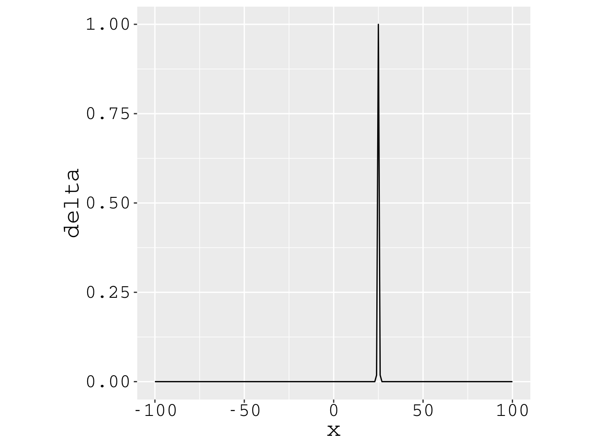
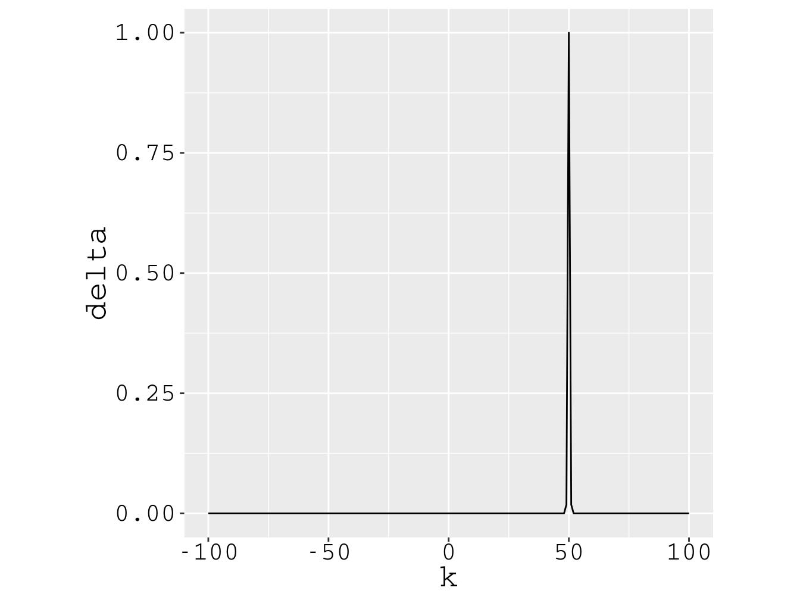
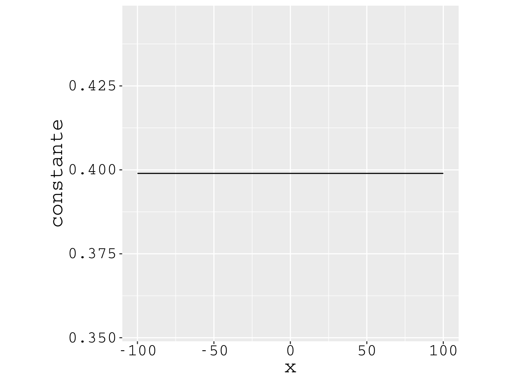

# A PARTÍCULA DELOCALIZADA E A LOCALIZADA {#Cap04}

## Introdução   {#Intro04}

Antes de tratarmos o assunto-título deste capítulo, vamos nos familiarizar com a equação de autovalor de
um operador e com o princípio da superposição de ondas. Depois, agregaremos essas novas informações com os
conceitos de probabilidade e incertezas para descrevermos o comportamento da partícula quântica totalmente
localizada no espaço e da totalmente delocalizada.

## A equação de autovalor  {#EqAuto}

Em mecânica quântica, as grandezas físicas sujeitas à medição estão associadas a operadores matemáticos. Os
operadores, por sua vez, operam sobre funções matemáticas alvos, instruindo que sejam realizadas algumas
operações matemáticas específicas sobre essas funções. Por exemplo, a grandeza posição está associada ao
operador da posição $\widehat x$, e a grandeza momento linear associa-se ao operador do momento linear 
$\widehat p$. O operador $\widehat x$, instrui que a função alvo seja multiplicada por $x$, 
enquanto que $\widehat p$, instrui que realizemos a derivada da função
alvo em relação à posição e, depois, multipliquemos o resultado por $-i\hbar$, em suma:

$$
\widehat x = x.
(\#eq:MAX94)
$$

$$
\widehat p = -i\hbar \frac{\mathrm{d}}{\mathrm{d}x}.
(\#eq:MAX95)
$$

A medição de uma grandeza física, feita em certa experiência, resulta em uma quantidade numérica, mas vinculada à
respectiva unidade da grandeza. Por exemplo, a medição da posição de uma partícula resulta em 
$x$ $\left( \mathrm{m} \right)$; já a medição do momento em $\hbar k$ $\left( \mathrm{ Js\cdot m^{-1} } \right)$.
Aqui, o número de onda angular $k$ está associado ao comprimento de onda $\lambda$, através da relação:

$$
k = \frac{2\pi}{\lambda}.
(\#eq:MAX96)
$$

Na teoria quântica, os resultados da medição de uma grandeza física que está associada a um operador
$\widehat A$, são os autovalores $a$ que satisfazem a equação de autovalor:

$$
\widehat A \psi_a = a \psi_a.
(\#eq:MAX97)
$$

Então, os resultados da medição da posição de uma partícula são os autovalores 
$x$ $\left( \mathrm{m} \right)$ que satisfazem a equação:

$$
\widehat x \psi_x = x \psi_x.
(\#eq:MAX98)
$$

Já os resultados da medição do momento da partícula
são os autovalores $\hbar k$ $\left( \mathrm{ Js\cdot m^{-1} } \right)$ que tornam verdadeira a equação:

$$
\widehat p \psi_k = \hbar k \psi_k.
(\#eq:MAX99)
$$

Em \@ref(eq:MAX97), a solução $\psi_a$ é chamada autoestado de $\widehat A$,
que corresponde ao autovalor $a$. Então em \@ref(eq:MAX98), a solução $\psi_x$ é o autoestado 
de $\widehat x$ correspondente ao autovalor $x$ $\left( \mathrm{m} \right)$. Já em \@ref(eq:MAX99), 
a função $\psi_k$ é o autoestado de $\widehat p$ correspondente ao 
autovalor $\hbar k$ $\left( \mathrm{ Js\cdot m^{-1} } \right)$.
 
Fica o desafio de resolvermos as equações \@ref(eq:MAX98) e \@ref(eq:MAX99)...

## O princípio da superposição  {#PrinSuper}

Um operador $\widehat A$ pode formar um conjunto _discreto_ de autofunções e de autovalores, do tipo:  

$$
\widehat A \psi_1 = a_1 \psi_1 \\
\widehat A \psi_2 = a_2 \psi_2 \\
\widehat A \psi_3 = a_3 \psi_3 \\
\vdots
(\#eq:MAX100)
$$

A base discreta de autoestados $\left( \psi_1,\, \psi_2,\, \psi_3,\,  ... \right)$,
pode ser utilizada para decompor um estado quântico de uma partícula:

$$
\begin{aligned}
\Psi(x) &= b_1\psi_1(x) + b_2\psi_2(x) + b_3\psi_3(x) +... \\
        &= \sum_{i} b_i\psi_i(x) .
\end{aligned}
(\#eq:MAX101)
$$

Dizemos, então, que $\Psi(x)$ é constituído por uma superposição linear dos autoestados de $\widehat A$.
Os coeficientes $b_i$ são números complexos. Se forem efetuadas medições da grandeza física associada ao $\widehat A$,
a quantidade real $b_i^{\ast}b_i$ será a probabilidade do autovalor $a_i$ ser o resultado dessa medição; 
também é a probabilidade do autoestado $\psi_i(x)$ ser o estado final dessa medição. 
A soma de todas as chances resulta em um, ou seja, $\sum_{i} |b_i|^2=1$.

Vamos encontrar a expressão do coeficiente $b_1$:

Primeiro, multiplicamos o $\Psi$, da equação \@ref(eq:MAX101), pelo complexo conjugado de $\psi_1$:

$$
\psi_1^{\ast}\Psi = b_1\psi_1^{\ast}\psi_1 + b_2\psi_1^{\ast}\psi_2 + b_3\psi_1^{\ast}\psi_3 +...
(\#eq:MAX102)
$$

Em seguida, efetuamos a integração da equação \@ref(eq:MAX102) em todo espaço das posições:

$$
\begin{aligned}
\int_{-\infty}^{+\infty} \psi_1^{\ast}\Psi \mathrm{d}x  &=
b_1 \int_{-\infty}^{+\infty} \psi_1^{\ast}\psi_1 \mathrm{d}x     +\\
& +b_2 \int_{-\infty}^{+\infty} \psi_1^{\ast}\psi_2 \mathrm{d}x  +\\ 
& +b_3 \int_{-\infty}^{+\infty} \psi_1^{\ast}\psi_3 \mathrm{d}x  +...
\end{aligned}
(\#eq:MAX103)
$$

Neste ponto, precisamos lançar mão da ortogonalidade da base de autoestados:

$$
\begin{aligned}
\int_{-\infty}^{+\infty} \psi_1^{\ast}\psi_1 \mathrm{d}x &= 1  \\
\int_{-\infty}^{+\infty} \psi_1^{\ast}\psi_2 \mathrm{d}x &= 0  \\
\int_{-\infty}^{+\infty} \psi_1^{\ast}\psi_3 \mathrm{d}x &= 0  \\
\vdots
\end{aligned}
(\#eq:MAX104)
$$

Por fim, aplicando \@ref(eq:MAX104) em \@ref(eq:MAX103), o coeficiente $b_1$ resulta em:

$$
b_1 = \int_{-\infty}^{+\infty} \psi_1^{\ast}(x) \Psi(x) \mathrm{d}x.
(\#eq:MAX105)
$$

Analogamente, a expressão de certo coeficiente $b_i$ segue \@ref(eq:MAX105):

$$
b_i = \int_{-\infty}^{+\infty} \psi_i^{\ast}(x) \Psi(x) \mathrm{d}x.
(\#eq:MAX106)
$$

Em \@ref(eq:MAX100), falamos de um operador que formar uma base _discreta_ de autoestados, 
$\psi_i(x)$, com $i=1,\,2,\,3\,...$.
Mas como proceder se certo operador formar uma base  _contínua_ de autoestados?

Vamos considerar o operador $\widehat U$ formando uma base contínua de autoestados$, \psi_u(x)$,
sendo $u$ um contínuo de reais, os autovalores desse operador.
Seguindo o princípio da superposição em \@ref(eq:MAX101), 
a base contínua poderá ser utilizada para decompor um estado,
mas, agora, ao invés de trabalharmos com somatórias, teremos que trabalhar com integrais:

$$
\Psi(x) = \int_{-\infty}^{+\infty} b(u) \psi_u(x) \mathrm{d}u.
(\#eq:MAX107)
$$

Também, fazendo comparação com o caso discreto, equação \@ref(eq:MAX106),
o coeficiente da superposição será assim determinado: 

$$
b(u) = \int_{-\infty}^{+\infty} \psi_u^{\ast}(x) \Psi(x) \mathrm{d}x.
(\#eq:MAX108)
$$

Agora, a quantidade  $b^{\ast}(u)b(u)$ não será uma probabilidade genuína, mas terá significado de densidade de probabilidade.
A probabilidade genuína será $|b(u)|^2\mathrm{d}u$, interpretada como a probabilidade de um resultado do 
experimento estar entre os autovalores $u+\mathrm{d}u$.
Desse modo, a probabilidade de um resultado do estar entre $u_1 < u < u_2$, será:

$$
{\rm Pr}( u_1 < u < u_2 ) = \int_{u_1}^{u_2} |b(u)|^2\mathrm{d}u.
(\#eq:MAX109)
$$

Lembrando da [ seção \@ref(InterProba) ], podemos interpretar $b(u)$
como certa função de onda do espaço $u$, a qual gera certa densidade de probabilidade $|b(u)|$.

## A delta de Dirac  {#DelDi}

Antes de avançarmos na física, estamos recordando um pouco da matemática. 
Já falamos da equação de autovalor [ seção \@ref(EqAuto) ]
e do princípio da superposição [ seção \@ref(PrinSuper) ].
Agora vamos recordar alguma coisa sobre a delta de Dirac,
muito utilizada no desenvolvimento da teoria quântica.

A delta de Dirac, centrada em $x=\ell$, é definida como:

$$
\begin{aligned}
\delta(x-\ell) &= \infty, \,\,\, & {\rm se} \,\,\, x =    \ell ,\\
               &= 0,      \,\,\, & {\rm se} \,\,\, x \neq \ell .
\end{aligned}
(\#eq:MAX110)
$$

A Fig. \@ref(fig:EXTRA1) ilustra o perfil da $\delta$-Dirac centrada em $x=25$;
não é possível graficar o eixo $y$ até o infinito, como exige \@ref(eq:MAX110),
por isso devemos encarar a figura apenas como uma ilustração.

(\#fig:EXTRA1)Ilustração de uma delta de Dirac centrada em $x=25$.

A $\delta$-Dirac também pode ser representada no formato de integral de função exponencial:

$$
\delta(k-g) = \frac{1}{2\pi} \int_{-\infty}^{+\infty} \mathrm{e}^{\large -i(k-g)x} \mathrm{d}x._{}
(\#eq:MAX111)
$$

Uma propriedade importante da $\delta$-Dirac é chamada de _filtragem-delta_.
Se $F(x)$ for uma função contínua em torno da localização exata de uma delta de Dirac, então:

$$
\int_{-\infty}^{+\infty} F(x) \delta(x-\ell) \mathrm{d}x = F(\ell)._{}
(\#eq:MAX112)
$$

Como se vê em \@ref(eq:MAX112), a delta de Dirac "percorre os valores da função
e filtra _apenas_ aquele que corresponde à localização exata _dela_".

## A partícula totalmente delocalizada  {#ParticulaD}

Vamos trabalhar a equação de autovalor do operador do momento linear [ seção \@ref(EqAuto) ]:

$$
\widehat p \psi_k(x) = \hbar k \psi_k(x).
(\#eq:MAX113)
$$

Aplicando a instrução do operador do momento, ficamos com a seguinte equação diferencial:

$$
-i\hbar \frac{\mathrm{d}\psi_k(x)}{\mathrm{d}x} = \hbar k \psi_k(x).
(\#eq:MAX114)
$$

O subscrito $k$ que aparece em \@ref(eq:MAX114),
subendende que cada autoestado $\psi_k$ está associado a um 
autovalor $\hbar k$ $\left( \mathrm{ Js\cdot m^{-1} } \right)$, ademais,
subentende que há um _contínuo_ de autovalores $\hbar k$, ou seja, $-\infty < k < +\infty$.

A solução da equação \@ref(eq:MAX114) é trivial:

$$
\psi_k(x) = C\mathrm{e}^{\large ikx}.
(\#eq:MAX115)
$$
 
A constante $C$ deve ser encontrada pelo processo de normalização:

$$
\int_{-\infty}^{+\infty} |\psi_k(x)|^2 \mathrm{d}x = \int_{-\infty}^{+\infty} |C|^2 \mathrm{d}x._{}
(\#eq:MAX116)
$$

Mas a equação \@ref(eq:MAX116) produz um resultado divergente.
Então vamos determinar $C$ analisando a integral \@ref(eq:MAX117),
com o auxílio da delta de Dirac na forma exponencial [ seção \@ref(DelDi) ]:

$$
\begin{aligned}
\int_{-\infty}^{+\infty} \psi_k^{\ast}(x) \psi_g(x) \mathrm{d}x
&= |C|^2 \int_{-\infty}^{+\infty} \mathrm{e}^{\large -i(k-g)x} \mathrm{d}x. \\
&= |C|^2 2\pi \delta(k-g).
\end{aligned}
(\#eq:MAX117)
$$

Justificamos a escolha $|C|^2={2\pi}^{-1}$ para a integral \@ref(eq:MAX117) valer _um_ delta de Dirac.
Finalmente temos \@ref(eq:MAX115) normalizada:

$$
\psi_k(x) = \frac{1}{\sqrt{2\pi}} \mathrm{e}^{\large ikx}.
(\#eq:MAX118)
$$

Como dissemos, a quantidade de autoestados do momento é infinita, 
em \@ref(eq:MAX118), $k$ pode percorrer de $-\infty$ até $+\infty$.
Vamos limitar nossa discussão a uma partícula preparada em um autoestado do momento, 
que chamaremos de estado $\Psi_{\rm D}$, possuindo um único $k$, por exemplo, $k=g$:

$$
\Psi_{\rm D}(x) = \frac{1}{\sqrt{2\pi}} \mathrm{e}^{\large igx}._{}
(\#eq:MAX119)
$$

A partir de \@ref(eq:MAX119), podemos determinar a densidade de probabilidade da posição:

$$
|\Psi_{\rm D}(x)|^2 = \frac{1}{2\pi} .
(\#eq:MAX120)
$$

Para toda posição $x$, a densidade de probabilidade \@ref(eq:MAX120) é constante.
Isso quer dizer que a chance de a partícula ser encontrada em um intervalo infinitesimal em torno de 
$x=\ell_1$, $|\Psi_{\rm D}(\ell_1)|^2\mathrm{d}x$, 
é a mesma de ser encontrada em um intervalo infinitesimal em torno de
$x=\ell_2$, $|\Psi_{\rm D}(\ell_2)|^2\mathrm{d}x$,
e a assim por diante.
A partícula ${\rm D}$, \@ref(eq:MAX119), tem posição totalmente incerta, $\Delta x=\infty$. 
Dizemos que tal partícula está _totalmente delocalizada_ 
– foi isso que motivou a escollha do subscrito ${\rm D}$. 
Visto que $\Delta x=\infty$, temos $\Delta p=0$, pelo princípio da incerteza [ seção \@ref(Intro02) ].
Isso quer dizer que medições do momento sempre resultarão numa mesma medida, 
o autovalor $\hbar g$  $\left( \mathrm{ Js\cdot m^{-1} } \right)$.
Dizemos que a partícula está num estado de momento _certo_. 

Portanto, o que concluímos desta seção é que a
partícula ${\rm D}$ possui momento certo e posição totalmente incerta. 

## A partícula totalmente localizada  {#ParticulaL}

Nosso objetivo agora é lidar com a equação de autovalor [ seção \@ref(EqAuto) ]
do operador da posição [ $\widehat x$ ]:

$$
\widehat x \psi_x(x) = x \psi_x(x).
(\#eq:MAX121)
$$

Exclarecimento sobre a notação: em \@ref(eq:MAX121), $x$ é coordenada ($x$), mas $x$ também é
autovalor de $\widehat x$. Para fazer distinção, $x$ continuará sendo coordenada ($x$),
mas $\ell$ passará a fazer o papel de autovalor de $\widehat x$. Com este exclarecimento, 
a equação \@ref(eq:MAX121) muda para a forma:

$$
\widehat x \psi_\ell(x) = \ell \psi_\ell(x).
(\#eq:MAX122)
$$

A solução da equação \@ref(eq:MAX122) pode ser deduzida a partir da filtragem-delta [ seção \@ref(DelDi) ], pois:

$$
F(x) \delta(x-\ell) = F(\ell) \delta(x-\ell).
(\#eq:MAX123)
$$

No nosso caso $F(x)=x$, então, a equação \@ref(eq:MAX123) tem a forma:

$$
x \delta(x-\ell) = \ell \delta(x-\ell).
(\#eq:MAX124)
$$

Vejam a semelhança entre as equações \@ref(eq:MAX122) e \@ref(eq:MAX124).
Por isso concluímos que $\psi_\ell$ é um delta de Dirac centrado em $x=\ell$, ou seja:

$$
\psi_\ell(x) = \delta(x-\ell)._{}
(\#eq:MAX125)
$$
 
O subscrito $\ell$ subentende um _contínuo_ de autovalores,
onde cada autovalor $\ell$ $\left( \mathrm{m} \right)$ associa-se ao seu autoestado $\psi_\ell$.

Como acabamos de dizer, a quantidade de autoestados da posição é infinita,
em \@ref(eq:MAX125), $\ell$ pode percorrer de $-\infty$ até $+\infty$.
Vamos limitar nossa discussão a uma partícula preparada em um _único_ autoestado da posição,
possuindo um _único_ autovalor $\ell$:

$$
\Psi_{\rm L}(x) = \delta(x-\ell)._{}
(\#eq:MAX126)
$$

A partir de \@ref(eq:MAX126), podemos determinar a densidade de probabilidade da posição:

$$
|\Psi_{\rm L}(x)|^2 = |\delta(x-\ell)|^2._{}
(\#eq:MAX127)
$$

Levando em conta a definição da delta de Dirac [ seção \@ref(DelDi) ],
a equação \@ref(eq:MAX127) produz dois resultados:

$$
\begin{aligned}
|\Psi_{\rm L}(x)|^2 &= \infty, \,\,\, & {\rm se} \,\,\, x = \ell_{} ,\\
                    &= 0,      \,\,\, & {\rm se} \,\,\, x \neq \ell .
\end{aligned}
(\#eq:MAX128)
$$

Como se vê, não há chance da partícula ${\rm L}$, \@ref(eq:MAX126), ser encontrada fora da posição $x=\ell$. 
Como era de se esperar, esta partícula só poderá ser achada em $x=\ell$. 
Dizemos que esta partícula está num estado de posição certa, _totalmente localizada_
– aqui está o porquê do subscrito ${\rm L}$. 
Sua incerteza na posição é zero, $\Delta x=0$. 
Visto que $\Delta x=0$, temos $\Delta p=\infty$, pelo princípio da incerteza [ seção \@ref(Intro02) ].
Isso quer dizer que medições do momento poderão resultar em qualquer medida
dentre os autovalores $-\infty < \hbar k< +\infty$.

Portanto, o que concluímos desta seção é que a
partícula ${\rm L}$ possui posição certa e momento totalmente incerto;
ver o contraste com a partícula ${\rm D}$ [ seção \@ref(ParticulaD) ].

## Mais sobre a partícula totalmente delocalizada

Na [ seção \@ref(ParticulaD) ], batizamos a partícula totalmente delocalizada de partícula ${\rm D}$:

$$
\Psi_{\rm D}(x) = \frac{1}{\sqrt{2\pi}} \mathrm{e}^{\large igx}._{}
(\#eq:MAX129)
$$

Entendemos que sua densidade de probabilidade da posição é constante: 

$$
|\Psi_{\rm D}(x)|^2 = \frac{1}{2\pi}._{}
(\#eq:MAX130)
$$
 
Entendemos, também, que seu momento é único, $k=g$, mas que sua posição é totalmente incerta.
Vamos explorar este fato.
Por ter posição totalmente incerta, a partícula ${\rm D}$ está
numa superposição [ seção \@ref(PrinSuper) ]
de autoestados [ $\delta(x-\ell)$ ]
do operador posição [ $\widehat x$ ], 
simultaneamente centrada em _todos_ autovalores $\ell$:

$$
\Psi_{\rm D}(x) = \int_{-\infty}^{+\infty} b_{\rm D}(\ell) \delta(x-\ell)  \mathrm{d}\ell._{}
(\#eq:MAX131)
$$
 
Temos que $\widehat x$ forma uma base contínua de autoestados.
Foi mencionado na mesma [ seção \@ref(PrinSuper) ], que para uma base contínua,
o coeficiente da superposição pode ser assim determinado: 

$$
b_{\rm D}(\ell) = \int_{-\infty}^{+\infty} \delta(x-\ell) \Psi_{\rm D}(x)\mathrm{d}x._{}
(\#eq:MAX132)
$$

Substituindo \@ref(eq:MAX129) em \@ref(eq:MAX132), temos:

$$
b_{\rm D}(\ell)=\frac{1}{\sqrt{2\pi}} \int_{-\infty}^{+\infty} \delta(x-\ell) \mathrm{e}^{\large igx} \mathrm{d}x.
(\#eq:MAX133)
$$

A integral \@ref(eq:MAX133) pode ser facilmente resolvida pela técnica da
filtragem-delta [ seção \@ref(DelDi) ], se percebemos que $F(x)=\mathrm{e}^{\large igx}$:

$$
b_{\rm D}(\ell)= \frac{1}{\sqrt{2\pi}} \mathrm{e}^{\large ig\ell}_{}.
(\#eq:MAX134)
$$

Para qualquer $\ell$, $-\infty < \ell < +\infty$, a densidade de probabilidade 
gerada por \@ref(eq:MAX134) é constante:

$$
|b_{\rm D}(\ell)|^2= \frac{1}{2\pi}._{}
(\#eq:MAX135)
$$

Isso significa que a chance da partícula ${\rm D}$ ser encontrada com autovalor $\ell_1$ 
é igual à chance de ser encontrada com autovalor $\ell_2$, e assim por diante. 

Em \@ref(eq:MAX131), a partícula ${\rm D}$ foi colocada na base do operador $\widehat x$.
E se ela fosse colocada na base operador $\widehat p$?
Os autoestados de $\widehat p$ foram deduzidos na [ seção \@ref(ParticulaD) ], 
com eles podemos escrever a superposição:

$$
\Psi_{\rm D}(x)=\int_{-\infty}^{+\infty} b_{\rm D}(k) \frac{1}{\sqrt{2\pi}} \mathrm{e}^{\large ikx} \mathrm{d}k._{}
(\#eq:MAX136)
$$

A base $\widehat p$ também é contínua, logo:

$$
b_{\rm D}(k)=\int_{-\infty}^{+\infty}  \frac{1}{\sqrt{2\pi}} \mathrm{e}^{\large -ikx} \Psi_{\rm D}(x) \mathrm{d}x._{}
(\#eq:MAX137)
$$

Substituindo \@ref(eq:MAX129) em \@ref(eq:MAX137): 

$$
b_{\rm D}(k) =
\int_{-\infty}^{+\infty}
\frac{1}{\sqrt{2\pi}} \mathrm{e}^{\large -ikx}
\frac{1}{\sqrt{2\pi}} \mathrm{e}^{\large igx} \mathrm{d}x .
(\#eq:MAX138)
$$

Vamos deixar \@ref(eq:MAX138) com aparência de delta de Dirac:

$$
b_{\rm D}(k)= \frac{1}{2\pi} \int_{-\infty}^{+\infty} \mathrm{e}^{\large -i(k-g)x} \mathrm{d}x.
(\#eq:MAX139)
$$

Não há dúvida que \@ref(eq:MAX139) é a delta de Dirac na forma exponencial [ seção \@ref(DelDi) ], assim:

$$
b_{\rm D}(k)= \delta(k-g).
(\#eq:MAX140)
$$

Então, no espaço do momento, há dois resultados possíveis para a densidade de probabilidade:

$$
\begin{aligned}
|b_{\rm D}(k)|^2  &= \infty, \,\,\, & {\rm se} \,\,\, k = g_{} ,\\
                  &= 0,      \,\,\, & {\rm se} \,\,\, k \neq g .
\end{aligned}
(\#eq:MAX141)
$$

Como se vê, as chances da partícula ${\rm D}$ ser encontrada com momento $k \neq g$ são nulas. 
Como era de se esperar, esta partícula ${\rm D}$ possui um _único_ momento, $k=g$.

As Figs. \@ref(fig:EXTRA2) e \@ref(fig:EXTRA3)
apresentam as densidades de probabilidade do momento e da posição, respectivamente,
os gráficos das equações \@ref(eq:MAX141) e \@ref(eq:MAX130),
para a partícula partícula ${\rm D}$ preparada com momento
$\hbar k=50$ $\left( \mathrm{Js\cdot m^{-1}} \right)$.
Essas figuras reforçam a conclusão da [ seção \@ref(ParticulaD) ]:
a partícula ${\rm D}$ possui momento certo e posição totalmente incerta.

Nota: para facilitar a visualização, fixamos $\hbar =1$ $\left( \mathrm{Js} \right)$.

(\#fig:EXTRA2)Partícula ${\rm D}$ com momento $k=50$. A densidade de probabilidade do momento é delta de Dirac.

(\#fig:EXTRA3)A mesma partícula ${\rm D}$, com momento $k=50$. A densidade de probabilidade da _posição_ é constante.

## Mais sobre a partícula totalmente localizada

Chegou a hora de falarmos mais um pouco sobre a partícula totalmente localizada,
batizada na [ seção \@ref(ParticulaL) ] de partícula ${\rm L}$.
Por ser delta de Dirac,
entendemos que sua densidade de probabilidade também tem características de $\delta$-Dirac:

$$
\begin{aligned}
\Psi_{\rm L}(x)      &= \delta(x-\ell)                               .\\
|\Psi_{\rm L}(x)|^2  &= \infty, \,\,\, & {\rm se} \,\,\, x = \ell_{} ,\\
                     &= 0,      \,\,\, & {\rm se} \,\,\, x \neq \ell .
\end{aligned}
(\#eq:MAX142)
$$

Apesar de sua posição ser certa, seu momento é totalmente incerto.
Isso significa que a partícula ${\rm L}$ está numa superposição de autoestados de $\widehat p$,
conforme a expressão:

$$
\Psi _ {\rm L}(x)=\int_{-\infty}^{+\infty} b_{\rm L}(k) \frac{1}{\sqrt{2\pi}} \mathrm{e}^{\large ikx} \mathrm{d}k .
(\#eq:MAX143)
$$ 

Onde o coeficiente da superposição é determinado por: 

$$
\begin{aligned}
b _ {\rm L}(k)
&= \int _ {-\infty}^{+\infty} \frac{1}{\sqrt{2\pi}} \mathrm{e}^{\large -ikx} \Psi _ {\rm L}(x) \mathrm{d}x ;\\
&= \frac{1}{\sqrt{2\pi}} \int _ {-\infty}^{+\infty} \mathrm{e}^{\large -ikx} \delta(x-\ell)  \mathrm{d}x   . 
\end{aligned}
(\#eq:MAX144)
$$

A integral \@ref(eq:MAX144) pode ser facilmente resolvida pela técnica da
filtragem-delta [ seção \@ref(DelDi) ], se percebemos que $F(x)=\mathrm{e}^{\large -ikx}$:

$$
b _ {\rm L}(k) = \frac{1}{\sqrt{2\pi}} \mathrm{e}^{\large -ik\ell} .
(\#eq:MAX145)
$$

Para qualquer $k$, $-\infty < k < +\infty$, a densidade de probabilidade 
gerada por \@ref(eq:MAX145) é constante:

$$
|b _ {\rm L}(k)|^2 = \frac{1}{2\pi} .
(\#eq:MAX146)
$$

Isso significa que a chance da partícula ${\rm L}$ ser encontrada com momento $k_1$
é igual à chance de se encontrada com momento $k_2$, e assim por diante.

As Figs. \@ref(fig:EXTRA4) e \@ref(fig:EXTRA5)
apresentam as densidades de probabilidade da posição e do momento, respectivamente,
os gráficos das equações \@ref(eq:MAX142) e \@ref(eq:MAX146),
para a partícula partícula ${\rm L}$ preparada na posição
$x=50$ $\left( \mathrm{m} \right)$.
Já essas figuras reforçam a conclusão da [ seção \@ref(ParticulaL) ]:
a partícula ${\rm L}$ possui posição certa e momento totalmente incerto.

(\#fig:EXTRA4)Partícula ${\rm D}$ na posição $x=50$. A densidade de probabilidade da posição é delta de Dirac.

(\#fig:EXTRA5)A mesma partícula ${\rm D}$, na posição $x=50$. A densidade de probabilidade do momento é constante.

