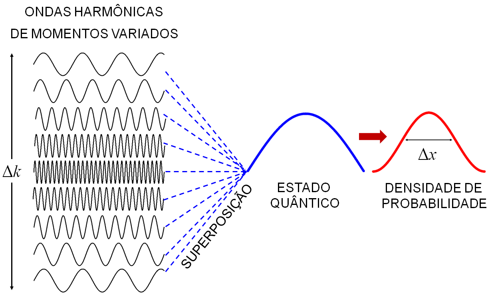
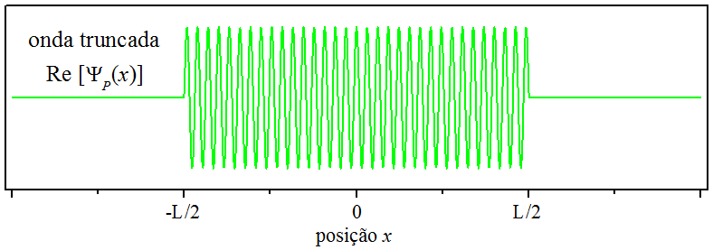
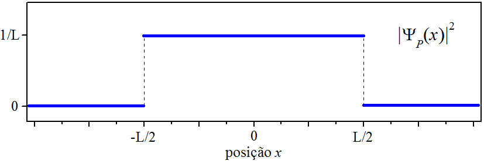
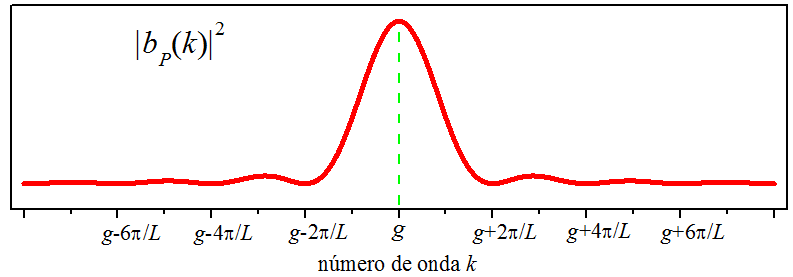
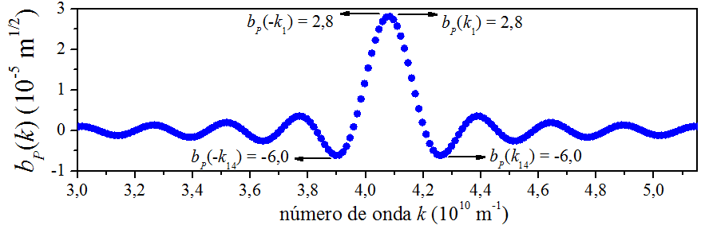
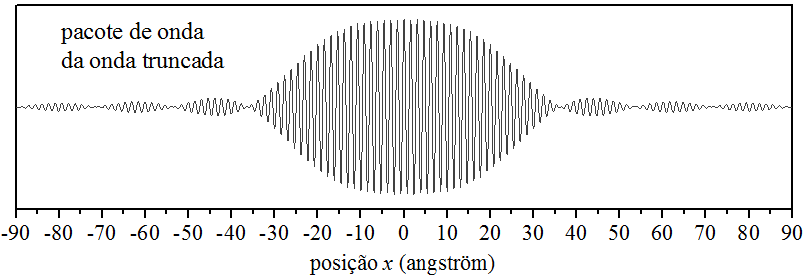

# A PARTÍCULA COMO PACOTE DE ONDAS {#Cap05}

## Introdução  {#Intro05}

No [ capítulo \@ref(Cap04) ],
tratamos da partícula totalmente delocalizada [ seção \@ref(ParticulaD) ]
e vimos que ela é uma onda harmônica totalmente delocalizada.
Também, tratamos da partícula totalmente localizada [ seção \@ref(ParticulaL) ]
e vimos que ela pode ser representada por um pulso delta totalmente localizado.

Em situação mais realistas, a onda de matéria quântica se apresenta _parcialmente_ localizada 
no espaço da posição e _parcialmente_ localizada no espaço do momento,
podendo ser representada como um pacote de ondas.

## A partícula como pacote de ondas   {#ParticulaP}

A Fig. \@ref(fig:FIG18)
ilustra o processo de sobreposição de ondas harmônicas na formação de um estado quântico
_parcialmente_ localizada no espaço da posição.

Nota: O momento $\hbar k$, com $\hbar$, 
é o momento da partícula com unidade de momento.
Porém, por motivo de simplicidade,
o momento da partícula é muitas vezes expresso como `momento k`, sem $\hbar$.

(\#fig:FIG18)A formação em um estado quântico.

Ondas harmônicas com variados momentos dão origem ao estado quântico, que por sua vez, gera a densidade de
probabilidade. O tamanho do desvio padrão do momento $\Delta k$, é proporcional a gama de momentos utilizados
no pacote de ondas. Por sua vez, o tamanho do desvio padrão da posição $\Delta x$,
é dependente de $\Delta k$ através do princípio da incerteza. 

Nessa seção, vamos analisar uma onda harmônica _truncada_,
uma onda que se apresenta _parcialmente_ localizada no espaço da posição e do momento.
Conforme aparece na Fig. \@ref(fig:FIG19), tal onda é chamada de pulso harmônico.

(\#fig:FIG19)Um pulso harmônico.

O pulso da Fig. \@ref(fig:FIG19) tem comprimento $L$ 
e o comprimento de onda $\lambda_0$, portanto, número de onda $k_0=2\pi /\lambda_0$, 
e é escrito como:

$$
\begin{aligned}
\Psi_{\rm P}(x) &= C\mathrm{e}^{\large ik_0x}, & {\rm se} \,\,\, -L/2 \leqslant x \leqslant L/2  ,\\
                &= 0,                        & {\rm fora\ de\ } L .
\end{aligned}
(\#eq:MAX147)
$$

Nota: Incorporamos o ${\rm P}$, de pulso, na notação.

A constante $C$ é determinada pela condição de normalização:

$$
\int_{-L/2}^{+L/2} C\mathrm{e}^{\large -ik_0x} C\mathrm{e}^{\large ik_0x} = 1 .
(\#eq:MAX148)
$$

A integral \@ref(eq:MAX148) é de fácil resolução, o que nos leva ao pulso normalizado:

$$
\begin{aligned}
\Psi_{\rm P}(x) &= \frac{1}{\sqrt{L}} \mathrm{e}^{\large ik_0x} ,
& {\rm se} \,\,\, -L/2 \leqslant x \leqslant L/2 ,\\
                &= 0 ,
& {\rm fora\ de\ } L .
\end{aligned}
(\#eq:MAX149)
$$

A densidade de probabilidade da posição é constante dentro do truncamento,
conforme equação \@ref(eq:MAX150) e perfil mostrado na Fig. \@ref(fig:FIG20).

$$
\begin{aligned}
|\Psi_{\rm P}(x)|^2 &= \frac{1}{L} & {\rm se} \,\,\, -L/2 \leqslant x \leqslant L/2  ,\\
                    &= 0,          & {\rm fora\ de\ } L .
\end{aligned}
(\#eq:MAX150)
$$

(\#fig:FIG20)A densidade de probabilidade da posição do pulso.

Agora vamos escrever a onda truncada [ equação \@ref(eq:MAX149) ] como superposição [ seção \@ref(PrinSuper) ]
de ondas harmônicas [ autoestados do operador $\widehat p$ ]:
 
$$
\Psi_{\rm P}(x)=\frac{1}{\sqrt{2\pi}} \int_{-\infty}^{+\infty} b_{\rm P}(k) \mathrm{e}^{\large ikx} \mathrm{d}k.
(\#eq:MAX151)
$$

Na matemática frequentemente encontramos pares de funções relacionadas por expressões \@ref(eq:MAX151).
A função $\Psi_{\rm P}$ é denominada transformada de Fourier 
da função $b_{\rm P}$ pelo núcleo $\mathrm{e}^{\large ikx}$.
O coeficiente da superposição é determinado pela transformada de Fourier inversa:

$$
b_{\rm P}(k) =\frac{1}{\sqrt{2\pi}} \int_{-\infty}^{+\infty} \mathrm{e}^{\large -ikx} \Psi_{\rm P}(x) \mathrm{d}x.
(\#eq:MAX152)
$$

Substituindo \@ref(eq:MAX149) em \@ref(eq:MAX152), temos:

$$
b_{\rm P}(k) =\frac{1}{\sqrt{2\pi L}} \int_{-L/2}^{+L/2} \mathrm{e}^{\large -i(k-k_0)x} \mathrm{d}x.
(\#eq:MAX153)
$$

Numa tabela de integrais, podemos encontrar o resultado da integral \@ref(eq:MAX153): 
 
$$
b_{\rm P}(k) = \sqrt{\frac{2}{\pi L}} \frac{\mathrm{sen} \left[ \frac{L}{2}(k-k_0) \right]}{k-k_0}.
(\#eq:MAX154)
$$

Podemos interpretar $b_{\rm P}$ como uma função de onda no espaço do momento,
geradora da seguinte densidade de probabilidade: 

$$
|b_{\rm P}(k)|^2 =\frac{2}{\pi L} \frac{\mathrm{sen}^2 \left[ \frac{L}{2}(k-k_0) \right]}{(k-k_0)^2}.
(\#eq:MAX155)
$$

No espaço do momento, a densidade de probabilidade do pluso não é constante.
Ela tem um pico acentuando em $k=k_0$, conforme gráfico de \@ref(eq:MAX155), visto na 
Fig. \@ref(fig:FIG21).

(\#fig:FIG21)A densidade de probabilidade do momento do pulso.

Uma onda harmônica [ $-\infty < x < \infty$ ],
construída com o número de onda $k_0$, somente pode manifestar o momento $k_0$.
Mas um pulso harmônico [ $-L/2 < x < L/2$ ], construído com o mesmo número de onda,
além de $k_0$, pode manifestar outros momentos.
À primeira vista, 
poderíamos _erroneamente_ pensar que 
a onda truncada tivesse somente o momento $k_0$.
Mas a curva da Fig. \@ref(fig:FIG21) deixa claro que existem _muitos_ momentos envolvidos,
distribuídos pelo eixo $k$. Vejam quantos momentos existem apenas ao redor do momento central $k_0$.
Estes são mais prováveis de ocorrer, pois compõem o pico da densidade de probabilidade,
em outras palavras,
a probabilidade da medição do momento dar resultados ao redor do pico central,
é determinada pela área da curva sob o pico central, por se tratar da maior área da curva,
os momentos ao redor desse pico são os mais prováveis de ocorrer.

Chegamos à conclusão de que para se truncar uma onda há necessidade de um pacote de ondas 
harmônicas com _vários_ momentos! O motivo é que, fora da região do truncamento,
a função de onda da posição necessita ser _nula_,
algo apenas realizável se houver muitas ondas se sobrepondo _destrutivamente_.

## A construção do pacote de ondas

Uma onda pode ser escrita na forma de um pacote de ondas harmônicas de momentos variados.
Há momentos que dão mais peso ao pacote do que outros, 
são aqueles ao redor do pico do coeficiente de superposição.
Naturalmente, para reproduzir a onda original, exatamente como ela é,
há necessidade de usarmos a gama completa de momentos.
Mas podemos _aproximar_ a onda original utilizando apenas os momentos mais influentes.

Vimos a onda truncada na [ seção \@ref(ParticulaP) ].
Agora tentaremos reproduzi-la através de um pacote _parcial_ de ondas harmônica. Então, 
vamos escrever novamente a onda truncada como superposição de ondas harmônicas [ autoestados de $\widehat p$ ]:
 
$$
\Psi_{\rm P}(x)=\frac{1}{\sqrt{2\pi}} \int_{-\infty}^{+\infty} b_{\rm P}(k) \mathrm{e}^{\large ikx} \mathrm{d}k._{}
(\#eq:MAX156)
$$

É claro, para termos uma representação gráfica,
trabalharemos apenas com a _parte real_ da exponencial complexa, cosseno,
e transformaremos a integral $\int_{-\infty}^{+\infty}$ na seguinte somatória:
 
$$
\Psi_{\rm P}(x)=\frac{1}{\sqrt{2\pi}} \sum_{i} b_{\rm P}(k_i) \mathrm{cos}(k_ix).
(\#eq:MAX157)
$$

A Fig. \@ref(fig:FIG22) mostra o contorno do coeficiente de superposição
para a onda truncada, função $b_{\rm P}$,
lembrando que na Fig. \@ref(fig:FIG21) temos $b_{\rm P}^{\ast}b_{\rm P}$.
Foram feitas para $\lambda_0=1,\!54 \ \unicode{xC5}$, o que implica em
$k_0 = 408 \times 10^{8}\ {\rm m^{-1}}$.

(\#fig:FIG22)O coeficiente de superposição para a onda truncada.

O pacote parcial é então construído com apenas alguns valores de $b_{\rm P}$, aqueles ao redor do pico central. 
Do lado direito e esquerdo do pico, foram selecionados 28 pontos 
– apresentamos apenas 4 na Fig. \@ref(fig:FIG22).

A somatória [ equação \@ref(eq:MAX157) ] de 28 ondas harmônicas [ cossenos ],
ponderada com os 28 termos selecionados de $b_{\rm P}$, gerou uma onda truncada 
parecida com a onda truncada original [ Fig. \@ref(fig:FIG19) ],
conforme se vê na Fig. \@ref(fig:FIG23).

(\#fig:FIG23)O pacote parcial de ondas para a onda truncada.

Por causa da aproximação, o pacote parcial não saiu exatamente igual ao pulso harmônicas original,
como era de se esperar. O problema pode ser amenizado, aumentando o número de termos desse pacote.
Também observamos pequenas ondulações fora da região do truncamento, são de pouca intensidade, mas estão lá!
Elas aparecem nos locais de grande manifestação do fenômeno de interferência destrutiva.
Pelo visto, o pacote parcial também não foi capaz de transformar essa região num “vazio de ondas”,
como se vê na onda truncada original.

Enfim, a construção do pacote de ondas nos ajudou
a entender o funcionamento da equação \@ref(eq:MAX156).

