# O POÇO RETANGULAR INFINITO {#Cap06}

## Introdução  {#Intro06}

Nas [ seções \@ref(ParticulaD) e \@ref(ParticulaL) ],
apresentamos o operador associado ao momento linear [ $\widehat p$ ]
e o operador associado à posição [ $\widehat x$ ].
Agora vamos tratar de um operador que está em correspondência com a _energia total_ de uma onda de matéria,
o operador da energia total $\widehat H$.

O operador $\widehat H$ é composto de dois termos.
Em relação à função alvo,
o primeiro termo instrui que realizemos a derivada segunda dessa função e,
depois, multipliquemos o resultado dessa derivada por uma constante.
O segundo termo instrui que a função alvo seja multiplicada pelo
potencial que perturba o espaço em que a partícula se encontra. 
Matematicamente, o operador $\widehat H$ é assim:

$$
\widehat H = -\frac{\hbar^2}{2m}  \frac{\mathrm{d}^2}{\mathrm{d}x^2} + V(x).
(\#eq:MAX158)
$$

A equação de autovalor do operador da energia total é do tipo:

$$
\widehat H \psi_E(x) = E \psi_E(x).
(\#eq:MAX159)
$$

Onde o subscrito $E$ subentende que a autofunção $\psi_E$ está associada ao autovalor $E$.

Substituindo \@ref(eq:MAX158) em \@ref(eq:MAX159), temos:

$$
-\frac{\hbar^2}{2m} \frac{\mathrm{d}^2 \psi_E(x) }{\mathrm{d}x^2} + V(x) \psi_E(x) = E \psi_E(x).
(\#eq:MAX160)
$$

Lembramos que \@ref(eq:MAX160) é a equação de Schrödinger independente do tempo [ seção \@ref(EstaEstaci) ].

O caso introdutório, no manuseio do operador da energia total,
será o da __partícula livre__.

Nota: o _livre_ de parícula livre é para indicar que tal partícula 
não sofre restrições de movimento, é para indicar que $V(x)=0$.

Na ausência de potencial, a equação \@ref(eq:MAX160) fica mais simples de resolver:

$$
-\frac{\hbar^2}{2m} \frac{\mathrm{d}^2 \psi_E(x) }{\mathrm{d}x^2} = E \psi_E(x).
(\#eq:MAX161)
$$

Podemos chamar,

$$
k^2 = \frac{2mE}{\hbar^2}.
(\#eq:MAX162)
$$

Desse modo, a equação \@ref(eq:MAX161) fica compacta,

$$
\frac{\mathrm{d}^2 \psi_E(x) }{\mathrm{d}x^2} = -k^2 \psi_E(x),
(\#eq:MAX163)
$$

e de solução trivial,

$$
\psi_E(x) = C\mathrm{e}^{\large ikx}.
(\#eq:MAX164)
$$

Na [ seção \@ref(ParticulaD) ], vimos \@ref(eq:MAX164) como solução do operador $\widehat p$.
Agora vemos \@ref(eq:MAX164) como solução do operador $\widehat H$.
Concluímos, então, que na falta de um potencial,
os autoestados de $\widehat p$ também são autoestados de $\widehat H$.

Agora sobre a energia, podemos isolar $E$ da equação \@ref(eq:MAX162):

$$
E(k) = \frac{\hbar^2 k^2}{2m}.
(\#eq:MAX165)
$$

Visto que o número de onda $k$ pode percorrer de $-\infty$ até $+\infty$,
a energia da partícula livre é contínua, $0 < E < +\infty$.

## A função de onda da posição   {#FunPosi}

Na introdução [ seção \@ref(Intro06) ], resolvemos o caso da partícula livre.
Agora vamos tratar do caso da partícula confinada em um segmento do espaço.
O poço de potencial que causa o confinamento terá paredes de altura infinita,
seu perfil é apresentado na Fig. \@ref(fig:FIG24). 

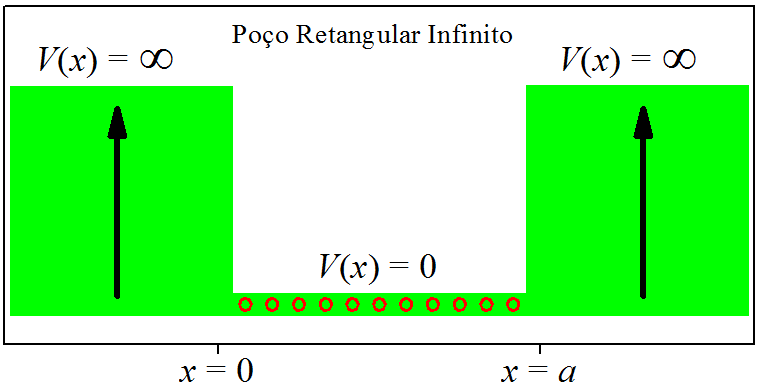

(\#fig:FIG24)O poço retangular infinito.

Matematicamente, o poço retangular infinito pode ser escrico assim:

$$
\begin{aligned}
V(x) &= 0,      & {\rm se\ \ } & 0 < x < a                                   ,\\
     &= \infty, & {\rm se\ \ } & x \leqslant 0 {\rm \ \ e\ \ } x \geqslant a .
\end{aligned}
(\#eq:MAX166)
$$

Basicamente, ficamos com duas equações de Schrödinger para resolver:
uma dentro do poço [ com $V=0$ ] e outra fora [ com $V=\infty$ ].

Dentro do poço, temos a solução da partícula livre, mas precisamos pensar em 
duas ondas se sobrepondo [ seção \@ref(SentidoPropaga) ]:
uma onda caminhando para a direita, com função $A\mathrm{e}^{\large ikx}$,
e outra onda caminhando no sentido contrário, com função $B\mathrm{e}^{\large -ikx}$.
O motivo de escolhermos essas duas ondas é para levar em conta as reflexões que ocorrem nas paredes do poço.
Assim, as ondas que caminham em sentidos opostos sofrem interferência uma da outra.
Como se vê, o estado dentro do poço é um estado de superposição:

$$
\psi(x) = A\mathrm{e}^{\large ikx} + B\mathrm{e}^{\large -ikx}.
(\#eq:MAX167)
$$

Agora vamos analisar o que acontece fora do poço.

A partícula _não_ pode ser encontrada fora do poço, pois o potencial é infinito. 
Não poder ser encontrada significa $\psi=0$.
Então $\psi=0$ deve ocorrer nas duas interfaces: $\psi(0)=0$ e $\psi(a)=0$.

Substituindo $\psi(0)=0$ na equação \@ref(eq:MAX167), encontramos: 

$$
0 = A + B   \implies   B = -A.
(\#eq:MAX168)
$$

O resultado \@ref(eq:MAX168), levado à equação \@ref(eq:MAX167),
simplifica a solução dentro do poço:

$$
\psi(x) = A \left( \mathrm{e}^{\large ikx} - \mathrm{e}^{\large -ikx} \right) .
(\#eq:MAX169)
$$

Usando a relação matemática 
$\mathrm{e}^{\large \pm ikx} = \mathrm{cos}(kx) \pm \mathrm{sen}(kx)$ 
na equação \@ref(eq:MAX169), ficamos com:

$$
\psi(x) = 2iA \mathrm{sen}(kx).
(\#eq:MAX170)
$$

A solução \@ref(eq:MAX170) deve passar pelo processo de normalização:

$$
\int_{-\infty}^{+\infty} |\psi(x)|^2 \mathrm{d}x=1 \implies 4|A|^2 \int_{0}^{a} |\mathrm{sen}(kx)|^2 \mathrm{d}x=1.
(\#eq:MAX171)
$$

Em tabelas de integral encontramos:

$$
\int_{0}^{a} |\mathrm{sen}(kx)|^2 \mathrm{d}x= \frac{a}{2}._{}
(\#eq:MAX172)
$$

Ao substituir o resultado \@ref(eq:MAX172) em \@ref(eq:MAX171):

$$
|A|^2 = A^{\ast} A = \frac{1}{2a}.
(\#eq:MAX173)
$$

O resultado \@ref(eq:MAX173) não esclarece se $A$ é um número real ou complexo. 
Isso fica para nós escolhermos. É preferível que a solução dentro do poço seja uma função real,
para que isso ocorra, podemos escolhemos que $A$ seja o seguinte número complexo:

$$
A =  \frac{1}{ i \sqrt{2a} }.
(\#eq:MAX174)
$$

Substituindo \@ref(eq:MAX174) em \@ref(eq:MAX170),
a função de onda dentro do poço passa a ser:

$$
\psi(x) = \sqrt{\frac{2}{a}} \mathrm{sen}(kx).
(\#eq:MAX175)
$$

Ainda falta analisar a condição $\psi(a)=0$.
Então, vamos substituir essa condição na equação \@ref(eq:MAX175): 

$$
0 = \sqrt{\frac{2}{a}} \mathrm{sen}(ka).
(\#eq:MAX176)
$$

O que torna a equação \@ref(eq:MAX176) verdadeira é:

$$
ka = n\pi  \implies k_n = \frac{n\pi}{a}, \ \ \ {\rm com}  \ \ n=1,2,3...
(\#eq:MAX177)
$$

Descartamos em \@ref(eq:MAX177) a possibilidade $n=0$ por se tratar de uma onda inexistente.
Ademais, incorporamos o subscrito $n$ na notação. 
Ele é chamado de _número quântico principal_ 
e indica que a grandeza é discreta: acabamos de "descobrir" a _quantização_!

Nota: A seção \@ref(DenMomento) vai aprofundar o entendimento do
papel do número de onda $k_n$ no poço retangular infinito.

Levando o resultado \@ref(eq:MAX177) em \@ref(eq:MAX175),
chegamos à solução final do poço retangular infinito:

$$
\psi_n(x) = \sqrt{\frac{2}{a}} \mathrm{sen} \left( \frac{n\pi}{a} x \right).
(\#eq:MAX178)
$$

Por causa da quantização do número de onda \@ref(eq:MAX177),
os estados \@ref(eq:MAX178) dentro do poço são discretos.

Sobre a energia, 
enquanto a partícula livre possui um espectro de energia contínuo [ seção \@ref(Intro06) ],
também por causa de \@ref(eq:MAX177),
a partícula confinada no poço retangular infinito apresenta um espectro discreto, ou seja,
a energia é quantizada:

$$
E_n = \frac{\hbar^2 k_n^2}{2m}.
(\#eq:MAX179)
$$

${\large \bullet \ }$ Um exemplo numérico.

Nosso objetivo é ver o contorno das funções de onda e determinar as energias de confinamento.
Dentro de um poço infinito de largura $a=100\ \unicode{xC5}$, vamos colocar um eletron.
Sabemos que a massa do elétron é $m = 9,\!1 \times 10^{-31} \, {\rm kg}$.
Também sabemos que $\hbar = 1,\!055 \times 10^{-34} \, {\rm Js}$,
que é o mesmo que $\hbar = 6,\!582 \times 10^{-16} \, {\rm eVs}$.
Colocando esses valores nas relações \@ref(eq:MAX179) e \@ref(eq:MAX177),
calculamos para $n=$ $1$, $2$, $3$ e $4$:

$$
\begin{aligned}
E_1 &=3,\!8  \ {\rm meV}, &  k_1 &=3,\!14  \times 10^{8} \ {\rm m}^{-1} ,\\
E_2 &=15,\!0 \ {\rm meV}, &  k_2 &=6,\!28  \times 10^{8} \ {\rm m}^{-1} ,\\
E_3 &=33,\!9 \ {\rm meV}, &  k_3 &=9,\!43  \times 10^{8} \ {\rm m}^{-1} ,\\
E_4 &=60,\!2 \ {\rm meV}, &  k_4 &=12,\!57 \times 10^{8} \ {\rm m}^{-1} .
\end{aligned}
(\#eq:MAX180)
$$

A Fig. \@ref(fig:FIG25)
compara as energias do elétron confinado no poço retangular infinito com as energias do elétron livre.
Enquanto a partícula livre possui um espectro contínuo,
torna-se claro o fenômeno da quantização da energia manifestado pela partícula confinada.

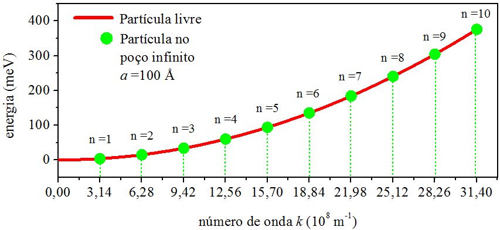

(\#fig:FIG25)A quantização da energia.

Submetendo os mesmos dados em \@ref(eq:MAX178),
a Fig. \@ref(fig:FIG26) apresenta o perfil das funções de onda da posição. 

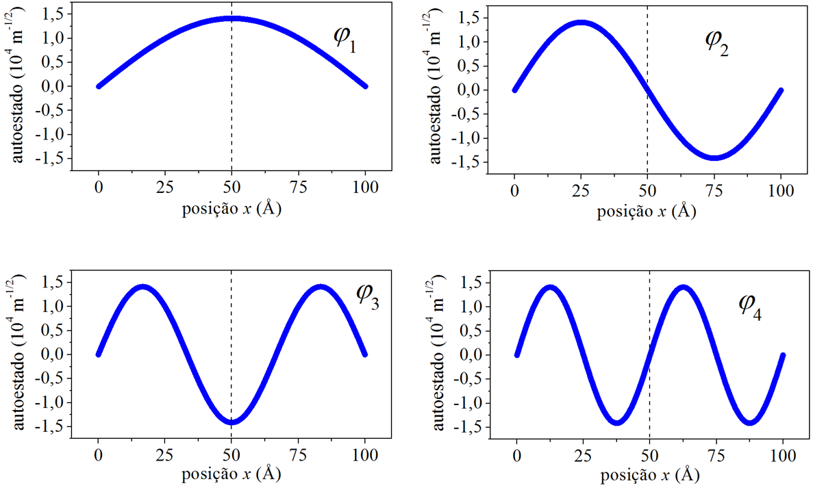

(\#fig:FIG26)As funções de onda da posição.

As funções de onda são pares ou ímpares com respeito ao centro do poço,
à medida que o número quântico principal $n$ aumenta.
Também, com o aumento de $n$, cresce o número de zeros da solução.
Uma inspeção visual nos permite dizer que o número de zero é igual a $n-1$.

## A densidade de probabilidade da posição 

Tendo determinado as funções de onda da posição para o poço retangular infinito
[ Fig. \@ref(fig:FIG26) ], a densidade de probabilidade da posição se escreve,

$$
|\psi_n(x)|^2 = \frac{2}{a} \mathrm{sen}^2 \left( \frac{n\pi}{a} x \right),
(\#eq:MAX181)
$$

e tem o perfil apresentado na Fig. \@ref(fig:FIG27)
[repetindo os mesmos dados da Fig. \@ref(fig:FIG26)].

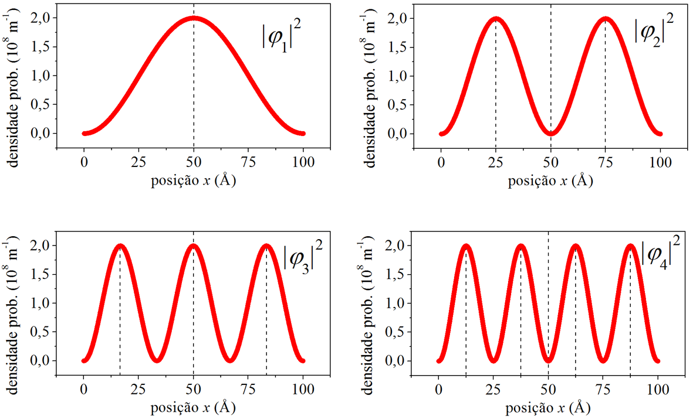

(\#fig:FIG27)As densidades de probabilidade da posição.

A densidade de probabilidade da posição oscila [ seção \@ref(DisPeriodica) ].
A quantidade de máximos da oscilação é igual $n$,
e o período espacial da oscilação é igual a $\delta x=a/n$.
Por exemplo, a densidade de probabilidade $n=1$ apresenta apenas $1$ máximo 
e $\delta x=100\ \unicode{xC5}$
[ devemos lembrar que o poço em questão possui largura $a=100\ \unicode{xC5}$ ].
Ela não é periódica. 
As demais densidades de probabilidade são periódicas. 
Por exemplo, densidade de probabilidade $n=2$ possui $2$ máximos
e $\delta x=50\ \unicode{xC5}$, e assim por diante.
Para $n$ elevado, o período espacial se torna tão pequeno que a densidade de probabilidade 
tende a se comportar como uma constante, na qual as posições são igualmente prováveis.
Dizemos, então, que a partícula deixa de ter caráter quântico e passa a agir 
como uma partícula clássica.
A Fig. \@ref(fig:FIG28)
ilustra  a perda do caráter quântico, mostrando a densidade de probabilidade $n=100$,
com $100$ picos e $\delta x=1\ \unicode{xC5}$.

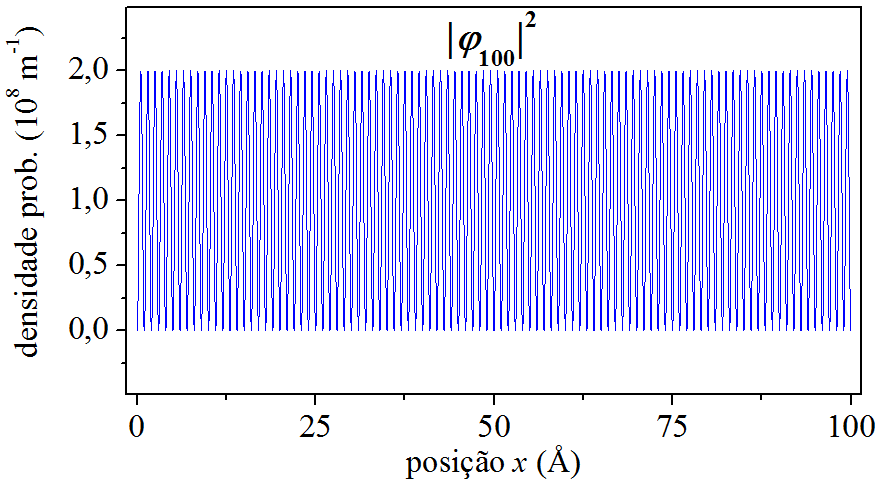

(\#fig:FIG28)A perda do caráter quântico para $n=100$.

## O desvio padrão da posição   {#DesPosi}

As médias ponderadas com a densidade de probabilidade da posição
são calculadas por integrais que cobrem todo espaço [ seção \@ref(DisQuantica) ].
Mas, por causa das funções de onda do poço infinito só existirem dentro do poço,
as integrações se limitam à largura do poço:

$$
\langle x \rangle _n = \int_{0}^{a} x |\psi_n(x)|^2\ \mathrm{d}x = \frac{a}{2},
(\#eq:MAX182)
$$

$$
\langle x^2 \rangle _n
= \int_{0}^{a} x^2 |\psi_n(x)|^2\ \mathrm{d}x
= \frac{a^2}{3} \left( 1 - \frac{3}{2\pi ^2 n^2} \right) .
(\#eq:MAX183)
$$

Com os resultados acima, poderemos determinar o desvio padrão da posição:

$$
\Delta x_n
= \sqrt{ \langle x^2 \rangle_n - \langle x \rangle^2_n }
= a \sqrt{ \frac{1}{12} - \frac{1}{2\pi^2 n^2} } .
(\#eq:MAX184)
$$

Se montarmos uma experiência para _medir a posição_ de uma partícula preparada no autoestado $\psi_n$ de um poço
infinito de largura $a$, firmada na seguinte hipótese: após cada medição, a partícula é colocada novamente em $\psi_n$,
temos motivos estatísticos para afirmar que a posição média dessa partícula será $a/2$
 – pouco importando o estado da partícula, pois a média \@ref(eq:MAX182) independe de $n$.

Sobre o desvio padrão \@ref(eq:MAX184), percebemos que ele aumenta à medida que a partícula é colocada em
autoestados superiores. No limite de $n$ tendendo ao infinito, o desvio padrão tende ao valor limite
igual a $a/\sqrt{12}$.
Considerando o poço retangular infinito de largura $a=100\ \unicode{xC5}$, 
a Fig. \@ref(fig:FIG29)
mostra o comportamento de $\Delta x_n$ em função de $n$.

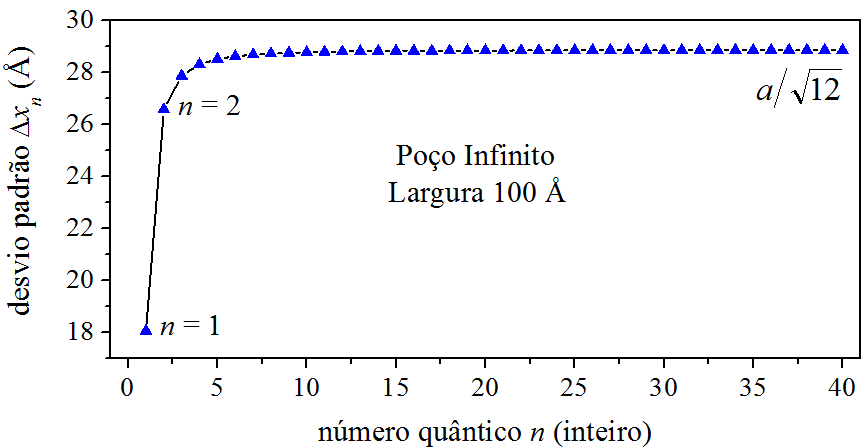

(\#fig:FIG29)Desvio padrão em função do número quântico principal.

Como vemos na Fig. \@ref(fig:FIG29),
o desvio padrão parte de $\Delta x_1=18,\!0\ \unicode{xC5}$, 
aumenta para $\Delta x_2=26,\!6\ \unicode{xC5}$ e, ao redor de $n=20$,
se acomoda no patamar $28,\!9\ \unicode{xC5}$.
Observa-se que a posição da partícula fica cada vez mais incerta.
Isso é reflexo do perfil da densidade de probabilidade: Na Fig. \@ref(fig:FIG27),
a densidade de probabilidade para $n$ alto é mais dispersiva que a densidade de probabilidade para $n$ baixo.

## A função de onda do momento   {#FunMomento}

Na [ seção \@ref(ParticulaP) ], 
escrevemos a onda truncada como um pacote de autoestados do operador do momento $\widehat p$
[ seção \@ref(ParticulaD) ].
Agora vamos repetir o procedimento com as funções de onda da posição provenientes do poço retangular infinito
[ seção \@ref(FunPosi) ]:

$$
\psi_n(x)=\frac{1}{\sqrt{2\pi}} \int_{-\infty}^{+\infty} \phi_n(k) \mathrm{e}^{\large ikx} \mathrm{d}k.
(\#eq:MAX185)
$$

O coeficiente da superposição é interpretado como _função de onda do momento_.
É determinado através da transformada de Fourier inversa:

$$
\begin{aligned}
\phi_n(k)
&=\frac{1}{\sqrt{2\pi}} \int_{-\infty}^{+\infty} \mathrm{e}^{\large -ikx} \psi_n(x) \mathrm{d}x \\
&=\frac{1}{\sqrt{2\pi}} \sqrt{\frac{2}{a}} \int_{-\infty}^{+\infty}
\mathrm{e}^{\large -ikx} \mathrm{sen} \left( \frac{n\pi}{a} x \right) \mathrm{d}x .
\end{aligned}
(\#eq:MAX186)
$$

A dica para resolver a integral \@ref(eq:MAX186) é fazer a seguinte substituição:
 
$$
\mathrm{sen} \left( \frac{n\pi}{a} x \right) =
\frac{\mathrm{e}^{\large i \frac{n\pi}{a}x} -\mathrm{e}^{\large -i\frac{n\pi}{a}x} }{2i} .
(\#eq:MAX187)
$$

Exige um pouco de trabalho até chegarmos à expressão final da função de onda do momento:

$$
\begin{aligned}
\phi_n(k) 
&= \frac{1}{i} \sqrt{\frac{a}{4\pi}}
\mathrm{e}^{\large -i \left( \frac{n\pi}{2} - \frac{ka}{2} \right) }
\times
\\
&\times
\left(
\frac{ \mathrm{sen} \left( \frac{n\pi}{2} - \frac{ka}{2} \right) }{\frac{n\pi}{2} - \frac{ka}{2}}
+(-1)^{n+1}
\frac{ \mathrm{sen} \left( \frac{n\pi}{2} + \frac{ka}{2} \right) }{\frac{n\pi}{2} + \frac{ka}{2}}
\right).
\end{aligned}
(\#eq:MAX188)
$$

Lembrando que $k_n = \frac{n\pi}{a}$, eis nossa "equaçãozinha" alternativa:

$$
\begin{aligned}
\phi_n(k) 
&= \frac{1}{i} \sqrt{\frac{a}{4\pi}}
\mathrm{e}^{\large -i \left[ \frac{a}{2}(k_n - k) \right] }
\times
\\
&\times
\left( 
\frac{ \mathrm{sen} \left[ \frac{a}{2}(k_n - k) \right] }{\frac{a}{2}(k_n - k)}
+(-1)^{n+1}
\frac{ \mathrm{sen} \left[ \frac{a}{2}(k_n + k) \right] }{\frac{a}{2}(k_n + k)}
\right).
\end{aligned}
(\#eq:MAX188B)
$$

## A densidade de probabilidade do momento   {#DenMomento}

Na [ seção \@ref(FunMomento) ], deduzimos a função de onda do momento.
Agora podemos escrever a densidade de probabilidade do momento:

$$
\begin{aligned}
|\phi_n(k)|^2 
&= \frac{a}{4\pi}
\times
\\
&\times
\left( 
\frac{ \mathrm{sen} \left( \frac{n\pi}{2} - \frac{ka}{2} \right) }{\frac{n\pi}{2} - \frac{ka}{2}}
+(-1)^{n+1}
\frac{ \mathrm{sen} \left( \frac{n\pi}{2} + \frac{ka}{2} \right) }{\frac{n\pi}{2} + \frac{ka}{2}}
\right)^2.
\end{aligned}
(\#eq:MAX189)
$$

Ou, na forma que exprime $k_n$:

$$
\begin{aligned}
|\phi_n(k)|^2 
&= \frac{a}{4\pi}
\times
\\
&\times
\left( 
\frac{ \mathrm{sen} \left[ \frac{a}{2}(k_n - k) \right] }{\frac{a}{2}(k_n - k)}
+(-1)^{n+1}
\frac{ \mathrm{sen} \left[ \frac{a}{2}(k_n + k) \right] }{\frac{a}{2}(k_n + k)}
\right)^2.
\end{aligned}
(\#eq:MAX189B)
$$

Alimentando \@ref(eq:MAX189) ou \@ref(eq:MAX189B) com os mesmos dados da [ seção \@ref(FunPosi) ],
podemos graficar a densidade de probabilidade do momento e discutir seu comportamento.
Por exemplo, para o elétron no estado $\psi_1$
do poço retangular infinito de largura $a=100\ \unicode{xC5}$,
a curva de $|\phi_1|^2$ é vista na 
Fig. \@ref(fig:FIG30)

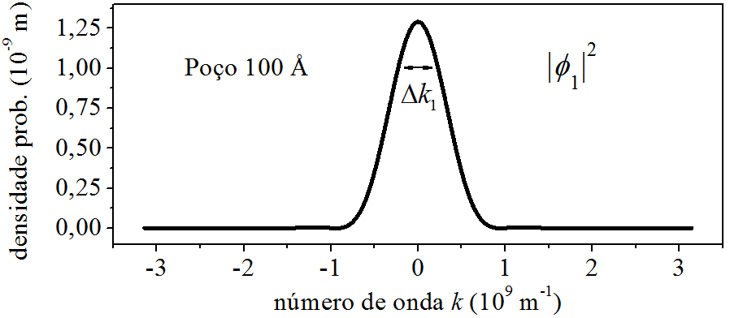

(\#fig:FIG30)Densidade de probabilidade do momento para $n=1$.

Observamos que há apenas um pico, em torno de $k=0$.
Observamos também que há uma gama de momentos distribuídos ao longo do eixo $k$.
Isso nos faz pensar que o elétron ocupando o estado $\psi_1$ do poço infinito,
não está em um estado de momento único, mas numa superposição de estados de momentos variados.
Em uma medição do momento do elétron,
os valores ao redor do pico são os mais prováveis de ocorrer,
já os afastados, também poderão ocorrer, mas tendem a não acontecer.
Tratando de um segmento de momentos,
a área que começa em $k=g_1$ e termina em $k=g_2$,
fornece a probabilidade de um resultado estar entre $g_1$ e $g_2$:

$$
{\rm Pr}( g_1 < k < g_2 ) = \int_{g_1}^{g_2} |\phi_1(k)|^2 \mathrm{d}k.
(\#eq:MAX190)
$$

O $k_1$, de valor $\pi/a = 3,\!14 \times 10^{8}\ {\rm m^{-1}}$,
é o número de onda $-{\rm \ geométrico \ }-$
que desenha a função de onda da posição $\psi_1$ pelo espaço da posição.
Ele entra na expressão da função de onda do momento $\phi_1$,
contribuindo para o desenho do pico de eventos mais prováveis e da deriva de eventos menos próváveis.
O $k_1$ ${\rm não}$ é o momento exclusivo do elétron.
Seria ${\rm errado}$ multiplicar o seu valor por $\hbar$
e dizer "o momento exclusivo do elétron é $\hbar k_1$".
O momento $\hbar k$ do elétron tem natureza probabilística, e não geométrica,
por exemplo, tem probabilidade \@ref(eq:MAX190) de ocorrer entre os valores $g_1$ e $g_2$.

E se o elétron subir de estado, indo para  $\psi_2$?
A Fig. \@ref(fig:FIG31) mostra a curva de $|\phi_2|^2$. 

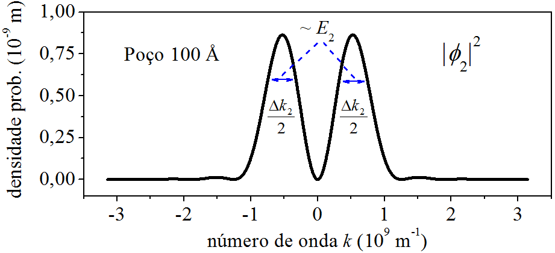

(\#fig:FIG31)Densidade de probabilidade do momento para $n=2$.

Agora a densidade de probabilidada do momento apresenta dois picos.
Em uma medição do momento do elétron,
os valores ao redor dos picos 1 e 2 são os mais prováveis de ocorrer.
Notem que eles se afastaram de $k=0$.
É útil comparar as Figs. \@ref(fig:FIG30) e \@ref(fig:FIG31).
Para facilitar a visão, juntamos as duas na Fig. \@ref(fig:FIG32).

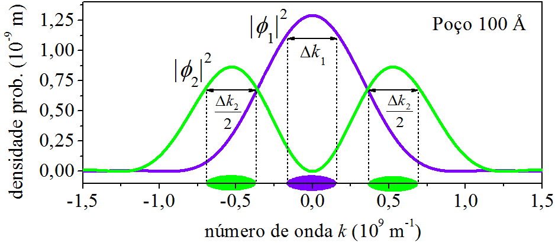

(\#fig:FIG32)Densidades de probabilidade do momento para $n=1$ e $n=2$.

O elétron em $\psi_1$ concentra os momentos ao redor de $k=0$,
manifesta valores baixos.
Já em $\psi_2$, manifesta valores mais altos, ao redor de $k=\pm 5 \times 10^{8}\ {\rm m^{-1}}$.
Isso é decorrente da energia do elétron nos dois casos.
Enquanto que em $n=1$, ele está com $E_1=3,\!8 \ {\rm meV}$,
em $n=2$, sua energia é mais alta, $E_2=15,\!0 \ {\rm meV}$.
Usando da linguagem coloquial:
"Um elétron energético possui momento alto."
E quanto maior a energia do elétron, maior será os valores de momento que ele pode manifestar.
Isso é claro observando as curvas de $|\phi_3|^2$ e $|\phi_4|^2$, 
Fig. \@ref(fig:FIG33).
Nos dois casos, os picos estão _acima_ de $k=\pm 5 \times 10^{8}\ {\rm m^{-1}}$.

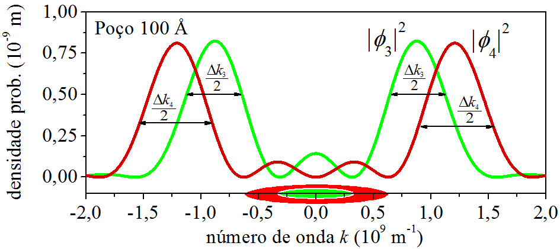

(\#fig:FIG33)Densidades de probabilidade do momento para $n=3$ e $n=4$.

A novidade que aparece na Fig. \@ref(fig:FIG33),
são os momentos menos prováveis _entre_ os valores $k=\pm 5 \times 10^{8}\ {\rm m^{-1}}$.

Mais sobre o papel do número de onda.

O $k_n$ "posiciona" o pico da curva de $|\phi_n|^2$. 
O pico não sai exatamente no mesmo valor do $k_n$,
mas fica próximo, conforme se vê na Fig. \@ref(fig:FIG33R),
casos $n=1$ até $n=4$.
É consequência da mistura!
A equação \@ref(eq:MAX189B) é formada por dois termos.
Cada termo individual tem pico em $k_n$, por causa dos denominadores $(k_n - k)$ e $(k_n + k)$.
Vemos a cointribuição do primeiro termo de \@ref(eq:MAX189B)
através da Fig. \@ref(fig:FIG33RR).
Veja agora como os picos se posicionam exatamente nos valores de $k_n$.

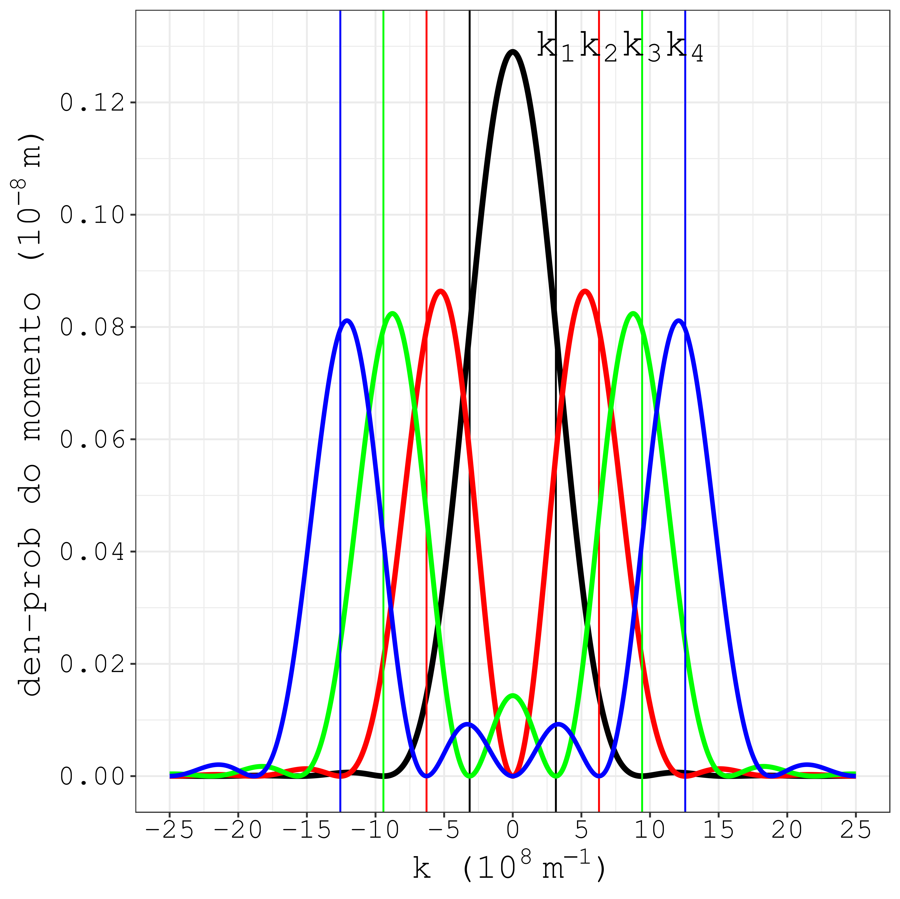

(\#fig:FIG33R)A localização do $k_n$, em relação aos picos de $|\phi_n|^2$, para os casos $n=1$ até $n=4$.

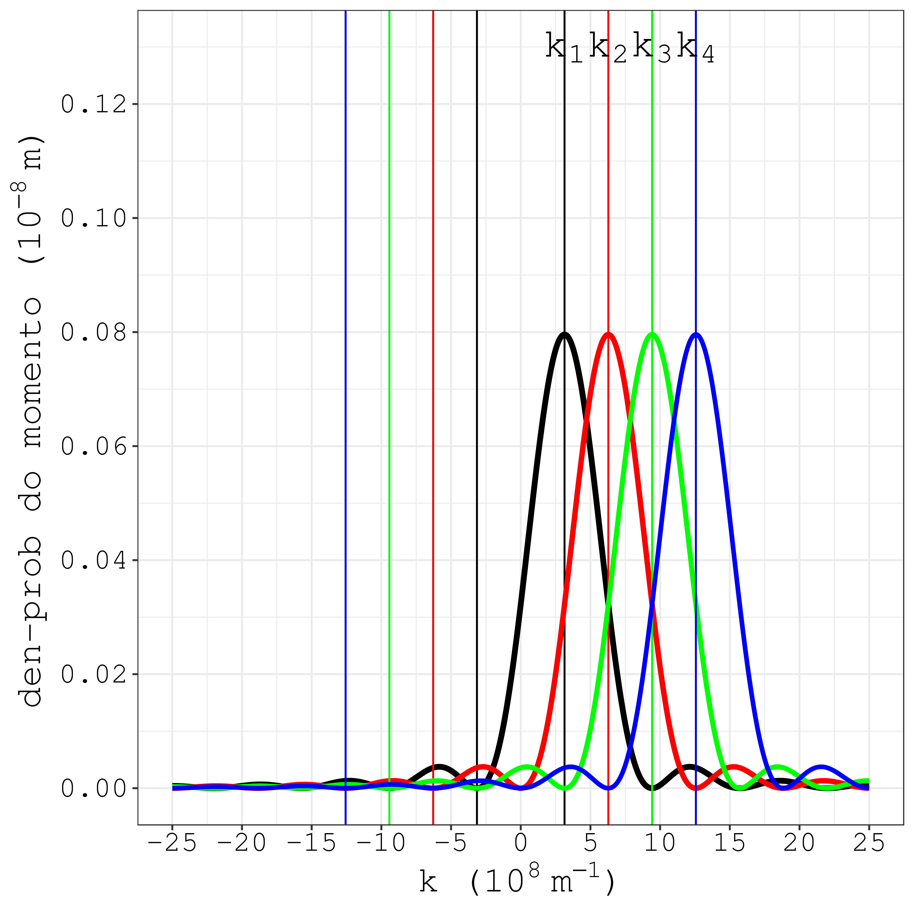

(\#fig:FIG33RR)Apenas a contrubuição do primeiro termo da equação \@ref(eq:MAX189B).

## O desvio padrão do momento   {#DesMomento}

Na [ seção \@ref(DisQuantica) ], vimos como determinar o resultado médio
de uma experiência montada para medir a posição de uma partícula.
Aqui vamos escrever a mesma equação, mas numa forma que ressalte o operador quântico:

$$
\langle x \rangle = \int_{-\infty}^{+\infty} \psi^{\ast}(x) \widehat x \psi(x) \mathrm{d}x._{}
(\#eq:MAX191)
$$

A formulação \@ref(eq:MAX191) também se aplica a outros casos.
Por isso, resultado médio e o resultado médio, ao quadrado, do momento, assim se equacionam:

$$
\langle k \rangle = \int_{-\infty}^{+\infty} \psi^{\ast}(x) \widehat k \psi(x) \mathrm{d}x,_{}
(\#eq:MAX192)
$$

$$
\langle k^2 \rangle = \int_{-\infty}^{+\infty} \psi^{\ast}(x) \widehat k ^2 \psi(x) \mathrm{d}x._{}
(\#eq:MAX193)
$$

Lembrando que [ seção \@ref(EqAuto) ]:

$$
\widehat k = -i\frac{\mathrm{d}}{\mathrm{d}x}.
(\#eq:MAX194)
$$

Escrevemos  $\widehat k ^2 = \widehat k \widehat k$:

$$
\widehat k = -\frac{\mathrm{d^2}}{\mathrm{d}x^2}.
(\#eq:MAX195)
$$

Substituindo as funções de onda da posição referentes ao poço retangular infinito
[ seção \@ref(FunPosi) ]
nas equações \@ref(eq:MAX192) e \@ref(eq:MAX193),
e resolvendo as integrais resultantes, encontramos:

$$
\langle k \rangle _n= 0,_{}
(\#eq:MAX196)
$$

$$
\langle k^2 \rangle _n = \left( \frac{n\pi}{a} \right) ^2._{}
(\#eq:MAX197)
$$

Com os resultados acima, determinamos o desvio padrão do momento:

$$
\Delta k_n = \sqrt{ \langle k^2 \rangle_n - \langle k \rangle^2_n } 
           = \frac{n\pi}{a}.
(\#eq:MAX198)
$$

Como podemos interpretar esses resultados?

Interpretação 1: Se montarmos uma experiência para medir o momento de uma partícula preparada 
em um estado de um poço retangular infinito, firmada na seguinte hipótese:
após cada medição, a partícula é colocada novamente no mesmo estado,
segundo \@ref(eq:MAX196),
há motivos estatísticos para afirmar que o momento médio dessa partícula será zero.

Interpretação 2: Se uma partícula, preparada em um estado de um poço retangular infinito,
subir de estado, a medição de seu momento ficará mais incerta,
pois o desvio padrão do momento \@ref(eq:MAX198) é diretamente proporcional 
ao número quantico principal $n$.

## O princípio da incerteza

Tendo em mãos as expressões das incertezas da posição [ seção \@ref(DesPosi) ]
e do momento [ seção \@ref(DesMomento) ],
podemos ver como fica o produto delas:

$$
\Delta x_n \Delta k_n = \sqrt{ \frac{n^2 \pi^2}{12} -\frac{1}{2} }.
(\#eq:MAX199)
$$

Por causa de $\Delta x_n$ ser diretamente proporcional à largura do poço [ $a$ ],
e $\Delta k_n$ ser inversamente proporcional à largura $a$,
produto \@ref(eq:MAX199) não depende da largura do poço.
Ademais, esse produto aumenta com o aumento do número quântico $n$. 

O _menor_ valor possível para o produto \@ref(eq:MAX199) acontece para o estado $n=1$:

$$
\Delta x_1 \Delta k_1 = 0,\!57.
(\#eq:MAX200)
$$

Na [ seção \@ref(Intro02) ], introduzimos o princípio da incerteza de Heisenberg.
Aqui vamos escrever a mesma relação, porém sem a constante $\hbar$:

$$
\Delta x \Delta k  \geqslant  0,\!50.
(\#eq:MAX201)
$$

Comparando \@ref(eq:MAX200) e \@ref(eq:MAX201), 
concluímos que o poço retangular infinito confirma a relação de Heisenberg.

## O princípio da incerteza, informal

As funções de onda da posição, $\psi_n$, do poço retangular infinito, 
formam um base _discreta_ [ seção \@ref(FunPosi) ].
Um novo estado pode ser construído por meio dessa base,
através de uma combinação linear.
Em certo tempo $t$, esse novo estado pode ser assim escrito:

$$
\Psi (x,t) = \sum_{n=1}^{\infty} c_n \psi_n(x) \mathrm{e}^{\large \frac{-iE_n}{\hbar} t}.
(\#eq:MAX202)
$$

${\large \bullet \ }$ Vamos trabalhar \@ref(eq:MAX202) com $t=0$ para simplificar a notação:

$$
\Psi (x,t) = \sum_{n=1}^{\infty} c_n \psi_n(x).
(\#eq:MAX203)
$$

E para simplificar ainda mais,
vamos limitar a discussão para o caso da superposição ser composta de apenas dois autoestados:

$$
\Psi (x,t) = c_1 \psi_1 + c_2 \psi_2.
(\#eq:MAX204)
$$

Em uma experiência montada para fazer a medição da energia de uma partícula
preparada na superposição \@ref(eq:MAX204),
o resultado médio da energia pode ser determinado por:

$$
\langle E \rangle = \int_{-\infty}^{+\infty} \Psi^{\ast} \widehat H \Psi \mathrm{d}x._{}
(\#eq:MAX205)
$$

Substituindo \@ref(eq:MAX204) em \@ref(eq:MAX205):

$$
\langle E \rangle = \int_{-\infty}^{+\infty}
( c_1^{\ast} \psi_1^{\ast} + c_2^{\ast} \psi_2^{\ast} )
\widehat H 
( c_1 \psi_1 + c_2 \psi_2 ) \mathrm{d}x .
(\#eq:MAX206)
$$

Aqui está a equação de autovalor do operador da energia total:

$$
\widehat H \psi_n = E_n \psi_n.
(\#eq:MAX207)
$$

Aplicando \@ref(eq:MAX207) no lado direito de \@ref(eq:MAX206), ficamos com:

$$
\langle E \rangle = \int_{-\infty}^{+\infty}
( c_1^{\ast} \psi_1^{\ast} + c_2^{\ast} \psi_2^{\ast} )
( c_1 E_1 \psi_1 + c_2 E_2 \psi_2 )  \mathrm{d}x .
(\#eq:MAX208)
$$

Fazendo as multiplicações dos termos entre os parênteses, 
e lembrando que as funções de onda da posição
do poço retangular infinito são ortogonais, o resultado final é:

$$
\langle E \rangle = |c_1|^2 E_1 + |c_2|^2 E_2.
(\#eq:MAX209)
$$

Temos em \@ref(eq:MAX209), uma equação de média poderada pelos coeficientes $|c_1|^2$ e $|c_2|^2$.
O valor de $|c_1|^2$, é a probabilidade de se registrar a energia $E_1$. 
Analogamente,
o valor de $|c_2|^2$, é a probabilidade de se registrar a energia $E_2$. 
E, decorrente da normalização dos eventos:

$$
|c_1|^2 + |c_2|^2 = 1.
(\#eq:MAX210)
$$

Repetindo o procedimento que levou à equação \@ref(eq:MAX209),
determinamos o resultado médio, ao quadrado, da energia:

$$
\langle E^2 \rangle = |c_1|^2 E_1^2 + |c_2|^2 E_2^2.
(\#eq:MAX211)
$$

Com os resultados acima, encontramos o desvio padrão da energia:

$$
\Delta E
= \sqrt{ \langle E^2 \rangle - \langle E \rangle^2 }
= \sqrt{ |c_1|^2 |c_2|^2 (E_2 - E_1)^2 } .
(\#eq:MAX212)
$$

No caso dos coeficientes serem reais, temos:

$$
\Delta E = c_1 c_2 (E_2 - E_1).
(\#eq:MAX213)
$$

O resultado \@ref(eq:MAX213) mostra que a incerteza na energia é proporcional à energia
que separa os estados $n=1$ e $n=2$.

${\large \bullet \ }$ Chegou a hora de colocar números nas equações.

Considere um elétron confinado em um poço retangular infinito de largura $a=100\ \unicode{xC5}$.
Obs.: Na [ seção \@ref(FunPosi) ], estão impressos os valores de $E_1$ e $E_2$.
Considere também o elétron está na superposição \@ref(eq:MAX204) com $c_1 = c_2 = \sqrt{0,\!50}$:

$$
\Psi (x,t) = \sqrt{0,\!50} \psi_1 + \sqrt{0,\!50} \psi_2.
(\#eq:MAX214)
$$

Utilizando \@ref(eq:MAX209) e \@ref(eq:MAX213), calculamos:

\begin{align}
\langle E \rangle &= 9,\!4\ {\rm meV},   (\#eq:MAX215) \\
\Delta E          &= 5,\!6\ {\rm meV}.   (\#eq:MAX216)
\end{align}

A superposição \@ref(eq:MAX214) gera uma distribuição de probabilidade discreta,
com apenas dois resultados possíveis, $E_1$ e $E_2$,
os quais possuem a mesma probabilidade de ocorrer, $c_1^2 = c_2^2 = 0,\!50$.
Ademais, a média  \@ref(eq:MAX215) não coincide com os possíveis resultados da medição.
Tudo pode ser visualizado no histograma da Fig. \@ref(fig:FIG34).

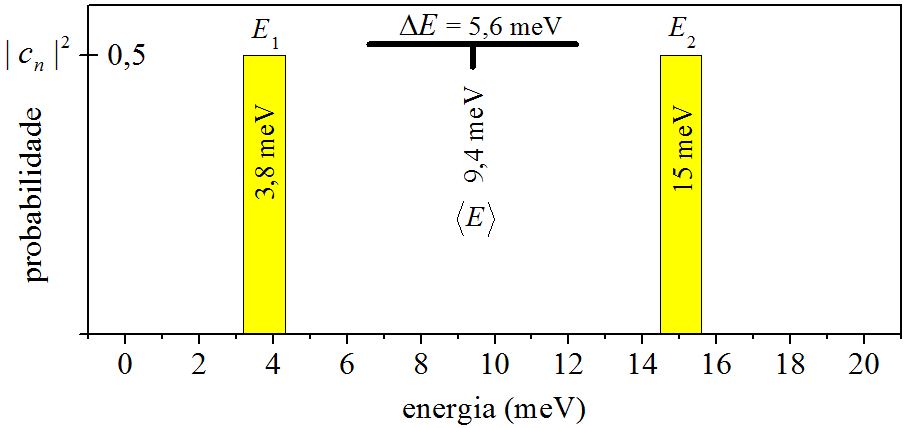

(\#fig:FIG34)Distribuição de probabilidade gerada pela superposição \@ref(eq:MAX214).

${\large \bullet \ }$ Agora voltaremos com o tempo.

O equivalente da situação \@ref(eq:MAX204) em $t$, é:

$$
\Psi (x,t)=c_1\psi_1\mathrm{e}^{\large \frac{-iE_1}{\hbar} t} + c_2\psi_2\mathrm{e}^{\large\frac{-iE_2}{\hbar} t}.
(\#eq:MAX217)
$$

O estado \@ref(eq:MAX217) gera a densidade de probabilidade [ $\psi_n$ é real ]:

$$
\begin{aligned}
|\Psi (x,t)|^2 
&= \left( c_1^{\ast} \psi_1 \mathrm{e}^{\large\frac{+iE_1}{\hbar} t} +
c_2^{\ast} \psi_2 \mathrm{e}^{\large\frac{+iE_2}{\hbar} t} \right)
\times
\\
&\times
\left( c_1 \psi_1 \mathrm{e}^{\large\frac{-iE_1}{\hbar} t} +
c_2 \psi_2 \mathrm{e}^{\large\frac{-iE_2}{\hbar} t} \right)    \\
&= |c_1|^2 \psi_1^2 + |c_2|^2 \psi_2^2 
+
\\
&+
c_2^{\ast}c_1\psi_2\psi_1 \mathrm{e}^{\large\frac{+iE_2}{\hbar} t} \mathrm{e}^{\large\frac{-iE_1}{\hbar} t} 
+
\\
&+
c_1^{\ast}c_2\psi_1\psi_2 \mathrm{e}^{\large\frac{+iE_1}{\hbar} t} \mathrm{e}^{\large\frac{-iE_2}{\hbar} t} .
\end{aligned}
(\#eq:MAX218)
$$

No caso de $c_1$ e $c_2$ reais, a equação \@ref(eq:MAX218) se torna:

$$
\begin{aligned}
|\Psi (x,t)|^2 
&= |c_1|^2 \psi_1^2 + |c_2|^2 \psi_2^2 
+ 
\\
&+
c_1 c_2 \psi_1 \psi_2 
\left( 
\mathrm{e}^{\large\frac{+i(E_2-E_1)}{\hbar}t} + \mathrm{e}^{\large\frac{-i(E_2-E_1)}{\hbar}t}
\right).
\end{aligned}
(\#eq:MAX219)
$$

Por fim, identificamos o termo entre os parênteses como uma função cosseno:

$$
\begin{aligned}
|\Psi (x,t)|^2 
&= |c_1|^2 \psi_1^2 + |c_2|^2 \psi_2^2 
+
\\
&+ 
2 c_1 c_2 \psi_1 \psi_2 \mathrm{cos} \left( \frac{E_2-E_1}{\hbar}t \right).
\end{aligned}
(\#eq:MAX220)
$$

Chamando $\delta E = E_2 - E_1$, concluímos que
a densidade de probabilidade oscila com a frequência angular temporal:

$$
\omega = \frac{\delta E}{\hbar}.
(\#eq:MAX221)
$$

Dizer que a densidade de probabilidade oscila com a frequência \@ref(eq:MAX221),
é o mesmo que dizer que a densidade de probabilidade oscila com o período temporal:

$$
\frac{2\pi}{\delta T} = \frac{\delta E}{\hbar}.
(\#eq:MAX222)
$$

E, a partir da equação \@ref(eq:MAX222), escrevemos:

$$
\delta E \, \delta T = 2\pi\, \hbar.
(\#eq:MAX223)
$$

${   }$

${\large \bullet \ }$ Finalmente chegamos ao título da seção!

A equação \@ref(eq:MAX223) é uma versão __informal__ do principio da incerteza.
Ela correlaciona a energia com o tempo. 
Em mecânica quântica, o tempo é um _parâmetro_ usado para reger a evolução de variáveis dinâmicas (energia,
posição e momento). O tempo não é uma variável dinâmica. Por isso, a relação que envolve tempo e energia não é
considerada verdadeiramente um princípio de incerteza, pois correlaciona um parâmetro (o tempo) com uma
variável dinâmica (a energia).

A resultado \@ref(eq:MAX223) basicamente nos diz que se 
o espaçamento energético $\delta E$ é grande, 
o período de oscilação $\delta T$ é pequeno, e vice-versa.
Para chegar nele, partimos de \@ref(eq:MAX217), 
uma superposição de 2 autoestados.
Ser $\delta T$ pequeno, significa que a partícula muda muitas vezes de autoestado,
oscila muitas vezes entre $\psi_1$ e $\psi_2$, 
e permanece pouco tempo em cada um desses autoestados.
Em outras palavras, em uma superposição, se $\delta E$ é grande,
o tempo de vida de cada autoestado é pequeno.
Por outro lado, se  $\delta E$ é pequeno,  $\delta T$ é grande, 
e a partícula muda poucas vezes de autoestado a cada segundo. 
Nesse caso, o tempo de vida do autoestado é grande. 
No limite, quando $\delta E \to 0$, ocorre $\delta T \to \infty$,
e a partícula não muda mais de autoestado. Ela é levada a uma situação de energia única: $E_2 \to E_1$.
Tirada da superposição, a partícula permanece apenas em um dos autoestado, o $\psi_1$.
Ali, pode ficar para sempre, pois o tempo de vida do autoestado numa situação em que 
não há superposição é infinito.

Como dissemos, \@ref(eq:MAX223) é uma versão do principio da incerteza,
aplicada especificamente ao poço retangular infinito.
Vendo de uma maneira mais ampla, ela pode ser ajustada para 
ter aspectos que reproduzam mais de perto a relação de Heisenberg [ seção \@ref(Intro02) ]:

$$
\Delta E\, {\large \tau} \geqslant \frac{\hbar}{2}.
(\#eq:MAX224)
$$

Na correlação da energia-tempo \@ref(eq:MAX224),
$\Delta E$ é a própria incerteza na energia, 
todavia ${\large \tau}$ não é a incerteza no tempo.
${\large \tau}$ pode ser interpretado como _tempo de vida de autoestado_.
Podemos relacionar ${\large \tau}$ com $\delta T$,
lembrando que $\delta T$ é o período temporal para ocorrer _uma oscilação_ entre dois autoestados,
sendo assim, a partícula deve permanecee em cada autoestado pelo tempo: 

$$
{\large \tau} = \frac{\delta T}{2}.
(\#eq:MAX225)
$$

Levando \@ref(eq:MAX225) ao resultado \@ref(eq:MAX223) do poço infinito, encontramos:

$$
\Delta E\, {\large \tau} = \pi\, \hbar \ \ \ \left( > \frac{\hbar}{2} \right).
(\#eq:MAX226)
$$

Como se vê, o poço retangular infinito, por meio do desfecho \@ref(eq:MAX226),
satisfaz rigorosamente \@ref(eq:MAX224), 
o princípio da incerteza da energia-tempo.

