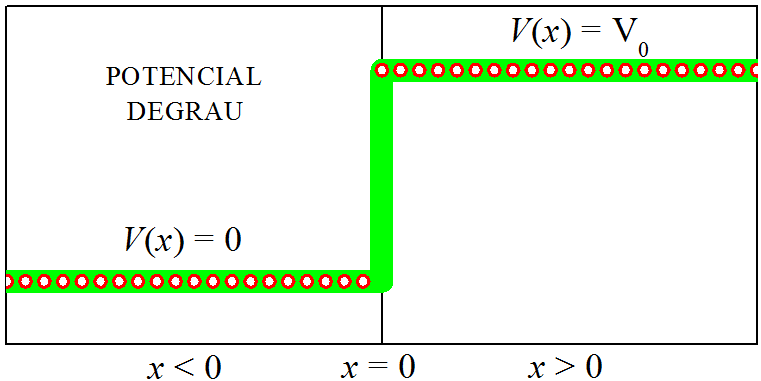
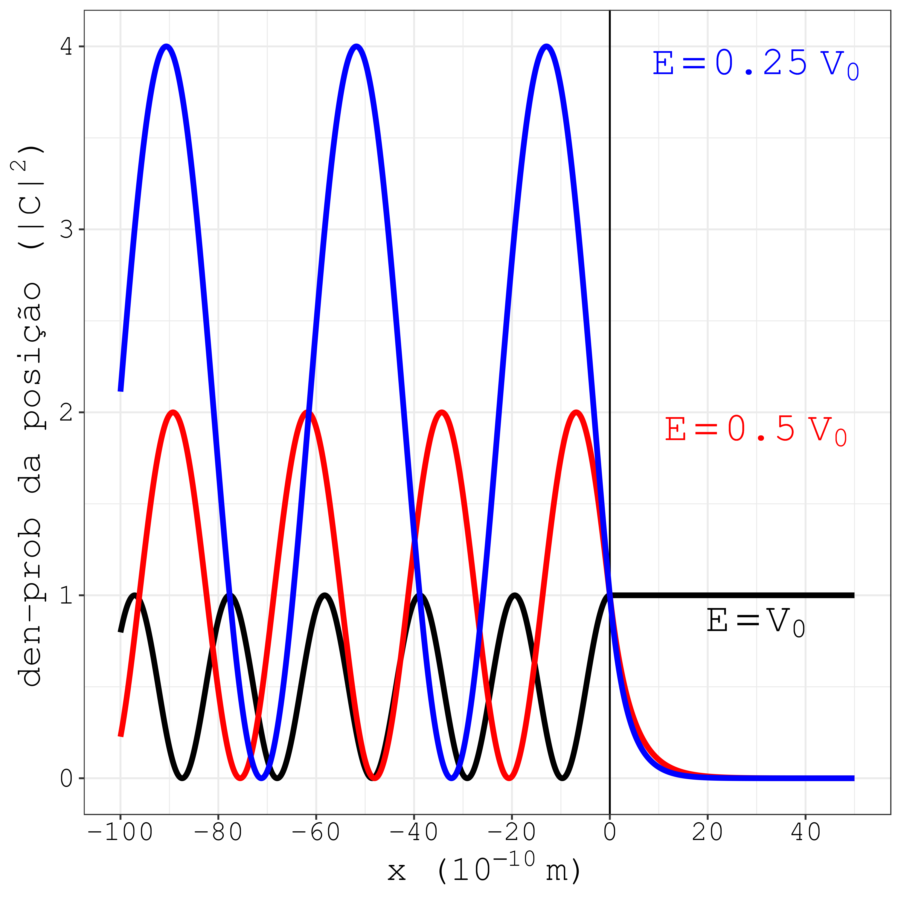
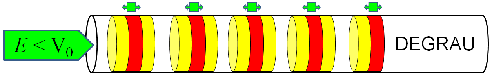
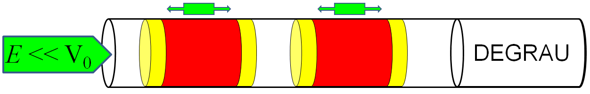
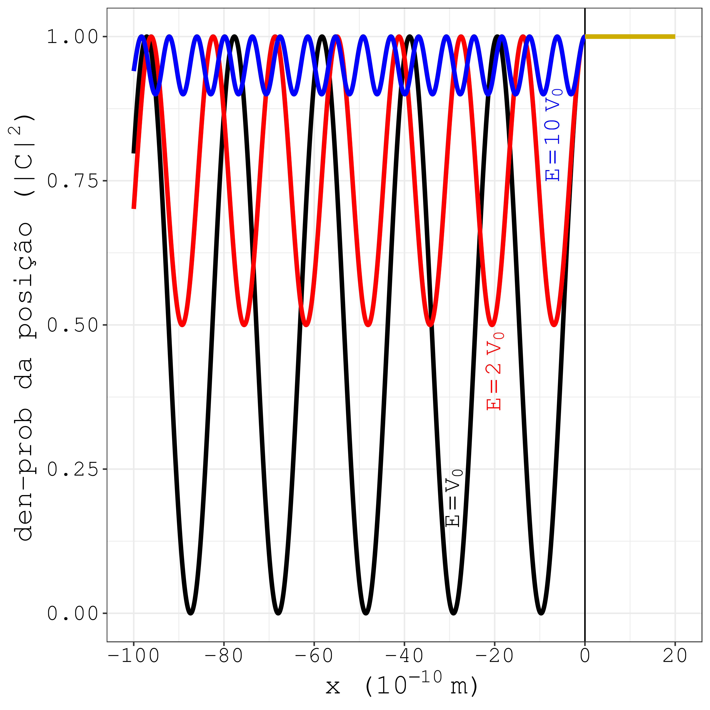
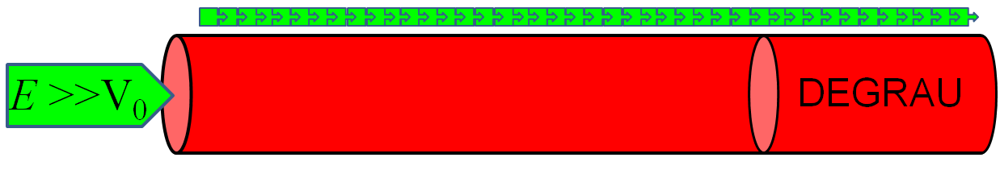

# O DEGRAU RETANGULAR {#Cap07}

## Introdução  {#Intro07}

Estudaremos a interação de uma partícula quântica com um potencial do tipo degrau retangular.
A onda de matéria é espalhada: uma parte é transmitida e outra é refletida pelo degrau.
Com base nos conceitos da mecânica newtoniana, uma partícula não é _refletida_ se sua energia for maior que o
degrau e, também, não é _transmitida_ se sua energia for menor que o degrau.
Mas uma partícula quântica _é_!
Estamos diante de um fenômeno que extrapola o senso comum da física clássica.

O potencial degrau é caracterizado por ser descontinuo em um ponto do espaço.
Ajustando a descontinuidade na origem, podemos escrever:
 
$$
\begin{aligned}
V(x) &= 0,   & {\rm se\ \ } & x < 0         ,\\
     &= V_0, & {\rm se\ \ } & x \geqslant 0 .
\end{aligned}
(\#eq:MAX227)
$$

Onde $V_0$ é uma grandeza positiva. Visualizamos o potencial degra na Fig. \@ref(fig:FIG35).

(\#fig:FIG35)O potencial degrau.

Em relação ao valor de $V_0$, a partícula interagente pode estar com energia maior ou menor.
Na [ seção \@ref(RegBaixa) ],
resolveremos o problema da partícula incidir com energia _menor_ que o degrau.
E na [ seção \@ref(RegAlta) ],
trataremos do caso da partícula incidir com energia _maior_ que o degrau.

## O regime de baixa energia   {#RegBaixa}

No regime que chamamos de baixa energia,
vamos limitar a energia da partícula incidente ao intervalo $0 < E \leqslant V_0$.
 
Fora (F) do degrau ($x<0$), o potencial é zero, a equação de Schrödinger pode ser escrita na forma:

$$
\begin{aligned}
-\frac{\hbar^2}{2m} \frac{\mathrm{d}^2 \psi_{\rm F}}{\mathrm{d}x^2} &= E \psi_{\rm F} ,\\
\frac{\mathrm{d}^2 \psi_{\rm F}}{\mathrm{d}x^2} &= -k_{\rm F}^2 \psi_{\rm F} ,\\
k_{\rm F} &= \frac{\sqrt{2mE}}{\hbar} .
\end{aligned}
(\#eq:MAX228)
$$

A solução da equação diferencial \@ref(eq:MAX228) não pode ser uma onda individual.
Ela precisa ser uma superposição de 2 ondas.
Vamos imaginar certa onda incidente ($A$) caminhando para a direita.
Então, também haverá a onda refletida pelo degrau ($B$), caminhando para a esquerda:

$$
\psi_{\rm F} = A\, \mathrm{e}^{\large ik_{\rm F}x} + B\, \mathrm{e}^{\large -ik_{\rm F}x}._{}
(\#eq:MAX229)
$$

Dentro (D) do degrau ($x>0$), o potencial é $V_0$, a equação de Schrödinger passa a ser:

$$
\begin{aligned}
-\frac{\hbar^2}{2m} \frac{\mathrm{d}^2 \psi_{\rm D}}{\mathrm{d}x^2} + V_0 \psi_{\rm D} &= E \psi_{\rm D} ,\\
\frac{\mathrm{d}^2 \psi_{\rm D}}{\mathrm{d}x^2} &= -k_{\rm D}^2 \psi_{\rm D} ,\\
k_{\rm D} &= \frac{\sqrt{2m(E - V_0)}}{\hbar} .
\end{aligned}
(\#eq:MAX230)
$$

A solução da equação \@ref(eq:MAX230) também é composta por 2 ondas:

$$
\psi_{\rm D} = C\, \mathrm{e}^{\large ik_{\rm D}x} + D\, \mathrm{e}^{\large -ik_{\rm D}x}.
(\#eq:MAX231)
$$

Por causa de $E<V_0$, o número de onda $k_{\rm D}$ é imaginário. 
É favorável escrevê-lo na forma: $k_{\rm D}=iq_{\rm D}$, onde $q_{\rm D}$ é um número real e positivo:

$$
q_{\rm D} = \frac{\sqrt{2m(V_0 - E)}}{\hbar}.
(\#eq:MAX232)
$$

Substituindo \@ref(eq:MAX232) em \@ref(eq:MAX231), a solução dentro do degrau
se torna em uma soma de exponenciais reais:

$$
\psi_{\rm D} = C\, \mathrm{e}^{\large -q_{\rm D}x} + D\, \mathrm{e}^{\large q_{\rm D}x}.
(\#eq:MAX233)
$$

Ao fazer $x \to \infty$ em \@ref(eq:MAX233), o segundo termo desta equação tende ao infinito,
então, para a solução $\psi_{\rm D}$ ter significado físico, há necessidade de $D=0$.
Desse modo, a solução dentro do degrau fica escrita somente em função de $C$:

$$
\frac{\psi_{\rm D}}{C} = \mathrm{e}^{\large -q_{\rm D}x}.
(\#eq:MAX234)
$$

Na interface $x=0$, precisamos garantir que a função de onda seja contínua, para isso,
aplicamos as condições de contorno:

\begin{align}
\psi _ {\rm F}(0)                                &= \psi _ {\rm D}(0),                               (\#eq:MAX235) \\ 
\frac{\mathrm{d} \psi _ {\rm F}(0)}{\mathrm{d}x} &= \frac{\mathrm{d} \psi _ {\rm D}(0)}{\mathrm{d}x}.(\#eq:MAX236) 
\end{align}

Substituindo as expressões \@ref(eq:MAX229) e \@ref(eq:MAX234)
nas condições de contorno \@ref(eq:MAX235) e \@ref(eq:MAX236), encontramos:

\begin{align}
A + B  &=  C, (\#eq:MAX237) \\
i k _ {\rm F} A - ik _ {\rm F} B  &=  -q _ {\rm D} C. (\#eq:MAX238)
\end{align}

Multiplicando \@ref(eq:MAX237) por $ik_F$,
e resolvendo o sistema de equações \@ref(eq:MAX237) e \@ref(eq:MAX238),
podemos escrever $A$ e $B$ em função de $C$:

\begin{align}
A &= \frac{1}{2} \left( 1 - \frac{q _ {\rm D}}{ik _ {\rm F}} \right) C  (\#eq:MAX239), \\
B &= \frac{1}{2} \left( 1 + \frac{q _ {\rm D}}{ik _ {\rm F}} \right) C  (\#eq:MAX240).
\end{align}

Substituindo \@ref(eq:MAX239) e \@ref(eq:MAX240) na equação \@ref(eq:MAX229),
a solução fora do degrau também fica escrita somente em função de $C$:

$$
\frac{\psi_{\rm F}}{C} = 
\frac{1}{2} \left( 1 - \frac{q_{\rm D}}{ik_{\rm F}} \right) \, \mathrm{e}^{\large  ik_{\rm F}x}
+ \frac{1}{2} \left( 1 + \frac{q_{\rm D}}{ik_{\rm F}} \right) \, \mathrm{e}^{\large -ik_{\rm F}x}.
(\#eq:MAX241)
$$

Trabalhando um pouco a matemática, podemos trasformar \@ref(eq:MAX241)  na seguinte expressão:

$$
\frac{\psi_{\rm F}}{C} = 
\left( \frac{ \mathrm{e}^{\large  ik_{\rm F}x} + \mathrm{e}^{\large -ik_{\rm F}x} } {2}   \right)
-\frac{q_D}{k_F}
\left( \frac{ \mathrm{e}^{\large  ik_{\rm F}x} - \mathrm{e}^{\large -ik_{\rm F}x} } {2i}  \right).
(\#eq:MAX242)
$$

Identificamos os parenteses como as funções cosseno e seno, então:

$$
\frac{\psi_{\rm F}}{C} = {\rm cos}(k_Fx) - \frac{q_D}{k_F} {\rm sen}(k_Fx).
(\#eq:MAX243)
$$

A partir das soluções _reais_ \@ref(eq:MAX243) e \@ref(eq:MAX234), podemos
determinar a densidade de probabilidade fora e dentro do degrau retandular:

\begin{align}
\frac{|\psi _ {\rm F}|^2}{|C|^2} &= \left( {\rm cos}(k_Fx) -\frac{q_D}{k_F} {\rm sen}(k_Fx) \right)^2, (\#eq:MAX244) \\
\frac{|\psi _ {\rm D}|^2}{|C|^2} &= \mathrm{e}^{\large -2q _ {\rm D}x}. (\#eq:MAX245)
\end{align}

${\large \bullet \ }$ Um exemplo numérico.

Considere um elétron incidindo em um degrau de altura $V_0=100\ {\rm meV}$.
Vamos atribuir 3 energias ao elétron: $E=V_0$, $E=0,\!50V_0$ e $E=0,\!25V_0$.
Utilizando \@ref(eq:MAX228) e \@ref(eq:MAX232),
encontramos os resultados \@ref(eq:MAX246).
Ademais, com as expressões da densidade de probabilidade,
equações \@ref(eq:MAX244) e \@ref(eq:MAX245),
construímos os gráficos apresentados na Fig. \@ref(fig:FIG36).

$$
\small
\begin{aligned}
E &= 100\ {\rm meV},
&  k_F &=16,\!2  \times 10^{8}\ {\rm m}^{-1},
&  q_D &=0 ,\\
E &= 50\  {\rm meV},
&  k_F &=11,\!4  \times 10^{8}\ {\rm m}^{-1},
&  q_D &=11,\!4  \times 10^{8}\ {\rm m}^{-1} ,\\
E  &=25\  {\rm meV},
&  k_F &=8,\!1   \times 10^{8}\ {\rm m}^{-1},
&  q_D &=14,\!0  \times 10^{8}\ {\rm m}^{-1} .\\
\end{aligned}
(\#eq:MAX246)
$$

(\#fig:FIG36)O degrau retangular no regime de baixa energia.

O que viola a percepção clássica é que, 
mesmo o elétron tendo energia _menor_ que o degrau, 
há possibilidade de encontrá-lo dentro do degrau,
conforme lado $x>0$ da Fig. \@ref(fig:FIG36).
O grau de penetração da densidade de probabilidade depende da energia do elétron.
Um elétron com pouca energia, corresponde a uma pequena penetração,
a exponencial cai rapidamente a zero quando se aprofunda no degrau. 
Por outro lado, um elétron com energia compatível com o degrau,
corresponde a uma grande penetração,
a exponencial cai suavemente à medida que se entra no degrau.
Ademais, incidindo com a energia no máximo, 
a densidade de probabilidade permanece constante para qualquer posição dentro do degrau. 

A amplitude das oscilações fora do degrau aumenta com a diminuição da energia do elétron, 
conforme lado $x<0$ da Fig. \@ref(fig:FIG36).
Ademais, observa-se que o período espacial da oscilação também aumenta quando a energia diminui.

Sendo mais detalhista, se montássemos uma experiência para encontrar o elétron
que incide no degrau com a energia $E=V_0$, todos os resultados dessa medição seriam igualmente prováveis, se a
procura ocorresse dentro do degrau, mas não seriam igualmente prováveis, se a procura ocorresse fora do
degrau. Em  $x<0$, haveria resultados se concentrando em faixas de posições ao redor dos picos da densidade de
probabilidade, sendo essas faixas estreitas e próximas uma das outras.
E se a experiência fosse montada para encontrar o elétron que incide no degrau com a energia  $E=0,25V_0$? 
Se a procura ocorresse dentro do degrau, os resultados não seriam igualmente prováveis, muitos resultados seriam
registrados numa estreita faixa de posições que começa em $x=0$, todavia, no fundo do degrau, a contagem dos
resultados começaria a definhar, bem mais ao fundo, não haveria resultados da medição da posição desse
elétron. Fora do degrau, os resultados se concentrariam em faixas de posições ao redor dos picos da
densidade, mas agora, essas faixas seriam largas e ficariam afastadas uma das outras.

${\large \bullet \ }$ Uma experiência mental.

Vamos aplicar os resultados quânticos do degrau retangular,
ao imaginar um feixe de elétrons encontrando um potencial degrau.
Se encararmos os picos da densidade de probabilidade como locais de concentração de elétrons, ocorre que a
largura desses picos e as distâncias entre eles, vão determinar a distribuição dos elétrons fora do
degrau. Quando a energia das partículas é compatível com o degrau, próxima da altura do degrau, os picos são estreitos e
próximos uns dos outros, sugerindo uma estrutura comprimida de faixas de elétrons; mas, quando a energia das
partículas é pequena, próxima da base do degrau, os picos são largos e afastados uns dos outros, indicando
uma estrutura entendida de faixas de elétrons. 
As Figs. \@ref(fig:FIG37a) e \@ref(fig:FIG37b)
ilustram a estruturas de faixas,
a cor vermelha representa alta concentração de elétrons, 
a cor amarela assinala baixa concentração de elétrons 
e a cor branca sinaliza ausência de elétrons.

(\#fig:FIG37a)Concentração de elétrons fora do degrau. Energia compatível com o degrau.

(\#fig:FIG37b)Concentração de elétrons fora do degrau. Energia muito abaixo do degrau.

## O regime de alta energia   {#RegAlta}

Chegamos ao caso da partícula que incide com energia maior que a altura do degrau, $E \geqslant V_0$,
que chamaremos de regime de alta energia.

Fora (F) do degrau, a situação não muda [ seção \@ref(RegBaixa) ],
há superposição da onda incidente com a onda refletida pelo degrau:

$$
\psi_{\rm F} = A\, \mathrm{e}^{\large ik_{\rm F}x} + B\, \mathrm{e}^{\large -ik_{\rm F}x}.
(\#eq:MAX247)
$$

A novidade acontece dentro do degrau.
Existe apenas uma onda nessa região, que chamaremos de onda transmitida (T):

$$
\psi_{\rm T} = C\, \mathrm{e}^{\large ik_{\rm T}x}.
(\#eq:MAX248)
$$

Os números de onda envolvidos são:

\begin{align}
k _ {\rm F} &= \frac{\sqrt{2mE}}{\hbar},          (\#eq:MAX249)\\
k _ {\rm T} &= \frac{\sqrt{2m(E - V_0)}}{\hbar}.  (\#eq:MAX250)
\end{align}

Na interface $x=0$, precisamos garantir que a função de onda seja contínua, para isso,
aplicamos as condições de contorno:

\begin{align}
\psi _ {\rm F}(0)                                &= \psi _ {\rm T}(0),                               (\#eq:MAX251) \\ 
\frac{\mathrm{d} \psi _ {\rm F}(0)}{\mathrm{d}x} &= \frac{\mathrm{d} \psi _ {\rm T}(0)}{\mathrm{d}x}.(\#eq:MAX252) 
\end{align}

Substituindo as expressões \@ref(eq:MAX247) e \@ref(eq:MAX248)
nas condições de contorno \@ref(eq:MAX251) e \@ref(eq:MAX252), encontramos:

\begin{align}
A + B                            &=  C,              (\#eq:MAX253) \\ 
i k _ {\rm F} A - ik _ {\rm F} B &= ik _ {\rm T} C.  (\#eq:MAX254) 
\end{align}

Multiplicando \@ref(eq:MAX253) por $ik_F$,
e resolvendo o sistema de equações \@ref(eq:MAX253) e \@ref(eq:MAX254),
podemos escrever $A$ e $B$ em função de $C$:

\begin{align}
A &= \frac{1}{2} \left( 1 + \frac{k _ {\rm T}}{k _ {\rm F}} \right) C  (\#eq:MAX255), \\
B &= \frac{1}{2} \left( 1 - \frac{k _ {\rm T}}{k _ {\rm F}} \right) C  (\#eq:MAX256).
\end{align}

Substituindo \@ref(eq:MAX255) e \@ref(eq:MAX256) na equação \@ref(eq:MAX247),
a solução fora do degrau fica escrita somente em função de $C$:

$$
\frac{\psi_{\rm F}}{C} =
\frac{1}{2} \left( 1 + \frac{k_{\rm T}}{k_{\rm F}} \right) \, \mathrm{e}^{\large  ik_{\rm F}x}
+ \frac{1}{2} \left( 1 - \frac{k_{\rm T}}{k_{\rm F}} \right) \, \mathrm{e}^{\large -ik_{\rm F}x}.
(\#eq:MAX257)
$$

Trabalhando um pouco a matemática, podemos trasformar \@ref(eq:MAX257)  na seguinte expressão:

$$
\frac{\psi_{\rm F}}{C} = 
\left( \frac{ \mathrm{e}^{\large  ik_{\rm F}x} + \mathrm{e}^{\large -ik_{\rm F}x} } {2}   \right)
+i\frac{k_T}{k_F}
\left( \frac{ \mathrm{e}^{\large  ik_{\rm F}x} - \mathrm{e}^{\large -ik_{\rm F}x} } {2i}  \right).
(\#eq:MAX258)
$$

Identificamos os parenteses como as funções cosseno e seno, então:

$$
\frac{\psi_{\rm F}}{C} = {\rm cos}(k_Fx) + i\frac{k_T}{k_F} {\rm sen}(k_Fx).
(\#eq:MAX259)
$$

A partir das soluções _complexas_ \@ref(eq:MAX259) e \@ref(eq:MAX248),
determinamos a expressão da densidade de probabilidade para o regime de alta energia:

\begin{align}
\frac{|\psi _ {\rm F}|^2}{|C|^2} &={\rm cos^2}(k_Fx)-\frac{k_T^2}{k_F^2}{\rm sen^2}(k_Fx), (\#eq:MAX260)\\
\frac{|\psi _ {\rm T}|^2}{|C|^2} &=1. (\#eq:MAX261)
\end{align}

Dividindo \@ref(eq:MAX250) por \@ref(eq:MAX249), temos:

$$
\frac{k_{\rm T}^2}{k_{\rm F}^2} = 1- \frac{V_0}{E}.
(\#eq:MAX262)
$$

Substituindo \@ref(eq:MAX262) em \@ref(eq:MAX260), 
a densidade de probabilidade fica independente de $k_T$:

\begin{align}
\frac{|\psi _ {\rm F}|^2}{|C|^2} &=1 - \frac{V_0}{E} {\rm sen^2}(k_Fx), (\#eq:MAX263)\\
\frac{|\psi _ {\rm T}|^2}{|C|^2} &=1. (\#eq:MAX264)
\end{align}

${\large \bullet \ }$ Um exemplo numérico.

Considere um elétron incidindo em um degrau de altura $V_0=100\ {\rm meV}$.
Vamos atribuir 3 energias ao elétron: $E=V_0$, $E=2V_0$ e $E=10V_0$.
Utilizando \@ref(eq:MAX249) e \@ref(eq:MAX250),
encontramos os resultados \@ref(eq:MAX265).
Ademais, com as expressões da densidade de probabilidade,
equações \@ref(eq:MAX263) e \@ref(eq:MAX264),
construímos os gráficos apresentados na Fig. \@ref(fig:FIG38).

$$
\small
\begin{aligned}
E &= 100  \ {\rm meV},
&  k_F &=16,\!2  \times 10^{8} \ {\rm m}^{-1},
&  k_T &=0 ,\\
E &= 200 \ {\rm meV}, 
&  k_F &=22,\!9  \times 10^{8} \ {\rm m}^{-1},
&  k_T &=16,\!2  \times 10^{8} \ {\rm m}^{-1} ,\\
E  &= 1000 \ {\rm meV}, 
&  k_F &=51,\!2   \times 10^{8} \ {\rm m}^{-1},
&  k_T &=48,\!5  \times 10^{8} \ {\rm m}^{-1} .\\
\end{aligned}
(\#eq:MAX265)
$$

(\#fig:FIG38)O degrau retangular no regime de alta energia.

Antes de começarmos a análise da Fig. \@ref(fig:FIG38),
sempre é bom destacar que estamos fazendo uma interpretação probabilística da função de onda.
O contorno da densidade de probabilidade não representa o traçado da partícula “andando” pelo degrau.
Ele nos informa qual a probabilidade por unidade de comprimento de essa partícula ser encontrada ao longo do degrau.

A densidade de probabilidade dentro do degrau é constante, de valor 1,
sendo mais preciso, de valor $|C|^2$.
Por ser constante, não há concentrações de resultados dentro do degrau,
todos são igualmente próváveis. Ligando à [ seção \@ref(ParticulaD) ], 
o elétron transmitido se comporta como uma partícula totalmente delocalizada
que "viaja" para o infinito.

Fora do degrau, a densidade de probabilidade oscila.
A oscilação diminui com o aumento da energia.
No exemplo da Fig. \@ref(fig:FIG38), a menor oscilação ocorre para $E=10V_0$.
Pensando no limite $E \to \infty$,
podemos imaginar que a densidade de probabilidade deixa de oscilar,
e se torna constande, também de valor $|C|^2$.
Nesse limite energético,
o degrau para de atuar como centro reflexivo.
A onda refletida se torna desprezível diante da incidente.
A onda incidente “paira”, em um “voo” solitário, pelo segmento fora do degrau.
Não havendo condições satisfatórias para ocorrer a interferência entre a incidente e a refletida, 
o efeito da superposição deixa de existir,
e as oscilações da densidade de probabilidade são interrompidas.
A manifestação probabilística do elétron no segmento fora do degrau
se torna idêntica à manifestação na região onde o degrau existe. 
Nos dois lados do degrau,
teremos um elétron totalmente delocalizado.

Agora vamos ver como fica o caso da energia rasante, 
quer dizer, uma energia pouco acima do degrau. 
No exemplo da Fig. \@ref(fig:FIG38),  os valores $E=V_0$ e $E=2V_0$.
Quando a energia se torna rasante, o efeito refletor do degrau se torna mais evidente. 
A onda incidente não está mais sozinha no segmento de posições negativas. 
A onda refletida é formada. 
Há interferência da onda incidente com a onda refletida pelo degrau. 
Ocorre o fenômeno da superposição,
e a densidade de probabilidade oscila,
indicando concentração de resultados em certas posições.

${\large \bullet \ }$ Uma experiência mental.

Vamos aplicar nosso conhecimento quântico a um feixe de elétrons que incide em um potencial degrau. 
Se os elétrons estiverem com energia muito acima do degrau, o efeito espalhador do degrau será desprezível. 
Então, não haverá concentração de elétrons em certas posições. 
O feixe caminhará como estando livre, 
e todas as posições serão igualmente prováveis, 
conforme é ilustrado na
Fig. \@ref(fig:FIG39a).

(\#fig:FIG39a)Elétrons com energia muito acima do degrau retangular.

Por outro lado, se os elétrons do feixe incidente estiverem com energia rasante, pouco acima do degrau
(todavia não muito maior que o degrau), o poder espalhador do degrau fará surgir um feixe de elétrons
refletidos, “caminhando” em sentido oposto ao feixe incidente. A interferência do feixe incidente com o
refletido criará, na frente do degrau, grande concentração de elétrons em certas posições, e pequenas concentrações
em outras. Já o feixe transmitido não é submetido ao fenômeno da interferência, o que se tem, então,
são posições igualmente prováveis onde o degrau existe. 
A ilustração na
Fig. \@ref(fig:FIG39b)
mostra a estrutura de faixas de elétrons quando a energia é rasante: 
a cor vermelha representa alta concentração de elétrons 
e a cor amarela sinaliza baixa concentração de elétrons.

(\#fig:FIG39b)Elétrons com energia razante ao degrau retangular.

