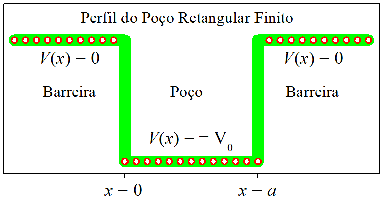
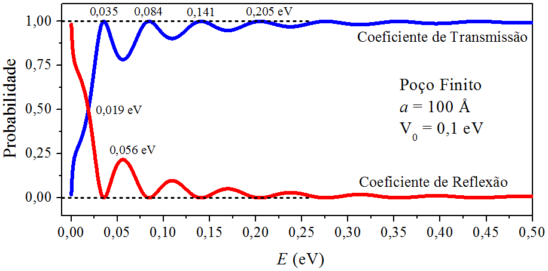
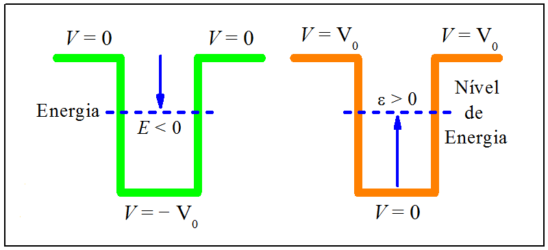
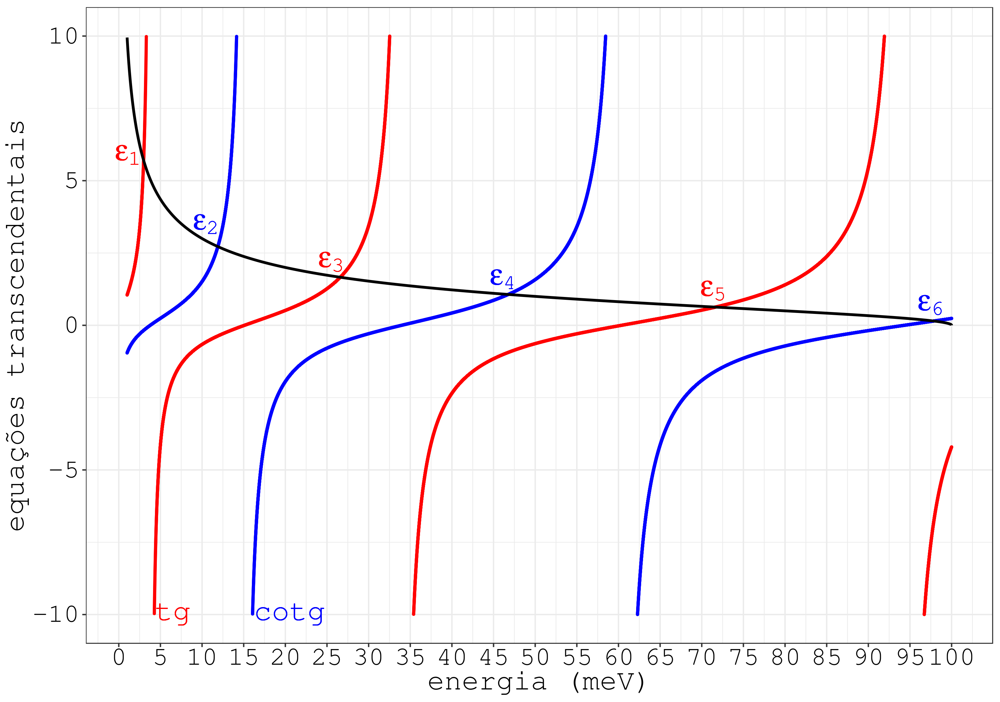
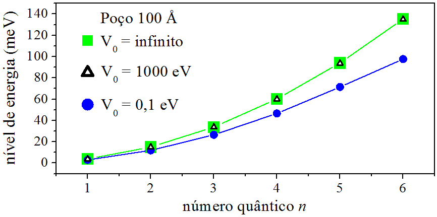
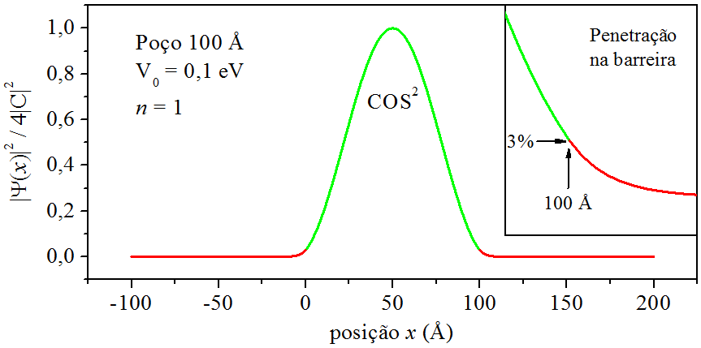
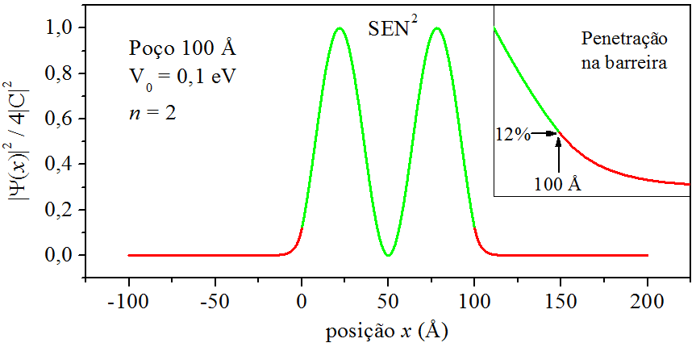
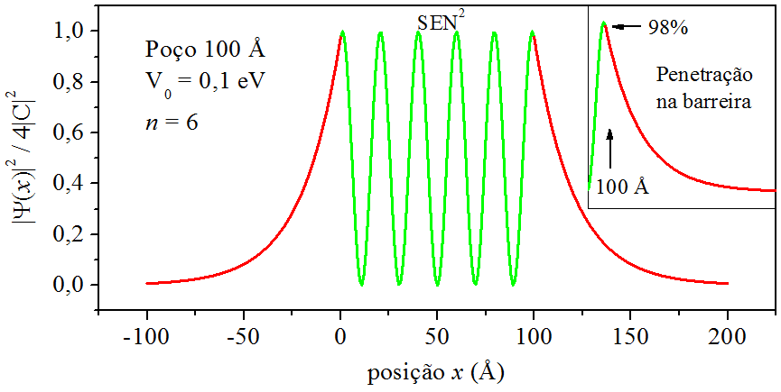

# O POÇO RETANGULAR FINITO {#Cap09}

## Introdução  {#Intro09}

O poço retangular finito `humaniza` o poço retangular infinito do [ capítulo \@ref(Cap06) ].
Uma parede de potencial infinita é uma idealização matemática.
Em alguns casos, pode até ser usada como aproximação.
Mas, para ser mais realístico, devemos considerar uma parede finita.

Podemos imaginar o perfil de um poço retangular finito pensando em uma barreira retangular invertida
[ capítulo \@ref(Cap08) ]. Se uma barreira é invertida, um poço é formado.

O poço retangular finito tem, em suas margens, que chamamos de barreiras,
um valor de potencial _maior_ que o valor do potencial que cobre a extensão do próprio poço.
Uma maneira de construirmos seu perfil, 
é igualar à zero a região das barreiras, esquerda e direita,
e fazer a região do poço igual a $(-V_0)$, sendo $V_0$ uma quantidade positiva:

$$
\begin{aligned}
V(x) &= 0,     & {\rm se\ \ } & x < 0  ,\\
     &= - V_0, & {\rm se\ \ } & 0 \leqslant x \leqslant a  ,\\
     &= 0,     & {\rm se\ \ } & x > a .
\end{aligned}
(\#eq:MAX345)
$$

Visualizamos o poço retangular finito na Fig. \@ref(fig:FIG43).
Observe que a região do poço se estende de $x=0$ até $x=a$.

(\#fig:FIG43)O poço retangular finito.

Tomando como referencial a energia potencial das barreiras, no caso, $V = 0$,
a energia da partícula que interage com o poço retangular finito, da Fig. \@ref(fig:FIG43),
pode assumir valores positivos ou negativos. 
Nosso primeiro objetivo será estudar a partícula com energia maior que as barreiras,
$E > 0$ [ seção \@ref(FinitoEmaior) ].
Depois, vamos tratar da partícula com energia menor que as barreiras e maior que o fundo do poço,
$-V_0 < E < 0$ [ seção \@ref(FinitoEmenor) ].

## A transmissão do estado não-ligado   {#FinitoEmaior}

 
A partícula que vamos estudar nessa seção 
possui energia _maior_ que a energia potencial das barreiras $\rm (B)$ do poço $\rm (P)$ retangular finito,
quer dizer, $``$a partícula interage com energia positiva$"$.
No regime $E>0$, o estado quântico dessa partícula é do tipo não-ligado,
o que proporciona condições para ela ser refletida ou transmitida pelo poço de potencial.

A solução da equação de Schrödinger segue a mesma estrutura da
[ seção \@ref(BarRegAlta) ]:

\begin{align}
\psi _ {\rm B} &= A\, \mathrm{e}^{\large ikx} + B\, \mathrm{e}^{\large -ikx}, 
& x < 0,  (\#eq:MAX346)\\
\psi _ {\rm P} &= C\, \mathrm{e}^{\large ik _ {\rm P}x} +D\, \mathrm{e}^{\large -ik _ {\rm P}x}, 
& 0 \leqslant x \leqslant a,  (\#eq:MAX347)\\
\psi _ {\rm B} &= F\, \mathrm{e}^{\large ikx},
& x > a.   (\#eq:MAX348)
\end{align}

Em cada região, o número de onda apresenta uma peculiar expressão:

\begin{align}
k           &= \frac{\sqrt{2mE}}{\hbar},         & x < 0,                     (\#eq:MAX349) \\
k _ {\rm P} &= \frac{\sqrt{2m(E + V_0)}}{\hbar}, & 0 \leqslant x \leqslant a, (\#eq:MAX350)\\
k           &= \frac{\sqrt{2mE}}{\hbar},         & x > a.                     (\#eq:MAX351)
\end{align}

Ao compararmos, as soluções e os números de onda acima,
com os correspondentes desenvolvidos na
[ seção \@ref(BarRegAlta) ],
fica evidente a perfeita identidade estrutural. 
Por essa razão, o coeficiente de transmissão do poço retangular finito 
compartilha a mesma expressão do coeficiente de transmissão da barreira retangular no regime de alta energia:

$$
\frac{1}{T}=1+ \frac{ \left( k^2 - k_{\rm P}^2 \right)^2 } { 4k^2 k_{\rm P}^2 } \, {\rm sen}^2(k_{\rm P}a).
(\#eq:MAX352)
$$

Nota: O que precisa ser destacado é que o número de onda da barreira retangular,
na região $0 \leqslant x \leqslant a$, é $k_{\rm D} = \sqrt{2m(E - V_0)} / \hbar$,
enquanto que o número de onda do poço é dado por \@ref(eq:MAX350).

Investigando a expressão do coeficiente \@ref(eq:MAX352),
transmissões com o valor mávimo $T = 1$
ocorrem para ${\rm sen}(k_{\rm P}a) = 0$, ou seja:

$$
k_{\rm P} = \frac{n\pi}{a}, \ \ \ \ \ n=1,2,3...
(\#eq:MAX353)
$$

Substituindo \@ref(eq:MAX353) em \@ref(eq:MAX350),
encontramos a expressão das energias que geram 100% de transmissão:

$$
E_n = \frac{n^2 \pi^2 \hbar^2}{2 m a^2} - V_0.
(\#eq:MAX354)
$$

Restrição aos valores de $n$: 
Por causa da condição $``$a partícula interage com energia positiva$"$
e também por \@ref(eq:MAX354) ser uma subtração de dois termos,
os inteiros válidos devem conferir ao primeiro termo de \@ref(eq:MAX354) um resultado _maior_ que $V_0$,
quer dizer, todo $n$ que resulte em $E<0$ deve ser descartado.

${\large \bullet \ }$ Um exemplo numérico.

Considere um elétron interagindo com um poço retangular finito, 
de largura $a=100\ \unicode{xC5}$ e profundidade $V_0=100\ {\rm meV}$. 
Os gráficos dos coeficientes de transmissão e reflexão, 
em função da energia do elétron, são apresentados
na Fig. \@ref(fig:FIG44).

(\#fig:FIG44)Os coeficientes de transmissão e reflexão do poço retangular finito discutido no exemplo.

Conforme previsto pela equação de ressonância \@ref(eq:MAX354),
há transmissões máximas no decorrer da curva do coeficiente de transmissão.
As energias de ressonância foram impressas na própria figura,
ao longo da linha pontilhada $T=1$.
O coeficiente de reflexão foi determinado fazendo $R=1-T$.
Quando $T$ é máximo, $R$ é zero, confirmando que não há reflexão.

Há pontos intermediários,
por exemplo, quando $E=56\ {\rm meV}$, temos $T=0,\!78$ e $R=0,\!22$.
Isso significa que há $78\%$ de chance do elétron atravessar a região do poço,
e $22\%$, do elétron _não_ atravessar a região do poço.
Se um $``$físico clássico$"$ fosse explicar a reflexão, diria:
$``$Um elétron incidindo com energia maior que a energia das barreiras de um poço,
não pode sofrer reflexão por esse poço$"$.
Mas um $``$físico quântico$"$ garante que há
$22\%$ de chance do elétron ser refletido pelo poço.
No ponto $E=19\ {\rm meV}$,
ocorre a intersecção das curvas, daí $T=R=50\%$.

## O confinamento do estado ligado   {#FinitoEmenor}

Na [ seção \@ref(FinitoEmaior) ], $``$a partícula interage com energia positiva$"$.
Nessa seção, ela interage com energia menor que as barreiras e maior que o fundo do poço,
$-V_0 < E < 0$, quer dizer, agora $``$a partícula interage com energia negativa$"$.

A solução da equação de Schrödinger segue a mesma estrutura da
[ seção \@ref(FinitoEmaior) ]:

\begin{align}
\newcommand{ \kP }{ k _ {\rm P} }
\newcommand{ \PP }{   _ {\rm P} }
\newcommand{ \BB }{   _ {\rm B} }
  \psi\BB &= A\,\mathrm{e}^{\large  ikx} +
             B\,\mathrm{e}^{\large -ikx},      &x < 0,                      (\#eq:MAX355)\\
  \psi\PP &= C\,\mathrm{e}^{\large  i\kP x} + 
             D\,\mathrm{e}^{\large -i\kP x},   &0 \leqslant x \leqslant a,  (\#eq:MAX356)\\
  \psi\BB &= F\,\mathrm{e}^{\large ikx},       &x > a.                      (\#eq:MAX357)
\end{align}

Em cada região, o número de onda apresenta uma peculiar expressão:

\begin{align}
k   &= \frac{\sqrt{2mE}}{\hbar},         &x < 0,                      (\#eq:MAX358) \\
\kP &= \frac{\sqrt{2m(E + V_0)}}{\hbar}, &0 \leqslant x \leqslant a,  (\#eq:MAX359)\\
k   &= \frac{\sqrt{2mE}}{\hbar},         &x > a.                      (\#eq:MAX360)
\end{align}

Visto que $E<0$, 
os números de onda nas regiões \@ref(eq:MAX358) e \@ref(eq:MAX360) são imaginários. 
É favorável escrevê-los na forma: $k=iq$, onde $q$ é um número real e positivo:

$$
q = \frac{\sqrt{2m(0-E)}}{\hbar}.
(\#eq:MAX361)
$$

Com o auxílio de \@ref(eq:MAX361),
as soluções \@ref(eq:MAX355) e \@ref(eq:MAX357) se transformam em exponenciais reais.
Ademais, fazendo $x \to -\infty$, percebe-se que a exponencial $A$ é divergente. 
Daí vem a necessidade de ajustar $A=0$. Após essas considerações, as soluções mudam para:

\begin{align}
\psi\BB &= B\,\mathrm{e}^{\large qx},       &x < 0,                      (\#eq:MAX362)\\
\psi\PP &= C\,\mathrm{e}^{\large i\kP x} + 
           D\, \mathrm{e}^{\large -i\kP x}, &0 \leqslant x \leqslant a,  (\#eq:MAX363)\\
\psi\BB &= F\,\mathrm{e}^{\large -qx},      &x > a.                      (\#eq:MAX364)
\end{align}

Nas interfaces, há necessidade de se aplicar as condições de continuidade da função de onda:

$$
{\rm Interface}\ x=0\ \left\{
\begin{array}{l}
  \psi\BB(0) = \psi\PP(0) \\
  \dfrac{\mathrm{d} \psi\BB(0)}{\mathrm{d}x} = \dfrac{\mathrm{d} \psi\PP(0)}{\mathrm{d}x}
\end{array} \right.
(\#eq:MAX365a)
$$

$$
{\rm Interface}\ x=a\ \left\{
\begin{array}{l}
\psi\PP(a) = \psi\BB(a) \\
\dfrac{\mathrm{d} \psi\PP(a)}{\mathrm{d}x} = \dfrac{\mathrm{d} \psi\BB(a)}{\mathrm{d}x}
\end{array} \right.
(\#eq:MAX365b)
$$

Resolvendo \@ref(eq:MAX365a) e \@ref(eq:MAX365b), encontramos:

$$
{\rm Interface}\ x=0\ \left\{
\begin{array}{l}
  B  = C + D \\
  qB = i\kP C - i\kP D
\end{array} \right.
(\#eq:MAX366a)
$$

$$
{\rm Interface}\ x=a\ \left\{
\begin{array}{l}
  C\,\mathrm{e}^{\large i\kP a} + D\,\mathrm{e}^{\large -i\kP a} =
  F\,\mathrm{e}^{\large -qa} \\
  i\kP C\,\mathrm{e}^{\large i\kP a} - i\kP D\,\mathrm{e}^{\large -i\kP a} =
  -qF\, \mathrm{e}^{\large -qa}
\end{array} \right.
(\#eq:MAX366b)
$$

Ao resolver o sistema de equações \@ref(eq:MAX366a):

$$
\begin{aligned}
2C &= \left( \frac{i\kP + q}{i\kP }   \right) B  ,\\
2D &= \left( \frac{i\kP - q}{i\kP }   \right) B  .
\end{aligned}
(\#eq:MAX367)
$$

E ao resolver o sistema de equações \@ref(eq:MAX366b):

$$
\begin{aligned}
2C\, \mathrm{e}^{\large i\kP a} 
&=\left( \frac{i\kP - q}{i\kP } \right) F\, \mathrm{e}^{\large -qa}  ,\\
2D\, \mathrm{e}^{\large -i\kP a} 
&=\left( \frac{i\kP + q}{i\kP } \right) F\, \mathrm{e}^{\large -qa}  .
\end{aligned}
(\#eq:MAX368)
$$

A utilização de $2C$ e $2D$, impressos em \@ref(eq:MAX367), nas relações \@ref(eq:MAX368), resulta em:

$$
\begin{aligned}
\left( \frac{i\kP + q}{i\kP }   \right) B\, \mathrm{e}^{\large i\kP a}
&=\left( \frac{i\kP - q}{i\kP } \right) F\, \mathrm{e}^{\large -qa}  ,\\
\left( \frac{i\kP - q}{i\kP }   \right) B\, \mathrm{e}^{\large -i\kP a}
&=\left( \frac{i\kP + q}{i\kP } \right) F\, \mathrm{e}^{\large -qa}  .
\end{aligned}
(\#eq:MAX369)
$$

Com um pouco de matemática em \@ref(eq:MAX369), podemos isolar o termo $F$:

$$
\begin{aligned}
\left( \frac{i\kP + q}{i\kP - q}   \right) B\, \mathrm{e}^{\large i\kP a} 
&=F\, \mathrm{e}^{\large -qa}  ,\\
\left( \frac{i\kP - q}{i\kP + q}  \right) B\, \mathrm{e}^{\large -i\kP a} 
&=F\, \mathrm{e}^{\large -qa}  .
\end{aligned}
(\#eq:MAX370)
$$

Enfim, dividindo as equações \@ref(eq:MAX370), encontramos:

$$
\left( \frac{i\kP - q}{i\kP + q} \right)^2 = \mathrm{e}^{\large 2i\kP a}.
(\#eq:MAX371)
$$

A igualdade \@ref(eq:MAX371) é verdadeira se:

$$
\frac{i\kP - q}{i\kP + q} = \pm \mathrm{e}^{\large i\kP a}.
(\#eq:MAX372)
$$

A igualdade \@ref(eq:MAX372) nos oferece duas possibilidades, 
de acordo com a escolha do sinal $\pm$. 
Vamos, então, analisar os dois casos.

### O caso tangente, transcendental   {#TransTG}

Vamos analisar o caso \@ref(eq:MAX372) com o sinal $(+)$.

Primeiro, dividimos as equações \@ref(eq:MAX367):

$$
\frac{D}{C} = \frac{i\kP - q}{i\kP + q}.
(\#eq:MAX373)
$$

Agora usamos \@ref(eq:MAX372) em \@ref(eq:MAX373):

$$
D = C\, \mathrm{e}^{\large i\kP a}.
(\#eq:MAX374)
$$

E agora usamos \@ref(eq:MAX374) em \@ref(eq:MAX366b), referente à interface $x=a$:

$$
\begin{aligned}
C\, \mathrm{e}^{\large i\kP a} +C\, \mathrm{e}^{\large i\kP a} \mathrm{e}^{\large -i\kP a}
&= F\, \mathrm{e}^{\large -qa}  ,\\
i\kP C\, \mathrm{e}^{\large i\kP a} -i\kP  C\, \mathrm{e}^{\large i\kP a} \mathrm{e}^{\large -i\kP a}
&= -qF\, \mathrm{e}^{\large -qa}  .
\end{aligned}
(\#eq:MAX375)
$$

Efetuando a matemática de \@ref(eq:MAX375):

$$
\begin{aligned}
C \left(  \mathrm{e}^{\large i\kP a} + 1  \right)
&= F\, \mathrm{e}^{\large -qa}  ,\\
C \left(  \mathrm{e}^{\large i\kP a} - 1  \right)
&= -\frac{q}{i\kP }  F\, \mathrm{e}^{\large -qa}  .
\end{aligned}
(\#eq:MAX376)
$$

Dividimos as equações \@ref(eq:MAX376):

$$
\frac{ \mathrm{e}^{\large i\kP a} -1}{ \mathrm{e}^{\large i\kP a} +1} = -\frac{q}{i\kP }. 
(\#eq:MAX377)
$$

Identificamos o lado esquerdo de \@ref(eq:MAX377) como sendo a seguinte relação trigonométrica:

$$
\frac{ \mathrm{e}^{\large i\kP a} -1}{ \mathrm{e}^{\large i\kP a} +1} 
= i{\rm tg}\left( \frac{\kP a}{2} \right). 
(\#eq:MAX378)
$$

Por fim, levando \@ref(eq:MAX378) ao resultado \@ref(eq:MAX377): 

$$
{\rm tg}\left( \frac{\kP a}{2} \right) = \frac{q}{\kP }. 
(\#eq:MAX379)
$$

Observe que a variável $\kP$ se encontra em ambos lados da equação \@ref(eq:MAX379).
Uma equação desse tipo é chamada transcendental.
Equações transcendentais vão além dos limites da álgebra e somente podem ser resolvidas numericamente.
Aqui temos uma transcendental envolvendo a função tangente.

### O caso cotangente, transcendental   {#TransCOTG}

Agora vamos analisar o caso \@ref(eq:MAX372) com o sinal $(-)$.

Seguindo o passo a passo da [ seção \@ref(TransTG) ], temos:

$$
D = -C\, \mathrm{e}^{\large i\kP a}.
(\#eq:MAX380)
$$

$$
\frac{ \mathrm{e}^{\large i\kP a} +1}{ \mathrm{e}^{\large i\kP a} -1} = -\frac{q}{i\kP }. 
(\#eq:MAX381)
$$

Identificamos o lado esquerdo de \@ref(eq:MAX381) como:

$$
\frac{ \mathrm{e}^{\large i\kP a} +1}{ \mathrm{e}^{\large i\kP a} -1} 
= -i{\rm cotg}\left( \frac{\kP a}{2} \right). 
(\#eq:MAX382)
$$

Por fim, levando \@ref(eq:MAX382) ao resultado \@ref(eq:MAX381): 

$$
{\rm cotg}\left( \frac{\kP a}{2} \right) = -\frac{q}{\kP }. 
(\#eq:MAX383)
$$

Então terminamos com uma equação transcendental envolvendo a função cotangente.

### Os níveis de energia

Conforme deduzido nas
[ seções \@ref(TransTG) e \@ref(TransCOTG) ],
o poço retangular finito gera duas equações transcendentais, 
as quais necessitam de métodos numéricos para serem resolvidas. 
A energia envolvida é negativa, $-V_0 < E < 0$.
É oportuno trabalhar com variáveis positivas. 
Isso pode ser feito seguindo o raciocínio ilustrado 
na Fig. \@ref(fig:FIG45).
Ao somar $V_0$ nas energias $E$ e $V$ do perfil do lado esquerdo de \@ref(fig:FIG45), 
chega-se ao perfil do lado direito de \@ref(fig:FIG45), que toma como referência o fundo do poço.

(\#fig:FIG45)Definição de nível de energia.

A nova variável $(E+V_0)$ é chamada de nível de energia, e será simbolizada por:

$$
\varepsilon = E + V_0.
(\#eq:MAX384)
$$

Logo, o número de onda \@ref(eq:MAX359) muda para:

$$
\kP = \frac{\sqrt{ 2m \varepsilon }}{\hbar}.
(\#eq:MAX385)
$$

E o coeficiente \@ref(eq:MAX361) passa para:
 
$$
q = \frac{\sqrt{2m(V_0 - \varepsilon)}}{\hbar}.
(\#eq:MAX386)
$$

Também, vale ressaltar que as energias percorrem o intervalo $-V_0 < E < 0$,
e os valores dos níveis de energia, $0 < \varepsilon < V_0$.

### Um exemplo numérico   {#Ex134} 
 

Considere o mesmo poço retangular finito utilizado na
[ seção \@ref(FinitoEmaior) ],
aquele de largura $a=100\ \unicode{xC5}$ e profundidade $V_0=100\ {\rm meV}$.
Nele, um elétron está confinado, por possuir energia menor que as barreiras.

Sabemos, do estudo do poço infinito [ capítulo \@ref(Cap06) ],
que as energias permitidas para um elétron confinado são discretas, quantizadas.
Inclusive, na [ seção \@ref(FunPosi) ], deduzimos uma fórmula para que possam ser calculadas. 
Mas, no caso atual, do poço finito, não há fórmula,
então, como determinar as energias?
O cálculo é numérico, substituiremos os dados do nosso poço
nas equações transcendentais \@ref(eq:MAX379) e \@ref(eq:MAX383):

$$
\begin{aligned}
{\rm tg}  \left( \frac{\kP a}{2} \right) &=  \frac{q}{\kP }  ,\\
{\rm cotg}\left( \frac{\kP a}{2} \right) &= -\frac{q}{\kP }  .
\end{aligned}
(\#eq:MAX387)
$$

A Fig. \@ref(fig:FIG46) apresenta as curvas das equações \@ref(eq:MAX387).
Segundo \@ref(eq:MAX385) e \@ref(eq:MAX386),
$\kP$ e $q$ dependem de $\varepsilon$, então, fizemos $0 < \varepsilon < V_0$.
Como se vê, as curvas tangente e cotangente cruzam a curva $q / \kP$.
São nas intersecções que aparecem os valores dos níveis de energia,
sinalizados por $\varepsilon _1$ até $\varepsilon _6$.
Nota-se que 
$\varepsilon _1$, $\varepsilon _3$ e $\varepsilon _5$ 
são determinados pela curva tangente,
e que
$\varepsilon _2$, $\varepsilon _4$ e $\varepsilon _6$, 
pela cotangente.
Os valores dos níveis de energia $\varepsilon _n$ 
e das energias de confinamento $E_n$ são mostrados logo abaixo da figura.

(\#fig:FIG46)Curvas das equações transcendentais do poço retangular finito discutido no exemplo numérico.

| Nível de energia (meV)   | Energia (meV)          |
| :----------------------: | :--------------------: |
| $\varepsilon _1=3,\!0$   | $E_1=-97,\!0$          |
| $\varepsilon _2=11,\!9$  | $E_2=-88,\!1$          |
| $\varepsilon _3=26,\!6$  | $E_3=-73,\!4$          |
| $\varepsilon _4=46,\!8$  | $E_4=-53,\!2$          |
| $\varepsilon _5=71,\!6$  | $E_5=-28,\!4$          |
| $\varepsilon _6=97,\!9$  | $E_6=-2,\!1$           |
|                          |                        |

É de se esperar que os valores dos níveis de energia do poço finito 
tendam aos valores dos níveis de energia do poço infinito, quando $V_0 \to \infty$. 
Para comprovar essa hipótese, 
determinamos os níveis de energia de um poço finito,
de largura $a=100\ \unicode{xC5}$ e profundidade $V_0=10^6\ {\rm meV}$,
e comparamos com os valores dos níveis de energia de um poço infinito, de mesma largura.
A Fig. \@ref(fig:FIG47) mostra a comparação.
Fica claro que os valores do poço finito $10^6\ {\rm meV}$ 
se aproximam muito dos valores do poço infinito.
Na mesma figura,
acrescentamos os valores dos níveis de energia do poço finito da Fig. \@ref(fig:FIG46).

(\#fig:FIG47)Comparação energética entre 3 poços quânticos.

## A densidade de probabilidade da posição

O poço retangular finito, de largura $a$, divide o espaço em três regiões: há
a região do próprio poço, $0 \leqslant x \leqslant a$,
a região da barreira da esquerda, $x < 0$,
e a região da barreira da direita, $x > a$.
A função de onda nessas regiões tem o aspecto:

\begin{align}
\newcommand{ \kP }{ k _ {\rm P} }
\newcommand{ \PP }{   _ {\rm P} }
\newcommand{ \BB }{   _ {\rm B} }
\psi \BB &=B\, \mathrm{e}^{\large qx}, &x < 0, \notag \\
\psi \PP &=C\, \mathrm{e}^{\large i\kP x} +D\, \mathrm{e}^{\large -i\kP x}, &0 \leqslant x \leqslant a, \notag \\
\psi \BB &=F\, \mathrm{e}^{\large -qx}, &x > a. \notag
\end{align}

Nosso objetivo é determinar uma _expressão_ para a densidade de probabilidade da posição.
Para isso, vamos utilizar alguns resultados da  [ seção \@ref(FinitoEmenor) ].
Antes, porém, precisamos de algumas relações trigonométricas:

$$
\begin{aligned}
2{\rm cos}z &= \mathrm{e}^{\large iz} + \mathrm{e}^{\large -iz}  ,\\
(2{\rm cos}z)^{\ast} (2{\rm cos}z) 
&= \left( \mathrm{e}^{\large -iz} + \mathrm{e}^{\large iz} \right)
\left( \mathrm{e}^{\large iz} + \mathrm{e}^{\large -iz} \right)  ,\\
4{\rm cos}^2 z &= 2 + \mathrm{e}^{\large 2iz} + \mathrm{e}^{\large -2iz}. 
\end{aligned}
(\#eq:MAX388)
$$

$$
\begin{aligned}
2i{\rm sen}z 
&= \mathrm{e}^{\large iz} - \mathrm{e}^{\large -iz}  ,\\
(2i{\rm sen}z)^{\ast} (2i{\rm sen}z) 
&= \left( \mathrm{e}^{\large -iz} - \mathrm{e}^{\large iz} \right)
\left( \mathrm{e}^{\large iz} - \mathrm{e}^{\large -iz} \right)  ,\\
4{\rm sen}^2 z 
&= 2 - \mathrm{e}^{\large 2iz} - \mathrm{e}^{\large -2iz}  .
\end{aligned}
(\#eq:MAX389)
$$

### Dentro do poço

A função de onda dentro do poço é:

$$
\psi \PP = C\, \mathrm{e}^{\large i\kP x} +D\, \mathrm{e}^{\large -i\kP x}.
(\#eq:MAX390)
$$

Se ela for vinculada ao caso tangente,
$D = C\, \mathrm{e}^{\large i\kP a}$ [ seção \@ref(TransTG) ]:

$$
\psi \PP = C\, 
\left( 
\mathrm{e}^{\large i\kP x} + \mathrm{e}^{\large i\kP a}\, \mathrm{e}^{\large -i\kP x}
\right).
(\#eq:MAX391)
$$

A partir de \@ref(eq:MAX391), determina-se a densidade de probabilidade da posição:

$$
| \psi \PP |^2 = |C|^2
\left( 
2 + \mathrm{e}^{\large  2i\kP x}\, \mathrm{e}^{\large -i\kP a} +
\mathrm{e}^{\large -2i\kP x}\, \mathrm{e}^{\large  i\kP a}
\right).
(\#eq:MAX392)
$$

Então, recorrendo à trigonometria \@ref(eq:MAX388):

$$
| \psi \PP |^2 = 4 |C|^2 {\rm cos}^2 \left( \kP x - {\small \frac{1}{2}} \kP a \right)
\ \ \Longleftarrow \ \ \varepsilon _1, \varepsilon _3, \varepsilon _5._{}
(\#eq:MAX393)
$$

$\blacklozenge\ $ Todavia, se a função de onda \@ref(eq:MAX390)
for vinculada ao caso cotangente, 
$D = -C\, \mathrm{e}^{\large i\kP a}$ [ seção \@ref(TransCOTG) ]:

$$
\psi \PP = C\, 
\left( 
\mathrm{e}^{\large i\kP x} - \mathrm{e}^{\large i\kP a}\, \mathrm{e}^{\large -i\kP x}
\right).
(\#eq:MAX394)
$$

E a densidade de probabilidade fica:

$$
| \psi \PP |^2 = |C|^2
\left( 
2 - \mathrm{e}^{\large  2i\kP x}\, \mathrm{e}^{\large -i\kP a} -
\mathrm{e}^{\large -2i\kP x}\, \mathrm{e}^{\large  i\kP a}
\right).
(\#eq:MAX395)
$$

Então, recorrendo à trigonometria \@ref(eq:MAX389):

$$
| \psi \PP |^2 = 4 |C|^2 {\rm sen}^2 \left( \kP x - {\small \frac{1}{2}} \kP a \right)
\ \ \Longleftarrow \ \  \varepsilon _2, \varepsilon _4, \varepsilon _6.
(\#eq:MAX396)
$$

Queremos destacar o sinal de $(-)$ que aparece em \@ref(eq:MAX394),
ele esconde uma fase:

$$
\psi \PP = C\, 
\left( 
\mathrm{e}^{\large i\kP x} + \mathrm{e}^{\large  i\pi}\,
\mathrm{e}^{\large i\kP a}\, \mathrm{e}^{\large -i\kP x}
\right).
(\#eq:MAX397)
$$

Logo, no caso dos estados pares, a partícula ganha uma fase adicional de $180^0$ 
ao passar pelo processo de reflexão na interface.

### Na barreira da esquerda

Na barreira da esquerda, a função de onda é:

$$
\psi \BB = B\, \mathrm{e}^{\large qx}.
(\#eq:MAX398)
$$

Ela deve respeitar a condição de continuidade em $x=0$, $B=C+D$, além do mais,
se for vinculada ao caso tangente, $D = C\, \mathrm{e}^{\large i\kP a}$:

$$
\psi \BB = C\, 
\left(
1 + \mathrm{e}^{\large i\kP a}
\right) \, \mathrm{e}^{\large qx}.
(\#eq:MAX399)
$$

Daí,

$$
| \psi \BB |^2 = |C|^2
\left(
2 + \mathrm{e}^{\large  i\kP a} + \mathrm{e}^{\large -i\kP a}
\right) \, \mathrm{e}^{\large 2qx}.
(\#eq:MAX400)
$$

Ou seja,

$$
| \psi \BB |^2 = 
4|C|^2 {\rm cos}^2 \left( {\small \frac{1}{2}} \kP a \right) \, \mathrm{e}^{\large 2qx}
\ \ \Longleftarrow \ \ \varepsilon _1, \varepsilon _3, \varepsilon _5.
(\#eq:MAX401)
$$

$\blacklozenge\ $ Contudo, se a função de onda for vinculada ao caso cotangente, $D=-C\, \mathrm{e}^{\large i\kP a}$:

$$
\psi \BB = C\, 
\left(
1 - \mathrm{e}^{\large i\kP a}
\right) \, \mathrm{e}^{\large qx}.
(\#eq:MAX402)
$$

Daí,

$$
| \psi \BB |^2 = |C|^2
\left( 
2 - \mathrm{e}^{\large  i\kP a} - \mathrm{e}^{\large -i\kP a}
\right) \, \mathrm{e}^{\large 2qx}.
(\#eq:MAX403)
$$

Ou seja,

$$
| \psi \BB |^2 = 4|C|^2 {\rm sen}^2 \left( {\small \frac{1}{2}} \kP a \right) \, \mathrm{e}^{\large 2qx}
\ \ \Longleftarrow \ \ \varepsilon _2, \varepsilon _4, \varepsilon _6.
(\#eq:MAX404)
$$

### Na barreira da direira

Na barreira da direita, a função de onda é:

$$
\psi \BB = F\, \mathrm{e}^{\large -qx}.
(\#eq:MAX405)
$$

Ela deve respeitar a condição de continuidade em $x=a$:

$$
C\, \mathrm{e}^{\large i\kP a}
+
D\, \mathrm{e}^{\large -i\kP a}
=
F\, \mathrm{e}^{\large -qa}.
(\#eq:MAX406)
$$

Então,

$$
F = 
\left(
C\, \mathrm{e}^{\large i\kP a} +D\, \mathrm{e}^{\large -i\kP a}
\right) \, \mathrm{e}^{\large qa}.
(\#eq:MAX407)
$$

Podemos usar em \@ref(eq:MAX407), o resultado do caso tangente:
$D=C\, \mathrm{e}^{\large i\kP a}$:

$$
F = C
\left(
\mathrm{e}^{\large i\kP a} + 1
\right) \, \mathrm{e}^{\large qa}.
(\#eq:MAX408)
$$

Surge uma nova expressão para \@ref(eq:MAX405):

$$
\psi \BB = C
\left(
\mathrm{e}^{\large i\kP a} + 1
\right) \, \mathrm{e}^{\large -q(x-a)}.
(\#eq:MAX409)
$$

A partir de \@ref(eq:MAX409), determina-se a densidade de probabilidade da posição:

$$
| \psi \BB |^2 = |C|^2
\left( 
2 + \mathrm{e}^{\large  i\kP a} + \mathrm{e}^{\large -i\kP a}
\right) \, \mathrm{e}^{\large -2q(x-a)}.
(\#eq:MAX410)
$$

Então, recorrendo à trigonometria \@ref(eq:MAX388):

$$
| \psi \BB |^2 = 4 |C|^2 {\rm cos}^2 
\left( 
{\small \frac{1}{2}} \kP a
\right) \, \mathrm{e}^{\large -2q(x-a)}
\ \ \Longleftarrow \ \ \varepsilon _1, \varepsilon _3, \varepsilon _5.
(\#eq:MAX411)
$$

$\blacklozenge\ $ Entretanto, podemos usar em \@ref(eq:MAX407),
o resultado do caso cotangente, $D=-C\, \mathrm{e}^{\large i\kP a}$:

$$
F = C
\left(
\mathrm{e}^{\large i\kP a} - 1
\right) \, \mathrm{e}^{\large qa}.
(\#eq:MAX412)
$$

E isso modifica a função de onda \@ref(eq:MAX405):

$$
\psi \BB = C
\left(
\mathrm{e}^{\large i\kP a} - 1
\right) \, \mathrm{e}^{\large -q(x-a)}.
(\#eq:MAX413)
$$

Daí, 

$$
| \psi \BB |^2 = |C|^2
\left( 
2 - \mathrm{e}^{\large  i\kP a} - \mathrm{e}^{\large -i\kP a}
\right) \, \mathrm{e}^{\large -2q(x-a)}.
(\#eq:MAX414)
$$

Então, recorrendo à trigonometria \@ref(eq:MAX389):

$$
| \psi \BB |^2 = 4 |C|^2 {\rm sen}^2 
\left( 
{\small \frac{1}{2}} \kP a
\right) \, \mathrm{e}^{\large -2q(x-a)}
\ \ \Longleftarrow \ \ \varepsilon _2, \varepsilon _4, \varepsilon _6.
(\#eq:MAX415)
$$

### Um exemplo numérico

Depois de tantas deduções, as tabelas abaixo nos ajudam a ter um visão geral do
poço retangular finito.

Table: DENSIDADE DE PROBABILIDADE PARA $\varepsilon _1, \varepsilon _3, \varepsilon _5$ ...

| Barreira $(x<0)$ | Poço $(0\leqslant x\leqslant a)$ | Barreira $(x>0)$ |
| :--------------: | :------------------------------: | :--------------: |
| $\small 4|C|^2{\rm cos}^2\left( {\small \frac{1}{2}}\kP a \right)\mathrm{e}^{\large 2qx}$  | $\small 4|C|^2 {\rm cos}^2 \left( \kP x - {\small \frac{1}{2}} \kP a \right)$ | $\small 4|C|^2{\rm cos}^2\left( {\small \frac{1}{2}} \kP a\right)\mathrm{e}^{\large -2q(x-a)}$ |
|                  |                                  |                  |                   |

Table: DENSIDADE DE PROBABILIDADE PARA $\varepsilon _2, \varepsilon _4, \varepsilon _6$ ...

| Barreira $(x<0)$ | Poço $(0\leqslant x\leqslant a)$ | Barreira $(x>0)$ |
| :--------------: | :------------------------------: | :--------------: |
| $\small 4|C|^2{\rm sen}^2 \left( {\small \frac{1}{2}} \kP a \right)\mathrm{e}^{\large 2qx}$  | $\small 4|C|^2 {\rm sen}^2 \left( \kP x - {\small \frac{1}{2}} \kP a \right)$ | $\small 4|C|^2{\rm sen}^2\left( {\small \frac{1}{2}} \kP a\right)\mathrm{e}^{\large -2q(x-a)}$ |
|                  |                                  |                  |                   |

Table: NÚMEROS DE ONDA

| Poço                                                  | Barreiras                                                 |
| :---------------------------------------------------: | :-------------------------------------------------------: |
| $\kP (\varepsilon _n)=\sqrt{2m \varepsilon _n}/\hbar$ | $q (\varepsilon _n)=\sqrt{2m(V_0 -\varepsilon _n)}/\hbar$ |
|                                                       |                                                           |

Agora vomos considerar o mesmo poço retangular finito utilizado nas
[ seções \@ref(FinitoEmaior) e \@ref(Ex134) ],
aquele de largura $a=100\ \unicode{xC5}$ e profundidade $V_0=100\ {\rm meV}$.
Já calculamos numericamente os valores dos níveis de energia.

Table: NÍVEIS DE ENERGIA

| Valores (meV)            | 
| :----------------------: | 
| $\varepsilon _1=3,\!0$   | 
| $\varepsilon _2=11,\!9$  | 
| $\varepsilon _3=26,\!6$  | 
| $\varepsilon _4=46,\!8$  | 
| $\varepsilon _5=71,\!6$  | 
| $\varepsilon _6=97,\!9$  | 
|                          | 

As Figs.
\@ref(fig:FIG48),
\@ref(fig:FIG49) e
\@ref(fig:FIG50),
apresentam os contornos das densidades de probabilidade 
referentes aos estados $n=1$, $n=2$ e $n=6$.
Na construção dessas figuras, o termo $4|C|^2$ foi desconsiderado.

(\#fig:FIG48)Densidades de probabilidade para $n=1$.

(\#fig:FIG49)Densidades de probabilidade para $n=2$.

(\#fig:FIG50)Densidades de probabilidade para $n=6$.

Alguém poderá estar se perguntando como fazer para normalizar as curvas acima,
pois o termo $4|C|^2$ foi desprezado.
Um dos caminhos é tentar determinar o valor desse termo por meio de integração numérica. 
Sabemos que o conceito de normalização implica em:
$$
  4|C|^2 * \left( {\rm área\ da\ curva\ não\ normalizada} \right) = 1.
  \notag
$$

Há vários softwares que podem determinar a área debaixo da curva não normalizada.
No caso em questão, a integração feita com certo software livre resultou nos seguintes valores:

\begin{align}
  4|C|^2 &= 1,\!78 \times 10^{8}\ {\rm m}^{-1} \ \ \Longleftarrow \ \ n=1, \notag \\
  4|C|^2 &= 1,\!12 \times 10^{8}\ {\rm m}^{-1} \ \ \Longleftarrow \ \ n=6. \notag
\end{align}

Analisando as figuras acima, 
o que chama atenção é a penetração da densidade de probabilidade nas barreiras, 
comportamento puramente quântico. 
E a penetração cresce à medida que subimos de estado. 
Na interface $x=100\ \unicode{xC5}$, quando $n=1$, 
a densidade de probabilidade marca $3\%$, 
mas, quando $n=6$, sobe para $98\%$
$-$ nesse caso, há grande chance da partícula ser encontrado dentro da barreira. 
É claro, a penetração está vinculada à energia da partícula.
Uma partícula no estado $n=6$ tem muito mais energia que no estado $n=1$.

As barreias possuem comprimento infinito. 
Não há propagação de onda dentro delas. 
Ali, a função de onda se transforma em exponencial decrescente. 
Portanto, não há fluxo de probabilidade dentro das barreiras. 
Por não haver transmissão, as barreiras são $100\%$ reflexivas. 
Isso significa que toda partícula que “bate” nas paredes do poço, “volta”. 
O fluxo se estabelece somente dentro do poço. 
Mesmo assim, há probabilidade de se encontrar uma partícula dentro das barreiras. 
Não há fluxo de partículas, 
mas uma experiência para “colher” uma partícula dentro da barreira pode registrar a presença dela.

