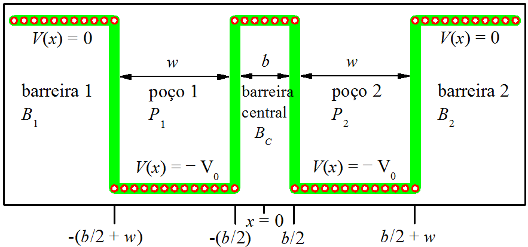
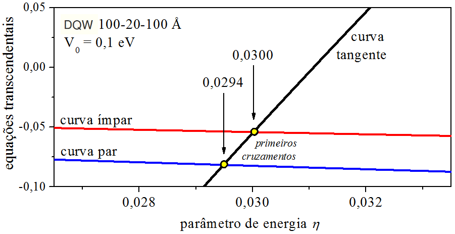
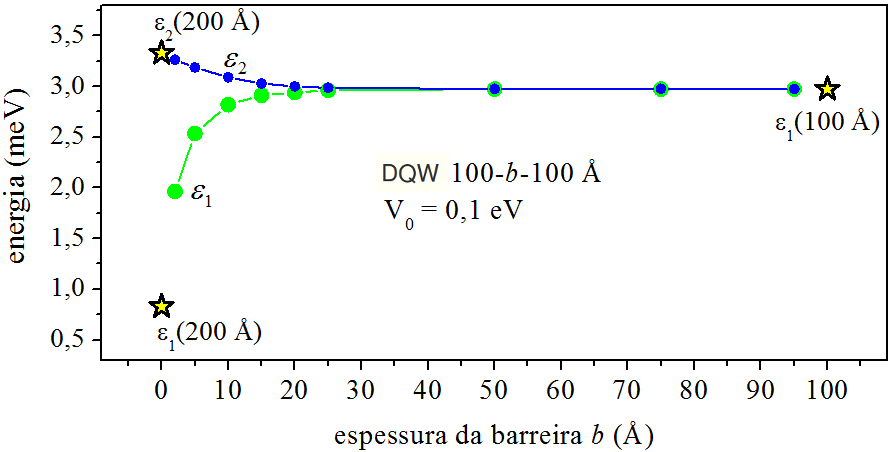
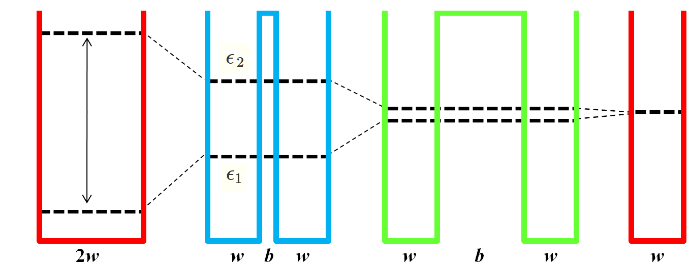
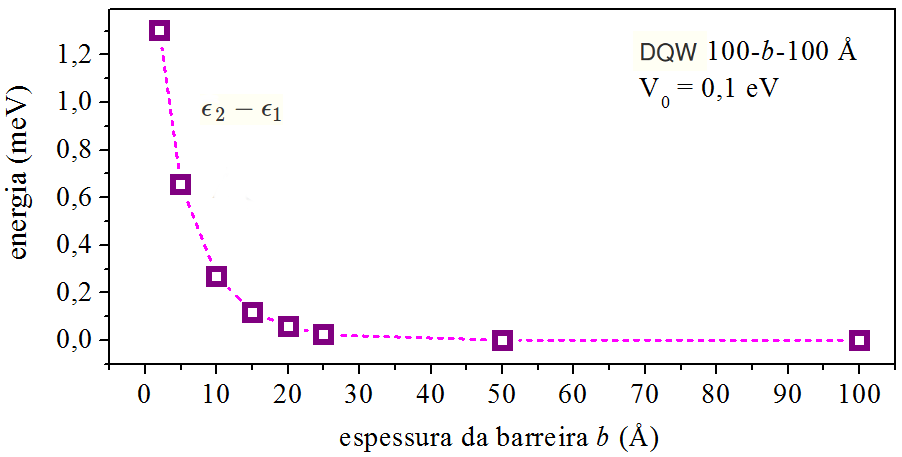
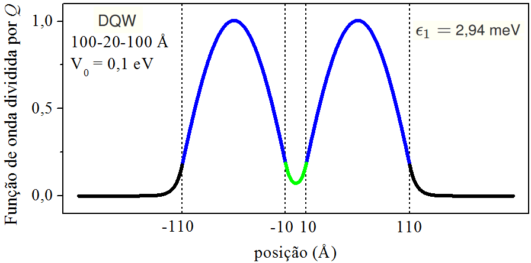
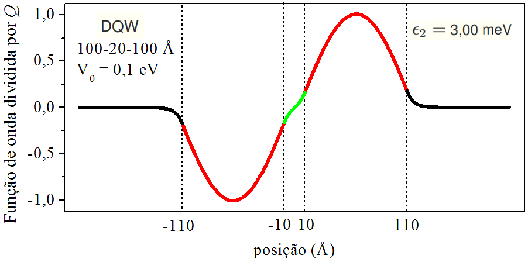
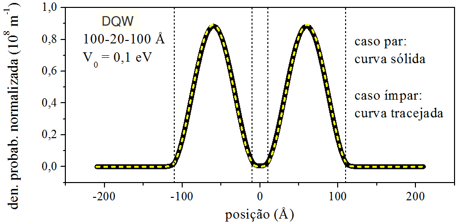

# O POÇO QUÂNTICO DUPLO: 1-ELÉTRON, 2-POÇOS  {#Cap11}

## Introdução {#cap11-1}

O artigo 
[2-Massas, 2-Poços; 2-Massas, 1-Poço; 2-Elétrons,
2-Poços; 2-Elétrons, 1-Poço](https://bycfisica.netlify.app/post/site13_pocos/)
analisa 4 situações de 2-partículas confinadas em poços quânticos.

Este capítulo analisa a situação de 1-elétron confinado em 2-poços quânticos.
Na literatura, o sistema é conhecido como _Double Quantum Well_ (DQW) --- Poço Quântico Duplo.
A estrutura é formada por 2-poços separados por 1-barreira delgada,
o que permite o tunelamento do elétron através da barreira [@tada1988].
Isso significa que há probabilidade do elétron ser encontrado
no primeiro e também no segundo poço do DQW.

Um método --
para se determinar a energia de confinamento e a função de onda de um DQW --
é o método numérico [@keshavarz2010].

Neste capítulo --
a energia de confinamento e a função de onda --
serão encontradas com base em resultados de equações transcendentais [@kamizato1989].
A técnica consiste em _cruzar equações_ que levam em conta
condições de continuidade da função de onda 
nas interfaces poço/barreira --- 
o local do cruzamento pode ser determinado por meio de um gráfico.

## O perfil do potencial {#cap11-2}

O poço quântico duplo (DQW) é formado por 2-poços retangulares separados por 1-barreira central.
Neste artigo, os poços serão considerados com potencial negativo, $V(x)=-V_0$,
e as barreiras laterais e central, com potencial igual a zero, $V(x)=0$.
A Fig. \@ref(fig:G1) mostra o perfil de potencial 
e a nomenclatura adotada para designar cada peça do DQW.

(\#fig:G1)Perfil de potencial do poço quântico duplo e nomenclatura das peças.

Olhando os cortes da Fig. \@ref(fig:G1), 
nota-se que $(b,w)$ representam a largura de barreira central e largura de poço individual, respectivamente. 
Também, que há simetria em relação à origem das posições $(x=0)$.
Por isso, esse tipo de DQW é classificado como simétrico -- é classificado como assimétrico 
quando os poços são diferentes, por exemplo, 
caso não possuam larguras ou profundidades iguais [@ram2006].

## As características da função de onda {#cap11-3}

O estudo se concentrará na energia de partícula _menor_ que a altura de barreira 
e _maior_ que o fundo de poço, ou seja, quando a energia do elétron estiver entre $-V_0<E<0$.

Na região dos poços, o número de onda da peça de função de onda é real:

$$
k = \frac{1}{\hbar} \sqrt{2m(E+V_0)} ,
(\#eq:Du1)
$$

e a solução da equação de Schrödinger resulta em exponencial complexa, do tipo $e^{\pm ikx}$.

Na região das barreiras (central, barreira-1 e barreira-2), 
a combinação de potencial nulo com energia de partícula negativa produz número de onda imaginário: 

$$
k^{\rm img} = \frac{1}{\hbar} \sqrt{2m(E-0)} ,
(\#eq:Du2)
$$

sendo conveniente escrevê-lo na forma

$$
k^{\rm img} = i q,
(\#eq:Du3)
$$

onde

$$
q = \frac{1}{\hbar} \sqrt{2m(0-E)} .
(\#eq:Du4)
$$

Então, na região das barreiras,
a solução da equação de Schrödinger resulta em exponencial real, do tipo $e^{\pm qx}$.
 
Em \@ref(eq:Du1) e \@ref(eq:Du4), as grandezas $m$ e $\hbar$ representam
a massa do elétron e a constante de Planck, nesta ordem.

Explorar a simetria do DQW \@ref(fig:G1)
poupa trabalho na hora de determinar a função de onda global, que se estende de $-\infty < x < \infty$,
pois, é preciso se preocupar apenas com a determinação da função do lado direito do DQW,
já que a função do lado esquerdo $(x<0)$ é mais ou menos igual à função do lado direito $(x>0)$:

$$
\Psi(x<0) = \pm \Psi(x>0) .
(\#eq:Du5)
$$

Na linguagem matemática, quando

$$
\Psi(x<0) = + \Psi(x>0),
(\#eq:Du6)
$$

diz-se que a função é par (seu gráfico tem simetria em relação ao eixo vertical), e quando

$$
\Psi(x<0) = - \Psi(x>0) ,
(\#eq:Du7)
$$

é dito que a função é ímpar (seu gráfico tem simetria em relação à origem).

Logo, 
as soluções do DQW \@ref(fig:G1) se dividem em 2-grupos: 
o conjunto de funções de onda pares e o conjunto de funções de onda ímpares.

Deve-se escolher peças de função de onda com o objetivo de simplificar a manipulação matemática. 
O capítulo 9 do livro 
[Mecânica Quântica: Confinamento e Espalhamento por Potenciais
Retangulares](http://ufrr.br/mq1cassio/9-Cap09.html#Cap09),
que trata do poço quântico simples, iniciou a análise utilizando peças complexas,
todavia, após alguns passos matemáticos, 
trasformou-se as peças complexas em peças reais (senos e cossenos).
Neste artigo, vamos prontamente iniciar o estudo considerando soluções reais.

Qual solução poderá compor as peças dos poços?

> Há propagação de ondas dentro dos poços,
ondas que incidem e refletem na interface poço/barreira,
então, poderia-se operar com uma combinação de exponenciais complexas,
todavia, é mais conveniente usar uma combinação de seno e cosseno.

Qual solução poderá compor a peça da barreira central?

> Não há propagação de ondas na barreira central,
a solução é a soma de duas exponenciais reais:
as que fariam a vez da “onda incidente” e da “onda refletida” -- aqui
cabe lembrar que a combinação de exponenciais reais resulta em cosseno hiperbólico ou seno hiperbólico.

Qual solução poderá compor as peças das barreiras laterais?

> Também não há propagação de ondas nas barreiras laterais,
a solução poderia ser do mesmo tipo da barreira central, 
a soma de duas exponenciais reais, todavia,
as barreiras laterais se estendem até o infinito, por isso,
a única exponencial que deve permanecer na solução, 
é aquela que tende a zero no infinito.

## A equação da energia {#cap11-4}

Esta seção apresenta o procedimento que leva à equação capaz de fornecer 
os valores da energia de confinamento do elétron,
uma equação cujas raizes podem ser determinadas com auxílio gráfico,
denominada equação transcendental.

A notação que é utilizada para descrever 
as peças da função de onda global,
está impressa na Fig. \@ref(fig:G1).

As ponderações feitas na seção [\@ref(cap11-3)]
nos leva a concentrar o trabalho ao redor do poço-2.

Com o intuito de utilizar o padrão Latex,
será utilizado `sin` para seno, `cos` para cosseno, `tan` para tangente, `exp` para exponencial,
`cosh` para cosseno hiperbólico e `sinh` para seno hiperbólico.

A função de onda dentro do poço-2 é escrita como combinação de seno e cosseno:

$$
P_2 (x) = P \cos [kx] + Q \sin [kx] ,
(\#eq:Du8)
$$

onde $P$ e $Q$ são amplitudes e $k$ é o número de onda \@ref(eq:Du1).

A função de onda dentro da barreira-2 tem a forma de uma exponencial 
que decai em função do número de onda \@ref(eq:Du4):

$$
B_2 (x) = D \exp [-qx] .
(\#eq:Du9)
$$

A função de onda deve ser contínua na interface poço/barreira,
para isso, iguala-se \@ref(eq:Du8) com \@ref(eq:Du9) no ponto $x=b/2+w$:

$$
\small
P \cos [k(b/2+w)] + Q \sin [k(b/2+w)] = D \exp [-q (b/2+w)] .
(\#eq:Du10)
$$

A derivada da função de onda também deve ser contínua na interface poço/barreira,
para isso, deriva-se as Eqs. \@ref(eq:Du8) e \@ref(eq:Du9)

$$
\begin{align}
P' _2 (x)  &=  -k P \sin [kx] + k Q \cos [kx]   (\#eq:Du11a),\\
B' _2 (x)  &=  -q D \exp [-qx]              (\#eq:Du11b),
\end{align}
$$

e, depois, iguala-se os resultados das derivadas no ponto $x=b/2+w$:

$$
\small
-P \sin [k(b/2+w)] + Q \cos [k(b/2+w)] = -\frac{q}{k} D \exp [-q (b/2+w)] .
(\#eq:Du12)
$$

Divide-se a Eq. \@ref(eq:Du12) pela Eq. \@ref(eq:Du10):

$$
\frac { -P \sin [k(b/2+w)] + Q \cos [k(b/2+w)] } 
      {  P \cos [k(b/2+w)] + Q \sin [k(b/2+w)] } = -\frac{q}{k} .
(\#eq:Du13)
$$
 

Manipula-se a Eq. \@ref(eq:Du13) até chegar no agrupamento dos senos e os cossenos:

$$
\small
-Q \sin [k(b/2+w)]
\left[ 1 -\frac{k}{q} \frac{P}{Q} \right] =
P \cos [k(b/2+w)]
\left[ 1 + \frac{k}{q} \frac{Q}{P} \right] .
(\#eq:Du14)
$$

Encerra-se a dedução utilizando a definição de tangente:

$$
\tan [k(b/2+w)] = -(P/Q)
\frac{  \left[  1  +  (k/q)  (Q/P)   \right] }
     {  \left[  1  -  (k/q)  (P/Q)   \right] } .
(\#eq:Du15)
$$

Que informação se torna pública por meio da equação transcendental \@ref(eq:Du15)? 

> Disparando o gráfico da Eq. \@ref(eq:Du15),
a energia de confinamento é determinada
fixando atenção no cruzamento que a curva tangente faz 
com a curva da expressão do lado direito.

Das variáveis da Eq. \@ref(eq:Du15), ainda resta saber a expressão de $P/Q$. 
Conforme discutido na seção [\@ref(cap11-3)],
há uma expressão vinculada ao conjunto de funções de onda pares
e outra vinculada ao conjunto de funções de onda ímpares.

## $P/Q$ (função par) {#cap11-5}

Esta seção determina a expressão de $P/Q$, vinculada à função de onda par.
Para isso, analisa a continuidade da função de onda 
na interface poço-2/barreira-central: ponto $x=b/2$.

A função de onda dentro da barreira-central é descrita por um cosseno hiperbólico,
já que cossenos hiperbólicos são funções pares:

$$
B_c (x) = B \cosh [q x] .
(\#eq:Du16)
$$

A derivada do cosseno hiperbólico resulta em seno hiperbólico

$$
B' _c (x) = q B \sinh [q x] .
(\#eq:Du17)
$$

A função de onda deve ser contínua na interface poço/barreira,
para isso, iguala-se \@ref(eq:Du8) com \@ref(eq:Du16) no ponto $x=b/2$:

$$
P \cos [k (b/2)] + Q \sin [k (b/2)] = B \cosh [q (b/2)] .
(\#eq:Du18)
$$

A derivada da função de onda também deve ser contínua na interface poço/barreira,
para isso, no ponto $x=b/2$, iguala-se $P' _2 (x)$ de \@ref(eq:Du11a) 
com $B' _c (x)$ de \@ref(eq:Du17):

$$
P \sin [k (b/2)] - Q \cos [k (b/2)]  =  -\frac{q}{k} B \sinh [q (b/2)] .
(\#eq:Du19)
$$

Multiplicação da Eq. \@ref(eq:Du18) por $\cos [k (b/2)]$: 

$$
\begin{aligned}
P \cos^2 [k (b/2)] &+ Q \sin [k (b/2)] \cos [k (b/2)] = \\
                   &= B \cosh [q (b/2)] \cos [k (b/2)] .
\end{aligned}
(\#eq:Du20)
$$

Multiplicação da Eq. \@ref(eq:Du19) por $\sin [k (b/2)]$: 

$$
\begin{aligned}
P \sin^2 [k (b/2)] &- Q \cos [k (b/2)] \sin [k (b/2)] = \\
                   &= -\frac{q}{k} B \sinh [q (b/2)] \sin [k (b/2)] .
\end{aligned}
(\#eq:Du21)
$$

Lembrando que $\cos^2 + \sin^2 = 1$, soma das Eqs. \@ref(eq:Du20) e \@ref(eq:Du21):

$$
\small
P = B \cosh [q (b/2)] \cos [k (b/2)] - \frac{q}{k} B \sinh [q (b/2)] \sin [k (b/2)] .
(\#eq:Du22)
$$

Agora,
multiplicação da Eq. \@ref(eq:Du18) por $\sin [k (b/2)]$,
multiplicação da Eq. \@ref(eq:Du19) por $\cos [k (b/2)]$,
e soma dos resultados:

$$
\small
Q = B \cosh [q (b/2)] \sin [k (b/2)] + \frac{q}{k} B \sinh [q (b/2)] \cos [k (b/2)] .
(\#eq:Du23)
$$

Por fim, a divisão de \@ref(eq:Du22) por \@ref(eq:Du23),
resulta na expressão de $P/Q$ (função par):

$$
\small
P/Q = 
\frac
{ (k/q) \cosh [q (b/2)] \cos [k (b/2)] - \sinh [q (b/2)] \sin [k (b/2)] }
{ (k/q) \cosh [q (b/2)] \sin [k (b/2)] + \sinh [q (b/2)] \cos [k (b/2)] } .
(\#eq:Du24)
$$

## $\bar{P}/\bar{Q}$ (função ímpar) {#cap11-6}

Esta seção segue o procedimento da seção [\@ref(cap11-5)] --- com algumas adaptações.

A função de onda de caráter _ímpar_ será marcada com uma _barra_.

A função de onda dentro da barreira-central, agora, é ímpar, por isso,
é representada por um seno hiperbólico,
já que senos hiperbólicos são funções ímpares:

$$
\begin{align}
\bar{B}   _ c (x) &= \bar{B} \sinh [q x]      (\#eq:Du25a),\\
\bar{B} ' _ c (x) &= q \bar{B} \cosh [q x]  (\#eq:Du25b).
\end{align}
$$

A função de onda dentro do poço-2 _continua_ escrita como combinação de seno e cosseno:

$$
\begin{align}
\bar{P}   _ 2 (x)  &=  \bar{P} \cos [kx] + \bar{Q} \sin [kx]      (\#eq:Du26a),\\
\bar{P} ' _ 2 (x)  &=  -k \bar{P} \sin [kx] + k \bar{Q} \cos [kx] (\#eq:Du26b).
\end{align}
$$

Semelhante ao que fizemos na seção anterior,
é hora de aplicar as condições de continuidade no ponto $x=b/2$ e manipular os resultados.
Com um pouco de trabalho, 
é fácil mostrar que $\bar{P}/\bar{Q}$ (função ímpar) tem o aspecto:

$$
\small
\bar{P}/\bar{Q} = 
\frac
{ (k/q) \sinh [q (b/2)] \cos [k (b/2)] - \cosh [q (b/2)] \sin [k (b/2)] }
{ (k/q) \sinh [q (b/2)] \sin [k (b/2)] + \cosh [q (b/2)] \cos [k (b/2)] } .
(\#eq:Du27)
$$

## Determinação da energia de confinamento {#cap11-7}

A determinação da energia de confinamento do elétron no poço quântico duplo,
lança mão da equação transcendental desenvolvida na seção [\@ref(cap11-4)] 
e das expressões deduzidas nas seções [\@ref(cap11-5)] e [\@ref(cap11-6)].
Vamos, então, agrupá-las nesta seção.

Ao trabalhar com `função de onda par`, deve-se usar:

$$
\tan [k(b/2+w)] = -(P/Q)
\frac{  \left[  1  +  (k/q)  (Q/P)   \right] }
     {  \left[  1  -  (k/q)  (P/Q)   \right] } ,
(\#eq:Du28)
$$

$$
\small
P/Q = 
\frac
{ (k/q) \cosh [q (b/2)] \cos [k (b/2)] - \sinh [q (b/2)] \sin [k (b/2)] }
{ (k/q) \cosh [q (b/2)] \sin [k (b/2)] + \sinh [q (b/2)] \cos [k (b/2)] } .
(\#eq:Du29)
$$

E, com `função de onda ímpar`:

$$
\tan [k(b/2+w)] = -( \bar{P}/\bar{Q} )
\frac{  \left[  1  +  (k/q)  \bar{Q}/\bar{P}   \right] }
     {  \left[  1  -  (k/q)  \bar{P}/\bar{Q}   \right] } ,
(\#eq:Du30)
$$

$$
\small
\bar{P}/\bar{Q} = 
\frac
{ (k/q) \sinh [q (b/2)] \cos [k (b/2)] - \cosh [q (b/2)] \sin [k (b/2)] }
{ (k/q) \sinh [q (b/2)] \sin [k (b/2)] + \cosh [q (b/2)] \cos [k (b/2)] } .
(\#eq:Du31)
$$

O método requer varredura na energia do elétron,
que é negativa, e está embutida nos números de onda:

$$
k = \frac{1}{\hbar} \sqrt{2m(E+V_0)} ,
(\#eq:Du32)
$$

$$
q = \frac{1}{\hbar} \sqrt{2m(0-E)} .
(\#eq:Du33)
$$

Como se vê na  Fig. \@ref(fig:G1), 
para fitar toda série de energia de confinamento,
a varredura deve conter os valores: $-V_0<E<0$.
Ao invés da inspeção ser realizada com números negativos, 
é preferível utilizar valores positivos.
Para isso, pode-se parametrizar a energia: 

$$
E = (\eta-1) V_0 ,
(\#eq:Du34)
$$

e fazer o parâmetro de energia percorrer os valores: $0<\eta<1$.

### Exemplo numérico {#cap11-7a}

Vamos colocar números nas fórmulas!

Este exemplo considera um DQW de profundidade $V_0=$ 0,1 eV
e estrutura 100-20-100 Å, quer dizer, de $w=$ 100 Å e $b=$ 20 Å.
As curvas das Eqs. \@ref(eq:Du28) e \@ref(eq:Du30),
que foram designadas `curva par` e `curva ímpar`, respectivamente,
são apresentadas na Fig. \@ref(fig:G2).

(\#fig:G2)Cruzamantos de equações transcendentais.

Os cruzamantos das equações transcendentais revelam os seguintes 
parâmetros de energia (adimensionais):

$$
\begin{aligned}
\eta _ 1 &= 0,\!0294   \ \   \leftarrow   \ \   {\it curva\ par}   ,\\
\eta _ 2 &= 0,\!0300   \ \   \leftarrow   \ \   {\it curva\ \acute{\imath}\!mpar} .
\end{aligned}
(\#eq:Du35)
$$

Os parâmetros \@ref(eq:Du35) correspondem às seguintes energias de confinamento (meV):

$$
\begin{aligned}
E _ 1 &= -97,\!06   ;\\
E _ 2 &= -97,\!00   .
\end{aligned}
(\#eq:Du36)
$$

O nível de energia é definido como:

$$
\epsilon = E + V_0 .
(\#eq:Du37)
$$

Já que $V_0=100$ meV,
as energias \@ref(eq:Du36) correspondem aos seguintes níveis de energia (meV):

$$
\begin{aligned}
\epsilon _ 1 &= 2,\!94   ;\\
\epsilon _ 2 &= 3,\!00   .
\end{aligned}
(\#eq:Du38)
$$

Os resultados indicam que o nível de energia do estado fundamental se origina
da solução par e que o nível de energia do primeiro estado excitado vem da solução ímpar.
A diferença de energia entre os níveis de energia \@ref(eq:Du38) é (meV):

$$
\epsilon _ 2 - \epsilon _ 1  =  0,\!06 .
(\#eq:Du39)
$$

## O efeito da espessura da barreira {#cap11-8}

A energia de confinamento é sensível em relação à espessura da barreira-central, ao valor de $b$. 
A função de onda do lado esquerdo do DQW se conecta com a do lado direito, 
através da barreira-central, mas,
se os poços estiverem muito afastados um do outro, a função de onda perde a conexão.
Nesse caso, o efeito de tunelamento passa a ser desprezível,
e o DQW se comporta como 2-poços simples, individuais.
Por exemplo, para o DQW da seção [\@ref(cap11-7a)],
o efeito de espessura de barreira 
sobre os níveis de energia é apresentado na Fig. \@ref(fig:G3).

(\#fig:G3)Efeito de espessura de barreira. A geometria e profundidade do DQW estão na própria figura.

O aumento da espessura da barreira faz os níveis do DQW $(\epsilon_1,\epsilon_2)$
se aproximarem do patamar $\epsilon_1$ (100 Å):
nível de energia do estado fundamental de um poço simples de largura 100 Å.
O efeito do desacoplamento dos poços é nítido,
por exemplo, quando a barreira atinge 50 Å de espessura.
Nesse caso, o poço duplo (100-50-100 Å)
se comporta como um poço simples (100 Å)
afastado (e desacoplado) de outro poço simples (100 Å).

Por outro lado, 
barreiras delgadas (finas) intensificam a diferença entre os níveis do DQW,
como se vê, no início da Fig. \@ref(fig:G3).
No limite da barreira desaparecer ($b \to 0$),
o DQW se comporta como um poço simples de largura $2w$:
O nível de energia $\epsilon_1$ tende ao 
nível de energia do estado fundamental de um poço simples de largura 200 Å,
e o nível de energia $\epsilon_2$,
avizinha-se do nível de energia do primeiro estado excitado desse mesmo poço simples.

O efeito de espessura de barreira é ilustrado na Fig. \@ref(fig:G4)

(\#fig:G4)Ilustração do efeito de espessura de barreira.

A Fig. \@ref(fig:G5) mostra que
a diferença de energia entre os níveis de energia $(\epsilon_2-\epsilon_1)$
do DQW da seção [\@ref(cap11-7a)]
cai exponencialmente em função da largura da barreira.

(\#fig:G5)Comportamento da diferença de energia entre níveis de energia. A geometria e profundidade do DQW estão na própria figura.

## A função de onda par {#cap11-9}

Distribuído pelas seções,
há peças para a construção da função de onda de caráter par,
que se estende de $-\infty < x < \infty$.
Cabe, agora, organizar essas peças.

Antes de tudo, precisamos revestir a notação com o fato da energia ser quantizada.
Faremos isso, adicionando $n$ à notação:

$$
\begin{aligned}
k_n  &=  \frac{1}{\hbar} \sqrt{2m(E_n + V_0)} ,\\
q_n  &=  \frac{1}{\hbar} \sqrt{2m(0   - E_n)} ,
\end{aligned}
(\#eq:Du40)
$$

Nesta seção, o rótulo $n$ corre entre os números ímpares: $n=1,3,5,\dots$

O procedimento é bem simples:
Para encontrar a função de onda do lado direto do DQW,
divide-se as Eqs. \@ref(eq:Du8), \@ref(eq:Du9) e \@ref(eq:Du16) pela quantidade $Q$:

$$
\begin{aligned}
P_2 (x) /Q  &= (P/Q) \cos [k_nx] + \sin [k_nx] ,\\
B_2 (x) /Q  &= (D/Q) \exp [-q_nx]              ,\\
B_c (x) /Q  &= (B/Q) \cosh [q_nx]              ,
\end{aligned}
(\#eq:Du41)
$$

sendo as relações de apoio:

$$
\small
\begin{aligned}
P/Q      &= 
\frac
{ (k_n/q_n) \cosh [q_n (b/2)] \cos [k_n (b/2)] - \sinh [q_n (b/2)] \sin [k_n (b/2)] }
{ (k_n/q_n) \cosh [q_n (b/2)] \sin [k_n (b/2)] + \sinh [q_n (b/2)] \cos [k_n (b/2)] } ,\\
D/Q      &= 
\left\{
(P/Q) \cos [k_n (b/2+w)] + \sin [k_n (b/2+w)] 
\right\} \exp{ [q_n (b/2+w)] }   ,\\
B/Q      &= 
\frac
{  (P/Q) \cos [k_n (b/2)] + \sin [k_n (b/2)]  }
{  \cosh{ [q_n (b/2)] }  } .
\end{aligned}
\notag
$$

Agora, o lado esquerdo é o lado negativo $(x<0)$.
Vamos chamar os negativos de $x_{-}$ (e os positivos de $x_{+}$).
Então, 
para encontrar a função de onda do lado esquerdo do DQW,
explora-se o fato deste caso de trabalho ser o _caso par_ e, conforme \@ref(eq:Du6), 
a função do lado esquerdo _é igual_ à função do lado direito, logo:
 
$$
\begin{aligned}
P_1 (x_{-}) /Q  &= P_2 (x_{+}) /Q  ,\\
B_1 (x_{-}) /Q  &= B_2 (x_{+}) /Q  ,\\
B_c (x_{-}) /Q  &= B_c (x_{+}) /Q  .
\end{aligned}
(\#eq:Du43)
$$

Por exemplo:

$$
B_1 (-121) /Q  =  (D/Q) \exp [-q_n \cdot 121] .
(\#eq:Du43b)
$$

As peças \@ref(eq:Du41) e \@ref(eq:Du43) constroem a função de onda par em toda extenção do DQW.
Mantendo a geometria e profundidade do DQW da seção [\@ref(cap11-7a)],
a Fig. \@ref(fig:G6) apresenta a função de onda 
do estado fundamental --- nível de energia $\epsilon_1=$ 2,94 meV.

(\#fig:G6)Função de onda do estado fundamental. A geometria e profundidade do DQW estão na própria figura.

## A função de onda ímpar {#cap11-10}

Deve-se lembrar que a notação do caso _ímpar_ é marcada com uma _barra_.
Também, que as posições do lado esquerdo e direiro são
representadas por $x_{-}$ e $x_{+}$, respectivamente.

Atenção na hora de utilizar os números de onda \@ref(eq:Du40):
Nesta seção, o rótulo $n$ corre entre os números pares: $n=2,4,6,\dots$

Do lado direto do DQW:

$$
\begin{aligned}
\bar{P}_2 (x) / \bar{Q}  &= (\bar{P}/\bar{Q}) \cos [k_nx] + \sin [k_nx] ,\\
\bar{B}_2 (x) / \bar{Q}  &= (\bar{D}/\bar{Q}) \exp [-q_nx]              ,\\
\bar{B}_c (x) / \bar{Q}  &= (\bar{B}/\bar{Q}) \sinh [q_nx]              .
\end{aligned}
(\#eq:Du44)
$$

Agora, as relações de apoio são:

$$
\small
\begin{aligned}
\bar{P}/\bar{Q}  &= 
\frac
{ (k_n/q_n) \sinh [q_n (b/2)] \cos [k_n (b/2)] - \cosh [q_n (b/2)] \sin [k_n (b/2)] }
{ (k_n/q_n) \sinh [q_n (b/2)] \sin [k_n (b/2)] + \cosh [q_n (b/2)] \cos [k_n (b/2)] } ,\\
\bar{D}/\bar{Q}  &= 
\left\{
(\bar{P}/\bar{Q}) \cos [k_n (b/2+w)] + \sin [k_n (b/2+w)] 
\right\} \exp{ [q_n (b/2+w)] }   ,\\
\bar{B}/\bar{Q}  &= 
\frac
{  (\bar{P}/\bar{Q}) \cos [k_n (b/2)] + \sin [k_n (b/2)]  }
{  \sinh{ [q_n (b/2)] }  } .
\end{aligned}
\notag
$$

E para encerrar,
este caso de trabalho é o _caso ímpar_, segundo \@ref(eq:Du7),
a função do lado esquerdo _é menos igual_ à função do lado direito:
 
$$
\begin{aligned}
\bar{P}_1 (x_{-}) / \bar{Q}  &= - \bar{P}_2 (x_{+}) / \bar{Q}  ,\\
\bar{B}_1 (x_{-}) / \bar{Q}  &= - \bar{B}_2 (x_{+}) / \bar{Q}  ,\\
\bar{B}_c (x_{-}) / \bar{Q}  &= - \bar{B}_c (x_{+}) / \bar{Q}  .
\end{aligned}
(\#eq:Du46)
$$

Por exemplo:

$$
\bar{B}_1 (-121) / \bar{Q}  =  - (\bar{D} / \bar{Q}) \exp [-q_n \cdot 121] .
(\#eq:Du46b)
$$

As peças \@ref(eq:Du44) e \@ref(eq:Du46) montam a função de onda ímpar em toda extenção do DQW.
Mantendo a geometria e profundidade do DQW da seção [\@ref(cap11-7a)],
a Fig. \@ref(fig:G7) apresenta a função de onda 
do primeiro estado excitado --- nível de energia $\epsilon_2=$ 3,00 meV.

(\#fig:G7)Função de onda do primeiro estado excitado. Ver geometria e profundidade do DQW na própria figura.

## A função de onda normalizada {#cap11-11}

As seções [\@ref(cap11-9)] e [\@ref(cap11-10)] deixaram em aberto a quantidade $Q$.
Pode-se dizer que as funções de onda apresentadas nas Figs. \@ref(fig:G6) e \@ref(fig:G7) 
não estão normalizadas.

O valor de $Q$ é encontrado pelo processo de normalização de função de onda:

$$
\int_{-\infty}^{+\infty}
\left| \frac{\Psi(x)}{Q} \right|^2  dx = \frac{1}{\left| Q \right|^2 } .
(\#eq:Du47)
$$

Lembrando que $\Psi(x)/Q$ representa uma função de onda _não normalizada_,
a Eq. \@ref(eq:Du47) nos leva a concluir
que `a área debaixo da curva da densidade de probabilidade não-normalizada` 
é igual à quantidade $1/|Q|^2$.

O valor de $Q$ está vinculado ao valor de uma área.
Há vários softwares que podem calcular áreas de curvas.
O método, aqui sugerido, faz uso desses softwares.

Desse modo,
tomando as funções de onda das Figs. \@ref(fig:G6) e \@ref(fig:G7),
as áreas de suas densidades de probabilidade possuem
os valores impressos na Tabela \@ref(tab:TT1).

Table: (\#tab:TT1) NORMALIZAÇÃO DE FUNÇÃO DE ONDA.

| Função de onda  | Área da densidade de probabilidade (m) | Valor de $|Q|^2$ (m$^{-1}$) |
| :-------------: | :------------------------------------: | :-------------------------: |
| Par             | $1,\!142 \times 10^{-8}$               | $8,\!757 \times 10^{7}$     |
| Ímpar           | $1,\!137 \times 10^{-8}$               | $8,\!797 \times 10^{7}$     |
|                 |                                        |                             |

Os valores da Tabela \@ref(tab:TT1) são bem parecidos,
isso porque as curvas das densidades de probabilidade 
são quase idênticas --- ver a Fig. \@ref(fig:G8).

(\#fig:G8)Densidade de probabilidade do estado fundamental e do primeiro estado excitado. As curvas estão normalizadas. DQW: Geometria e profundidade na própria figura.

## Considerações finais  {#cap11-12}

A primeira equação escrita no artigo, Eq. \@ref(eq:Du1),
estabeleceu o "público-alvo" que se queira atingir.
Pode-se dizer que o "publico-alvo" é o elétron no vácuo.
Isso é claro, já que a grandeza $m$, da Eq. \@ref(eq:Du1), 
representa massa de repouso do elétron: $m=9,\!11 \times 10^{-31}$ kg.
E onde está esse elétron? Não há matéria ao seu redor.
O potencial \@ref(fig:G1) que confina o elétron é construído no vácuo.

Então está faltando algo nesse artigo: a matéria!

Poços quânticos não são construídos no vácuo.
A indústria de semicondutores investe pesado 
no desenvolvimento de materiais semicondutores.
Faça uma pesquisa sobre o tema.
O resultado vai mostrar que são feitos montantes enormes de investimentos para
se alcançar uma posição de destaque na indústria de componentes eletrônicos.

O elétron dentro de um material semicondutor se comporta como uma partícula de massa reduzida.
Por exemplo, a massa efetiva do elétron no GaAs é $0,\!067 \times 9,\!11 \times 10^{-31}$ kg,
ou seja, um valor `15 vezes menor` que a massa do elétron no vácuo. 

> E como o fator `massa reduzida` afeta o valor da energia de confinamento?

Este será o tema do próximo capítulo, tendo como título:

> __Poço Quântico Duplo de Semicondutores__.

