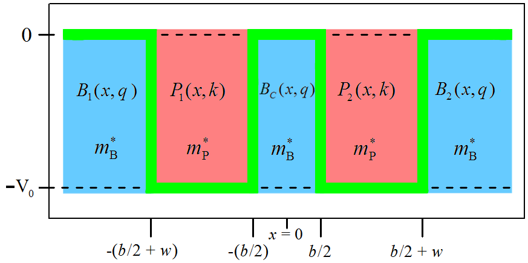
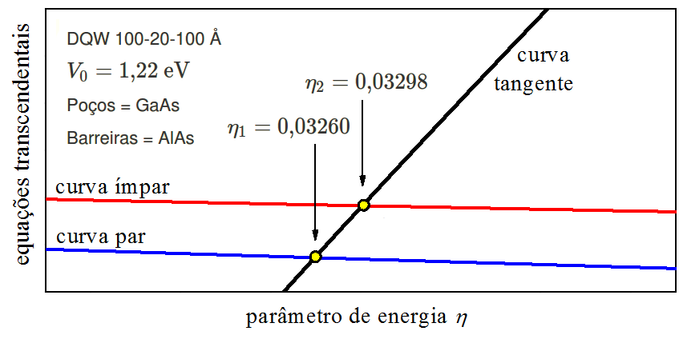

# O POÇO QUÂNTICO DUPLO DE SEMICONDUTORES  {#Cap12}

\newcommand{\mP}{\dfrac{1}{m ^ {\ast} _ {{\rm P}}}}

\newcommand{\mB}{\dfrac{1}{m ^ {\ast} _ {{\rm B}}}}

\newcommand{\mPo}{m ^ {\ast} _ {{\rm P}}}

\newcommand{\mBa}{m ^ {\ast} _ {{\rm B}}}

## Introdução {#cap12-1}

O capítulo anterior
mostra como determinar a energia de um elétron confinado em um poço quântico duplo,
mas, com uma simplificação: O objeto de estudo é desprovido de material.
O elétron é tratado como estando no vácuo, 
sob a ação de um potencial que corta o espaço na forma de poço duplo.

Neste capítulo, 
o __poço quântico duplo__  (DQW) é formado por __materiais semicondutores__,
quer dizer,
o potencial se torna ativo por causa de heterocamadas semicondutoras.

A resolução do poço quântico duplo crescido com materiais semicondutores 
se fundamenta na `aproximação da massa efetiva` e na `aproximação da função envelope`. 
Ademais, necessita saber os valores das profundidades dos poços 
e os valores das massas efetivas das camadas semicondutoras.
Estes assuntos já foram tratados no capítulo 10.

Outra coisa necessária é saber escrever 
as condições de continuidade (CC) 
da função de onda ao longo da heteroestrutura (ver a seção 10.4 do Livro).
As CC em semicondutores diferem do caso do elétron no vácuo, pois,
quando o elétron muda de uma "camada vazia" para outra "camada vazia",
sua massa não se altera, permanece com o valor $m=9,\!11 \times 10^{-31}\ {\rm kg}$.
Por outro lado,
em heteroestruturas semicondutoras, 
a massa efetivada do elétron  ($m^{\ast}$) no poço (P)  _é diferente_ 
da massa efetiva do elétron na barreira (B).
Por exemplo, numa interface P/B = GaAs/AlAs,
a massa efetiva da banda de condução do
GaAs é $m^{\ast}_{{\rm P}}=0,\!067 \times 9,\!11 \times 10^{-31}\ {\rm kg}$,
e a massa efetiva da banda de condução do
AlAs é $m^{\ast}_{{\rm B}}=0,\!150 \times 9,\!11 \times 10^{-31}\ {\rm kg}$ [@Sadao1985].
Por isso, 
as CC dependem da massa efetiva dos semicondutores que integram a interface.
Para certa interface P/B, localizada na posição $x=\ell$, 
as CC se escrevem:

$$
\begin{aligned}
\psi _ {\rm P}(\ell)                   &=  \psi _ {\rm B}(\ell)                  ,\\
\mP \frac{d\psi _ {\rm P}(\ell)} {dx}  &=  \mB \frac{d\psi _ {\rm B}(\ell)} {dx} .
\end{aligned}
(\#eq:CC1)
$$ 

Analisando a Eq. \@ref(eq:CC1), 
é fácil de entender as CC para o caso de "camadas vazias": 

$$
\begin{aligned}
\psi _ {\rm P}(\ell)                          &= \psi _ {\rm B}(\ell)                          ,\\
\frac{1}{m} \frac{d\psi _ {\rm P}(\ell)} {dx} &= \frac{1}{m} \frac{d\psi _ {\rm B}(\ell)} {dx} .
\end{aligned}
(\#eq:CC2)
$$ 

## Os elementos de trabalho {#cap12-2}

O poço quântico duplo de semicondutores
é formado por 2-poços retangulares separados por 1-barreira central.
Neste artigo,
os poços são considerados com potencial negativo, $V(x)=-V_0$,
e as barreiras laterais e central, com potencial igual a zero, $V(x)=0$.

A Fig. \@ref(fig:FG1) mostra o perfil do potencial 
ao longo das camadas do DQW.
Observe, com atenção, 
a peça de função de onda e a massa efetiva de cada camada
e, também, o número de onda associado à peça de função de onda.
Ademais, perceba que a largura da barreira central é designada por $b$
e a largura do poço individual, por $w$.
 

(\#fig:FG1)Poço duplo de semicondutores: Perfil de potencial; peças de função de onda; massas efetivas; números de onda; camadas.

Na região dos poços, o número de onda é real:

$$
k = \frac{1}{\hbar} \sqrt{2m ^{\ast} _ {{\rm P}} (E+V_0)} .
(\#eq:CC3)
$$

Na região das barreiras (central, barreira-1 e barreira-2), 
a combinação de potencial nulo com energia de partícula negativa produz número de onda imaginário: 

$$
k^{\rm img} = \frac{1}{\hbar} \sqrt{2m ^{\ast} _ {{\rm B}} (E-0)} ,
(\#eq:CC4)
$$

sendo conveniente escrevê-lo na forma

$$
k^{\rm img} = i q,
(\#eq:CC5)
$$

onde

$$
q = \frac{1}{\hbar} \sqrt{2m ^{\ast} _ {{\rm B}} (0-E)} .
(\#eq:CC6)
$$

Mais exclarecimentos sobre a notação:
Uma função de onda de caráter _ímpar_ será marcada com uma _barra_;
as posições negativas $(x<0)$ e positivas $(x>0)$
serão representadas por $x_{-}$ e $x_{+}$, nesta ordem;
as funções elementares serão escritas no padrão Latex: 
`sin` para seno,
`cos` para cosseno,
`tan` para tangente,
`cot` para cotangente,
`cosh` para cosseno hiperbólico,
`sinh` para seno hiperbólico
e `exp` para exponencial.

O DQW \@ref(fig:FG1) é simétrico em relação à origem das posições $(x=0)$. 
Logo, sua função de onda é par  $(\Psi)$  ou ímpar  $(\bar{\Psi})$,
sendo:

$$
\begin{aligned}
\Psi (x _ {-})       &= + \Psi (x _ {+})       ,\\
\bar{\Psi} (x _ {-}) &= - \bar{\Psi} (x _ {+}) .
\end{aligned}
(\#eq:CC7)
$$

A função de onda par é formada pelas seguintes peças:

$$
\begin{aligned}
B _ 1 (x _ {-}) &= B _ 2 (x _ {+})                        ,\\
P _ 1 (x _ {-}) &= P _ 2 (x _ {+})                        ,\\
B _ c (x _ {-}) &= B _ c (x _ {+})                        ,\\
B _ c (x _ {+}) &= B \cosh [qx _ {+}]                     ,\\
P _ 2 (x _ {+}) &= P \cos [kx _ {+}] + Q \sin [kx _ {+}]  ,\\
B _ 2 (x _ {+}) &= D \exp [-qx _ {+}]                     .
\end{aligned}
(\#eq:CC8)
$$

E as peças da função de onda ímpar são:

$$
\begin{aligned}
\bar{B _ 1} (x _ {-}) &= - \bar{B _ 2} (x _ {+})                             ,\\
\bar{P _ 1} (x _ {-}) &= - \bar{P _ 2} (x _ {+})                             ,\\
\bar{B _ c} (x _ {-}) &= - \bar{B _ c} (x _ {+})                             ,\\
\bar{B _ c} (x _ {+}) &=   \bar{B} \sinh [qx _ {+}]                          ,\\
\bar{P _ 2} (x _ {+}) &=   \bar{P} \cos [kx _ {+}] + \bar{Q} \sin [kx _ {+}] ,\\
\bar{B _ 2} (x _ {+}) &=   \bar{D} \exp [-qx _ {+}]                          .
\end{aligned}
(\#eq:CC9)
$$

## A equação da energia {#cap12-3}

Esta seção apresenta o procedimento que leva à equação capaz de fornecer 
os valores da energia de confinamento do elétron,
uma equação cujas raizes podem ser determinadas com auxílio gráfico,
denominada equação transcendental. 

> Todo trabalho se resume em aplicar as CC \@ref(eq:CC1) na interface $P_2$/$B_2$:

Primeiro, escreve-se $P_2(x)=B_2(x)$ para $x=b/2+w$:

$$
\small
P \cos [k(b/2+w)] + Q \sin [k(b/2+w)] = D \exp [-q (b/2+w)] .
(\#eq:CC10)
$$

Segundo, escreve-se as seguintes derivadas:

$$
\begin{aligned}
P' _ 2 (x)  &=  -k P \sin [kx] + k Q \cos [kx] ,\\
B' _ 2 (x)  &=  -q D \exp [-qx] .
\end{aligned}
(\#eq:CC11)
$$

Terceiro, escreve-se $\mBa P'_2(x) = \mPo B'_2(x)$ para $x=b/2+w$:

$$
\begin{aligned}
-P \sin [k(b/2+w)] &+ Q \cos [k(b/2+w)] =\\ 
                   &= -\frac{q\mPo}{k\mBa}  D \exp [-q (b/2+w)] .
\end{aligned}
(\#eq:CC12)
$$

Quarto, divide-se a Eq. \@ref(eq:CC12) pela Eq. \@ref(eq:CC10):

$$
\frac { -P \sin [k(b/2+w)] + Q \cos [k(b/2+w)] } 
      {  P \cos [k(b/2+w)] + Q \sin [k(b/2+w)] } = -\frac{q\mPo}{k\mBa} .
(\#eq:CC13)
$$
 

Quinto, manipula-se a Eq. \@ref(eq:CC13) até chegar no agrupamento dos senos e os cossenos:

$$
\small
\begin{aligned}
-Q \sin [k(b/2+w)]
\left[ 1 -\frac{k\mBa}{q\mPo} \frac{P}{Q} \right] &=
P \cos [k(b/2+w)] \times \\
&\times
\left[ 1 + \frac{k\mBa}{q\mPo} \frac{Q}{P} \right] .
\end{aligned}
(\#eq:CC14)
$$

Sexto, utiliza-se a definição de tangente:

$$
\tan [k(b/2+w)] = -(P/Q)
\frac{  \left[  1  +  \dfrac{k\mBa}{q\mPo}  \dfrac{Q}{P}   \right] }
     {  \left[  1  -  \dfrac{k\mBa}{q\mPo}  \dfrac{P}{Q}   \right] } .
(\#eq:CC15)
$$

> Disparando o gráfico da equação \@ref(eq:CC15),
a energia de confinamento é determinada fixando atenção 
no cruzamento que a curva tangente faz com a curva da expressão à direita.

Das variáveis da Eq. \@ref(eq:CC15), ainda resta saber a forma de $P/Q$. 
Haverá uma expressão para a função de onda par e outra para a função de onda ímpar.

### A expressão de $P/Q$ {#cap12-4}

Esta seção determina a expressão de $P/Q$ ---
a vinculação é com a função de onda par.

> Exame das CC \@ref(eq:CC1) na interface $P_2$/$B_c$:

Primeiro, escreve-se $P_2(x)=B_c(x)$ para $x=b/2$:

$$
P \cos [k(b/2)] + Q \sin [k(b/2)] = B \cosh [q (b/2)] .
(\#eq:CC16)
$$

Segundo, escreve-se as seguintes derivadas:

$$
\begin{aligned}
P' _ 2 (x)  &=  -k P \sin [kx] + k Q \cos [kx] ,\\
B' _ c (x)  &=   q B \sinh [qx] .
\end{aligned}
(\#eq:CC17)
$$

Terceiro, escreve-se $\mBa P'_2(x) = \mPo B'_c(x)$ para $x=b/2$:

$$
P \sin [k(b/2)] - Q \cos [k(b/2)] = -\frac{q\mPo}{k\mBa}  B \sinh [q (b/2)] .
(\#eq:CC18)
$$

Quarto, multiplica-se a Eq. \@ref(eq:CC16) por $\cos [k (b/2)]$: 

$$
\begin{aligned}
P \cos^2 [k (b/2)] &+ Q \sin [k (b/2)] \cos [k (b/2)] = \\ 
                   &= B \cosh [q (b/2)] \cos [k (b/2)] .
\end{aligned}
(\#eq:CC19)
$$

Quinto, multiplica-se a Eq. \@ref(eq:CC18) por $\sin [k (b/2)]$: 

$$
\begin{aligned}
P \sin^2 [k (b/2)] &- Q \cos [k (b/2)] \sin [k (b/2)] = \\
                   &= -\frac{q\mPo}{k\mBa}  B \sinh [q (b/2)] \sin [k (b/2)] .
\end{aligned}
(\#eq:CC20)
$$

Sexto, lembrando que $\cos^2 + \sin^2 = 1$, 
soma-se das Eqs. \@ref(eq:CC19) e \@ref(eq:CC20):

$$
\small
P = B \cosh [q (b/2)] \cos [k (b/2)]  -\frac{q\mPo}{k\mBa}  B \sinh [q (b/2)] \sin [k (b/2)] .
(\#eq:CC21)
$$

Sétimo (adaptação dos passos 4, 5 e 6),
multiplica-se a Eq. \@ref(eq:CC19) por $\sin [k (b/2)]$,
multiplica-se a Eq. \@ref(eq:CC20) por $\cos [k (b/2)]$,
soma-se os resultados:

$$
\small
Q = B \cosh [q (b/2)] \sin [k (b/2)]  +\frac{q\mPo}{k\mBa}  B \sinh [q (b/2)] \cos [k (b/2)] .
(\#eq:CC22)
$$

Oitavo,
divide-se a Eq. \@ref(eq:CC21) pela Eq. \@ref(eq:CC22):

$$
\small
P/Q = 
\frac
{ \dfrac{k\mBa}{q\mPo}  \cosh [q (b/2)] \cos [k (b/2)] - \sinh [q (b/2)] \sin [k (b/2)] }
{ \dfrac{k\mBa}{q\mPo}  \cosh [q (b/2)] \sin [k (b/2)] + \sinh [q (b/2)] \cos [k (b/2)] } .
(\#eq:CC23)
$$

### A expressão de $\bar{P}/\bar{Q}$ {#cap12-5}

Esta seção trada da expressão de $\bar{P}/\bar{Q}$ ---
a vinculação é com a função de onda ímpar.

Segue-se os passos da seção [\@ref(cap11-4)], mas, com esta adequação:
A função de onda dentro da barreira-central, agora, é ímpar, por isso,
é escrita como `seno hiperbólico` -- compare as 
Eqs. \@ref(eq:CC8) com as Eqs \@ref(eq:CC9).
Então, é fácil mostrar que:

$$
\small
\bar{P}/\bar{Q} = 
\frac
{ \dfrac{k\mBa}{q\mPo}  \sinh [q (b/2)] \cos [k (b/2)] - \cosh [q (b/2)] \sin [k (b/2)] }
{ \dfrac{k\mBa}{q\mPo}  \sinh [q (b/2)] \sin [k (b/2)] + \cosh [q (b/2)] \cos [k (b/2)] } .
(\#eq:CC24)
$$

## A energia de confinamento {#cap12-6}

A determinação da energia --- de elétron confinado em poço quântico duplo ---
lança mão da equação transcendental desenvolvida na seção [\@ref(cap11-3)] 
e das equações de apoio elaboradas nas seções [\@ref(cap11-4)] e [\@ref(cap11-5)].
Vamos, então, agrupá-las nesta seção.

`Equações de função de onda par`:

$$
\tan [k(b/2+w)] = -(P/Q)
\frac{  \left[  1  +  \dfrac{k\mBa}{q\mPo}  \dfrac{Q}{P}   \right] }
     {  \left[  1  -  \dfrac{k\mBa}{q\mPo}  \dfrac{P}{Q}   \right] } ,
(\#eq:CC25)
$$

$$
\small
P/Q = 
\frac
{ \dfrac{k\mBa}{q\mPo}  \cosh [q (b/2)] \cos [k (b/2)] - \sinh [q (b/2)] \sin [k (b/2)] }
{ \dfrac{k\mBa}{q\mPo}  \cosh [q (b/2)] \sin [k (b/2)] + \sinh [q (b/2)] \cos [k (b/2)] } .
(\#eq:CC26)
$$

`Equações de função de onda ímpar`:

$$
\tan [k(b/2+w)] = -(\bar{P}/\bar{Q})
\frac{  \left[  1  +  \dfrac{k\mBa}{q\mPo}  \dfrac{\bar{Q}}{\bar{P}}   \right] }
     {  \left[  1  -  \dfrac{k\mBa}{q\mPo}  \dfrac{\bar{P}}{\bar{Q}}   \right] } ,
(\#eq:CC27)
$$

$$
\small
\bar{P}/\bar{Q} = 
\frac
{ \dfrac{k\mBa}{q\mPo}  \sinh [q (b/2)] \cos [k (b/2)] - \cosh [q (b/2)] \sin [k (b/2)] }
{ \dfrac{k\mBa}{q\mPo}  \sinh [q (b/2)] \sin [k (b/2)] + \cosh [q (b/2)] \cos [k (b/2)] } .
(\#eq:CC28)
$$

O método requer varredura na energia do elétron,
que é negativa, e está declarada nos números de onda:

$$
k = \frac{1}{\hbar} \sqrt{2\mPo (E+V_0)} ,
(\#eq:CC29)
$$

$$
q = \frac{1}{\hbar} \sqrt{2\mBa (-E)} .
(\#eq:CC30)
$$

Como se vê na  Fig. \@ref(fig:FG1), 
para fitar toda série de energia de confinamento,
a varredura deve conter os valores de $(-V_0)<E<0$.
Ao invés da inspeção ser realizada com números negativos, 
é preferível utilizar valores positivos.
Para isso, pode-se parametrizar a energia: 

$$
E = (\eta-1) V_0 ,
(\#eq:CC31)
$$

e fazer o parâmetro de energia percorrer os valores de $0<\eta<1$.

### Um exemplo com números {#cap12-6a}

Vamos colocar números nas fórmulas!

Este exemplo considera um poço quântico duplo crescido com materiais semicondutores.
Os poços são de GaAs e as barreiras são de AlAs, por isso,
as massas efetivas nos poços e nas barreiras são $\mPo = 0,\!067 m_0$ e $\mBa = 0,\!150 m_0$,
nesta ordem, sendo $m_0 = 9,\!11 \times 10^{-31}$ kg [@Sadao1985].
A geometria é 100-20-100 Å, quer dizer, a largura do poço é $w=$ 100 Å 
e a largura da barreira-central é $b=$ 20 Å.
E a profundidade do poço 
é $V_0=1,\!22\ {\rm eV}$ (consulte o [Livro](http://ufrr.br/mq1cassio/10-2-PofunPoco.html) 
para saber determinar esse valor).

As curvas das Eqs. \@ref(eq:CC25) e \@ref(eq:CC27) são apresentadas na Fig. \@ref(fig:FG2).

(\#fig:FG2)Cruzamantos de equações transcendentais.

Os cruzamantos das equações transcendentais revelam os seguintes 
parâmetros de energia (adimensionais):

$$
\begin{aligned}
\eta _ 1 &= 0,\!03260  ,\\
\eta _ 2 &= 0,\!03298  .
\end{aligned}
(\#eq:CC32)
$$

Os parâmetros \@ref(eq:CC32) correspondem às seguintes energias de confinamento (eV):

$$
\begin{aligned}
E _ 1 &= -1,\!1802  ;\\
E _ 2 &= -1,\!1798  .
\end{aligned}
(\#eq:CC33)
$$

O nível de energia é definido como:

$$
\epsilon = E + V_0 .
(\#eq:CC34)
$$

Então,
as energias \@ref(eq:CC33) correspondem aos seguintes níveis de energia (meV):

$$
\begin{aligned}
\epsilon _ 1 &= 39,\!77  ;\\
\epsilon _ 2 &= 40,\!24  .
\end{aligned}
(\#eq:CC35)
$$

Os resultados indicam que o nível de energia do estado fundamental $(\epsilon_1)$ se origina
da solução par e que o nível de energia do primeiro estado excitado $(\epsilon_2)$ vem da solução ímpar.
A diferença de energia entre os níveis de energia \@ref(eq:CC35) é (meV):

$$
\epsilon _ 2 - \epsilon _ 1  =  0,\!47 .
(\#eq:Du39)
$$

## Do duplo para o simples {#cap12-7}

Há uma maneira de trasformar a equação transcendental de poço duplo
em equação transcendental de poço simples.
No limite da barreira desaparecer $(b \to 0)$,
o poço duplo se comporta como um poço simples de largura $2w$ --- caso $w=L/2$, 
vai se comportar como um simples de largura $L$.

O procedimento é bem elementar, 
consiste em substituir $w=L/2$ e $b=0$ nas Eqs. \@ref(eq:CC25) e \@ref(eq:CC27).

> Transformação da Eq. \@ref(eq:CC25):

$$
\tan [k(L/2)] = -
\frac{  \left[    1    +  \dfrac{k\mBa}{q\mPo}  \dfrac{Q}{P}   \right] }
     {  \left[  (Q/P)  -  \dfrac{k\mBa}{q\mPo}                 \right] } .
(\#eq:CC25b)
$$

Agora, a substituição de $b=0$ na equação de apoio \@ref(eq:CC26) resulta em $(Q/P)=0$,
que por sua vez, levado à Eq. \@ref(eq:CC25b), culmina em:

$$
\tan [k(L/2)] = \dfrac{q\mPo}{k\mBa} .
(\#eq:CC25c)
$$

> Transformação da Eq. \@ref(eq:CC27):

$$
\tan [k(L/2)] = -
\frac{  \left[  (\bar{P}/\bar{Q})  +  \dfrac{k\mBa}{q\mPo}                             \right] }
     {  \left[  1                  -  \dfrac{k\mBa}{q\mPo}  \dfrac{\bar{P}}{\bar{Q}}   \right] } .
(\#eq:CC27b)
$$

Agora, a substituição de $b=0$ na equação de apoio \@ref(eq:CC28) resulta em $(\bar{P}/\bar{Q})=0$,
que por sua vez, levado à Eq. \@ref(eq:CC27b), culmina em:

$$
\cot [k(L/2)] = -\dfrac{q\mPo}{k\mBa} .
(\#eq:CC27c)
$$

