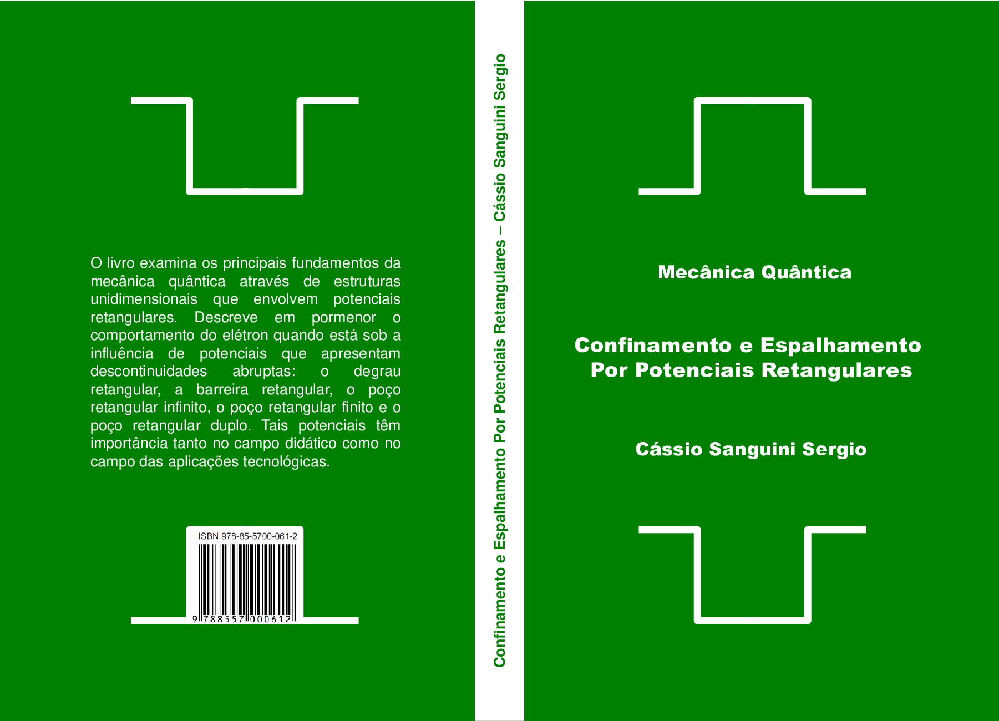

--- 
title: "Confinamento e Espalhamento por Potenciais Retangulares"
author: "Cássio Sanguini Sergio"
date: '2021-02-28'
documentclass: book
bibliography: bibliography.bib
biblio-style: apalike
link-citations: yes
favicon: FONTE/favicon.ico
---

# Sobre o Livro {-}

O livro examina os principais fundamentos da mecânica quântica 
através de estruturas unidimensionais que envolvem potenciais retangulares. 
Descreve em pormenor o comportamento do elétron quando está sob a influência de 
potenciais que apresentam descontinuidades abruptas: 
o degrau retangular, a barreira retangular, o poço retangular infinito e o poço retangular finito. 
Tais potenciais têm importância tanto no campo didático como no campo das aplicações
tecnológicas. O leque de aplicações é diversificado, podendo os perfis retangulares ser utilizados como
aproximações de sistemas físicos, químicos e biológicos. Aqui vamos nos apegar ao estudo dos semicondutores,
por se tratar de uma área de grande interesse científico, comercial e tecnológico. A facilidade encontrada na
estruturação matemática dos potenciais retangulares também torna a resolução desses potenciais um rico
material para a aprendizagem. Os casos estudados apresentam soluções analíticas fáceis de ser encontradas e
examinadas, ou soluções do tipo transcendental, que podem ser determinadas por simples métodos numéricos.
${-}$ _O autor_.

__Primeira Edição__: Setembro de 2016, Editora Letras e Versos, 225 páginas, ISBN 978-85-5700-061-2.

__Renderização HTML__: Setembro de 2019, software R com o pacote bookdown.

# Sobre o Autor {-}

__Cássio Sanguini Sergio__ é Prof. Dr. do Departamento de Física da Universidade Federal de Roraima – UFRR.
Possui bacharelado pela Universidade Estadual de Campinas – UNICAMP,
e mestrado e doutorado pela Universidade de São Paulo – USP.

Atua como físico na área da Matéria Condensada, 
especialmente no estudo das propriedades ópticas e de transporte de heteroestruturas semicondutoras. 
Seus temas de pesquisas são: 
Poços Quânticos Parabólicos, 
Efeito Hall Quântico, 
Oscilações de Shubnikov-de Haas,
Caracterização Mineralógica de Solos e Sedimentos da Região Norte,
e Simulação Atômica e Molecular. 

Sua experiência no Ensino é decorrente de ter ministrado Física no Ensimo Médio e Superior,
e de ter coordenado projetos da Educação Básica da Capes:
PIBID  – Programa Institucional de Bolsa de Iniciação à Docência, 
PRODOCÊNCIA  – Programa de Consolidação das Licenciaturas 
e PROGRAMA NOVOS TALENTOS.

É também autor do livro __A FÍSICA DO HOMEM-CONTA__ (ISBN 9788560215683):
O livro se completa entre o científico e literário. Quem conduz a narração é um jovem que “não
tem a força” em sua formação muscular, mas, que, com física, 
calcula a força necessária para agir em situações do dia a dia.
Lembrando de histórias da sua infância e adolescência, 
o homem-conta descreve e explica fundamentos de
física relacionados com a mecânica clássica. 
Este livro, então, é uma ferramenta didática apropriada para estimular o gosto pela física. 

# Agradecimentos {-}  

O autor é muito grato ao Prof. Dr. __Celso de Araujo Duarte__,
do Departamento de Física da Universidade Federal do Paraná – UFPR,
pela revisão rigorosa do manuscrito, e por muitos comentário úteis.

# SUMÁRIO {-}

|                       |                                              | 
| :-------------------: | :------------------------------------------- | 
| CAPÍTULO \@ref(Cap01) |   A NATUREZA TRAZ EM SI A PROBABILIDADE      | 
| CAPÍTULO \@ref(Cap02) |   A NATUREZA TRAZ EM SI A INCERTEZA          | 
| CAPÍTULO \@ref(Cap03) |   A DISTRIBUIÇÃO DE PROBABILIDADE QUÂNTICA   | 
| CAPÍTULO \@ref(Cap04) |   A PARTÍCULA DELOCALIZADA E A LOCALIZADA    | 
| CAPÍTULO \@ref(Cap05) |   A PARTÍCULA COMO PACOTE DE ONDAS           | 
| CAPÍTULO \@ref(Cap06) |   O POÇO RETANGULAR INFINITO                 | 
| CAPÍTULO \@ref(Cap07) |   O DEGRAU RETANGULAR                        | 
| CAPÍTULO \@ref(Cap08) |   A BARREIRA RETANGULAR                      | 
| CAPÍTULO \@ref(Cap09) |   O POÇO RETANGULAR FINITO                   | 
| CAPÍTULO \@ref(Cap10) |   O POÇO RETANGULAR FINITO DE SEMICONDUTORES | 
| CAPÍTULO \@ref(Cap11) |   O POÇO QUÂNTICO DUPLO: 1-ELÉTRON, 2-POÇOS  | 
| CAPÍTULO \@ref(Cap12) |   O POÇO QUÂNTICO DUPLO DE SEMICONDUTORES    | 
|                       |                                              | 

